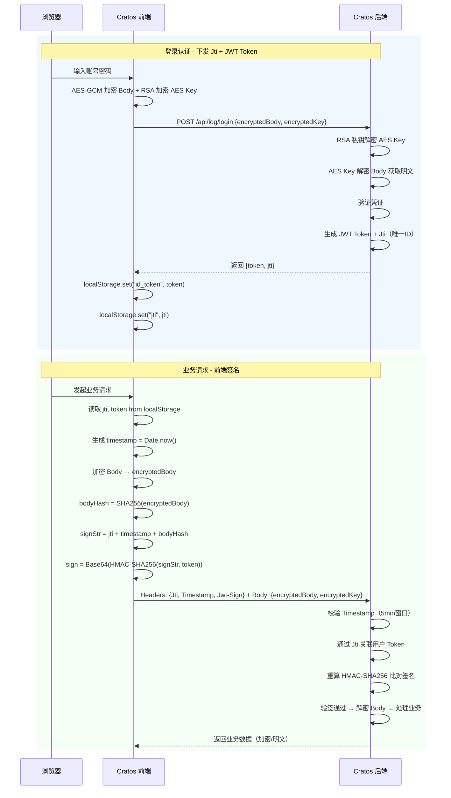

# Cratos 登录认证与请求签名流程

```mermaid
sequenceDiagram
    participant B as 浏览器
    participant F as Cratos 前端
    participant S as Cratos 后端

    rect rgb(240, 248, 255)
    Note over B, S: 登录认证 - 下发 Jti + JWT Token
    B->>F: 输入账号密码
    F->>F: AES-GCM 加密 Body + RSA 加密 AES Key
    F->>S: POST /api/log/login {encryptedBody, encryptedKey}
    S->>S: RSA 私钥解密 AES Key
    S->>S: AES Key 解密 Body 获取明文
    S->>S: 验证凭证
    S->>S: 生成 JWT Token + Jti（唯一ID）
    S-->>F: 返回 {token, jti}
    F->>F: localStorage.set("id_token", token)
    F->>F: localStorage.set("jti", jti)
    end

    rect rgb(245, 255, 245)
    Note over B, S: 业务请求 - 前端签名
    B->>F: 发起业务请求
    F->>F: 读取 jti, token from localStorage
    F->>F: 生成 timestamp = Date.now()
    F->>F: 加密 Body → encryptedBody
    F->>F: bodyHash = SHA256(encryptedBody)
    F->>F: signStr = jti + timestamp + bodyHash
    F->>F: sign = Base64(HMAC-SHA256(signStr, token))
    F->>S: Headers: {Jti, Timestamp, Jwt-Sign} + Body: {encryptedBody, encryptedKey}
    S->>S: 校验 Timestamp（5min窗口）
    S->>S: 通过 Jti 关联用户 Token
    S->>S: 重算 HMAC-SHA256 比对签名
    S->>S: 验签通过 → 解密 Body → 处理业务
    S-->>F: 返回业务数据（加密/明文）
    end
```
