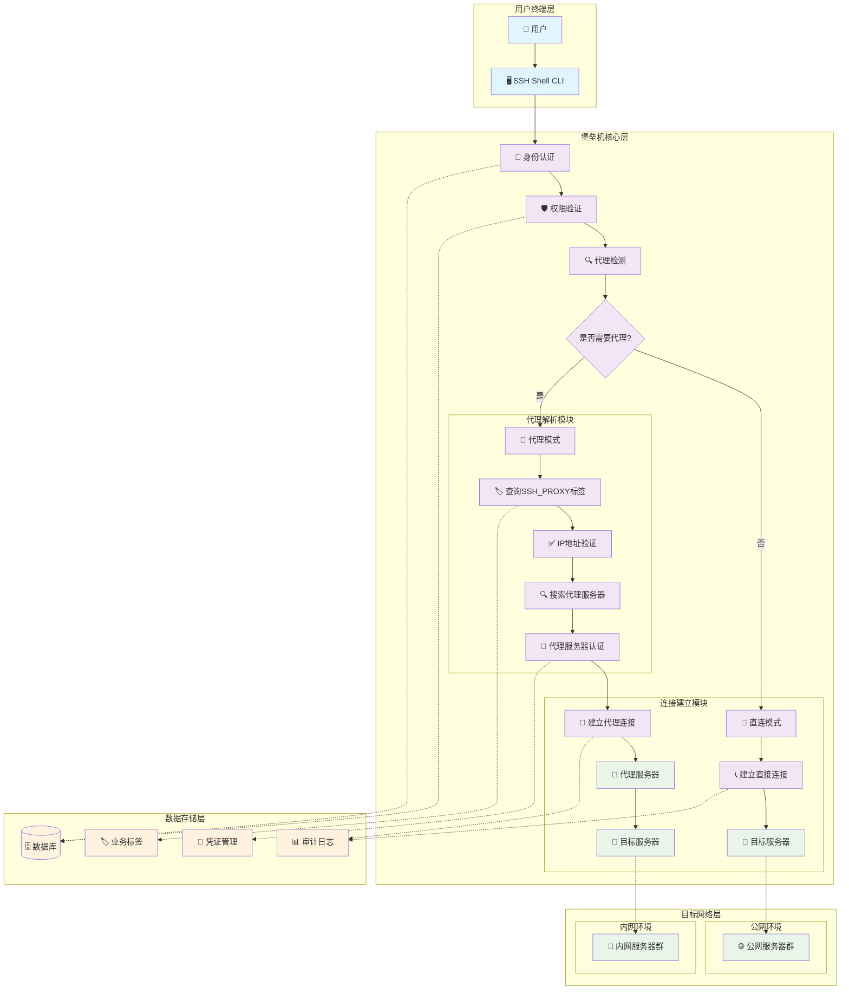
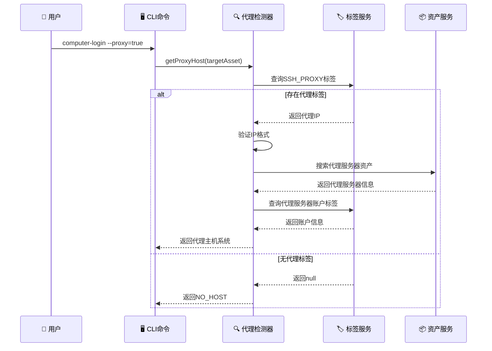
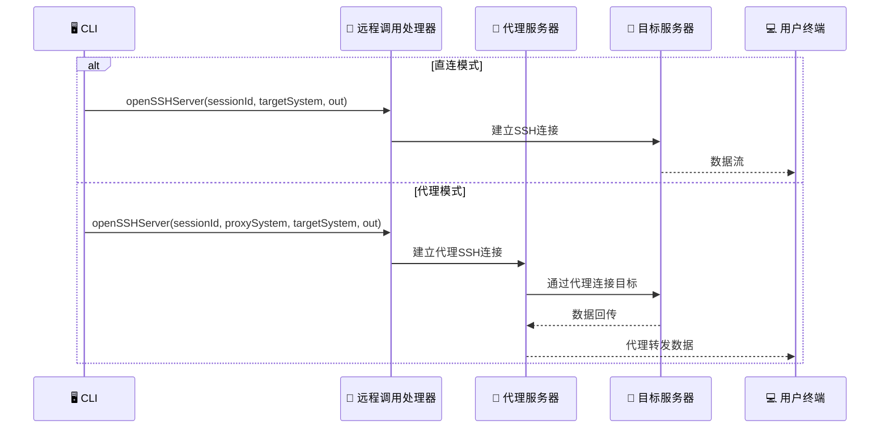
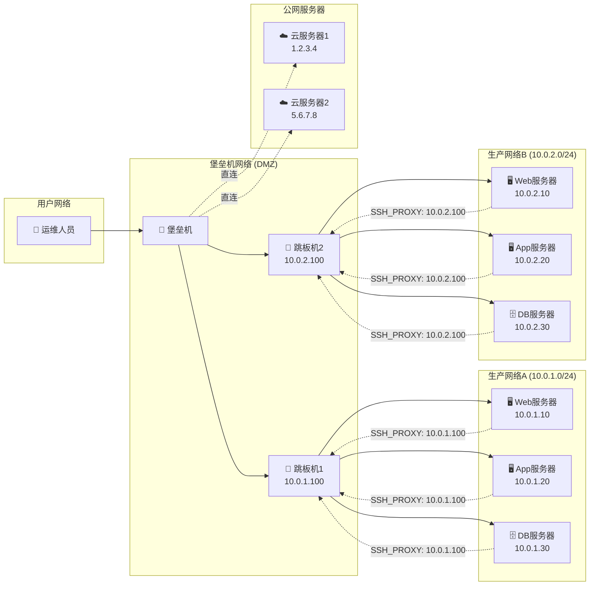
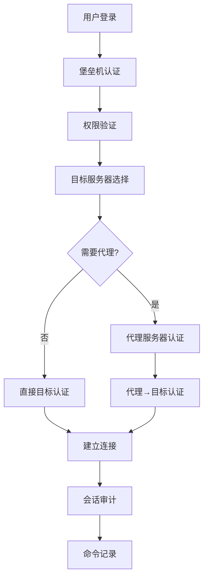
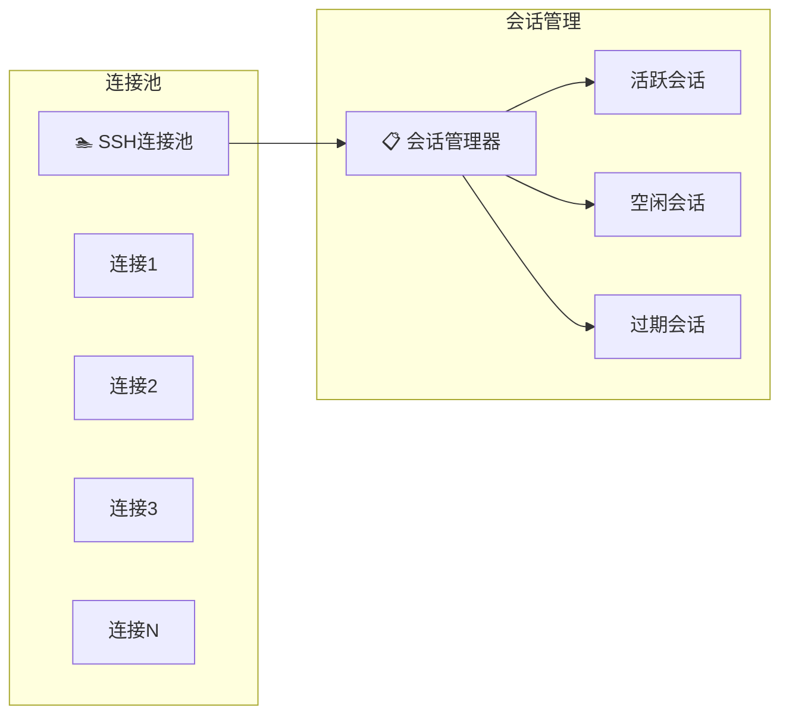
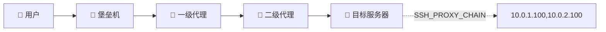

# 🏰 堡垒机代理模式深度分析

## 📋 概述

基于Cratos堡垒机系统的SSH代理连接模式分析，该系统实现了多层代理跳转的安全访问机制。

---

## 🏗️ 系统架构图



---

## 🔄 代理模式工作流程

### 1️⃣ 代理检测流程



### 2️⃣ 连接建立流程



---

## 🏷️ 核心组件分析

### 1. 代理检测器 (ProxyDetector)

```java
private HostSystem getProxyHost(EdsAsset targetComputer) throws SshException {
    // 1. 查询目标服务器的SSH_PROXY标签
    BusinessTag sshProxyBusinessTag = businessTagFacade.getBusinessTag(
        SimpleBusiness.builder()
            .businessType(BusinessTypeEnum.EDS_ASSET.name())
            .businessId(targetComputer.getId())
            .build(), 
        SysTagKeys.SSH_PROXY.getKey()
    );
    
    // 2. 验证代理IP
    String proxyIP = sshProxyBusinessTag.getTagValue();
    if (!IpUtils.isIP(proxyIP)) {
        return HostSystem.NO_HOST;
    }
    
    // 3. 搜索代理服务器资产
    List<EdsAsset> proxyComputers = edsAssetService.queryInstanceAssetByTypeAndKey(
        targetComputer.getInstanceId(),
        targetComputer.getAssetType(), 
        proxyIP
    );
    
    // 4. 构建代理主机系统
    return HostSystemBuilder.buildHostSystem(proxyComputer, serverAccount, credential);
}
```

**关键特性**:
- 🏷️ **标签驱动**: 通过业务标签配置代理关系
- 🔍 **动态发现**: 运行时查找代理服务器
- ✅ **多重验证**: IP格式、资产存在性、账户有效性
- 🛡️ **安全隔离**: 代理服务器独立认证

### 2. 连接管理器 (ConnectionManager)

```java
// 代理连接逻辑
if (proxy) {
    HostSystem proxySystem = getProxyHost(asset);
    if (Objects.isNull(proxySystem)) {
        // 降级为直连
        RemoteInvokeHandler.openSSHServer(sessionId, targetSystem, out);
    } else {
        // 代理访问
        RemoteInvokeHandler.openSSHServer(sessionId, proxySystem, targetSystem, out);
    }
} else {
    // 直连访问
    RemoteInvokeHandler.openSSHServer(sessionId, targetSystem, out);
}
```

**设计亮点**:
- 🔄 **自动降级**: 代理失败时自动切换直连
- 🎯 **统一接口**: 相同的调用方式处理不同连接模式
- 📊 **会话管理**: 统一的会话ID管理机制

---

## 🌐 网络拓扑示例



---

## 🔐 安全机制

### 1. 多层认证



### 2. 权限控制矩阵

| 用户角色 | 直连权限 | 代理权限 | 目标网络 | 审计级别 |
|---------|---------|---------|---------|---------|
| 🔴 超级管理员 | ✅ 全部 | ✅ 全部 | 🌐 所有网络 | 📊 完整审计 |
| 🟡 网络管理员 | ✅ 公网 | ✅ 指定代理 | 🏢 指定网段 | 📊 完整审计 |
| 🟢 应用运维 | ❌ 禁止 | ✅ 应用代理 | 🖥️ 应用服务器 | 📝 命令审计 |
| 🔵 开发人员 | ❌ 禁止 | ✅ 开发代理 | 🧪 测试环境 | 📝 基础审计 |

---

## 📊 性能优化策略

### 1. 连接池管理



### 2. 代理服务器负载均衡

```java
// 伪代码：代理服务器选择策略
public HostSystem selectOptimalProxy(List<EdsAsset> proxyServers) {
    return proxyServers.stream()
        .filter(this::isHealthy)           // 健康检查
        .min(Comparator.comparing(this::getConnectionCount))  // 最少连接
        .map(this::buildHostSystem)
        .orElse(HostSystem.NO_HOST);
}
```

---

## 🚀 扩展功能

### 1. 多级代理跳转



### 2. 智能路由选择

```java
// 智能代理路由算法
public class SmartProxyRouter {
    public HostSystem selectBestRoute(EdsAsset target, List<ProxyRoute> routes) {
        return routes.stream()
            .filter(route -> route.isAccessible(target))
            .min(Comparator
                .comparing(ProxyRoute::getLatency)
                .thenComparing(ProxyRoute::getLoadFactor))
            .map(ProxyRoute::getProxyHost)
            .orElse(HostSystem.NO_HOST);
    }
}
```

---

## 📈 监控指标

### 关键性能指标 (KPI)

| 指标类型 | 指标名称 | 目标值 | 监控方式 |
|---------|---------|--------|---------|
| 🚀 性能 | 连接建立时间 | < 3秒 | 实时监控 |
| 🚀 性能 | 代理延迟 | < 100ms | 持续测量 |
| 🛡️ 安全 | 认证成功率 | > 99% | 日志分析 |
| 🛡️ 安全 | 异常连接检测 | 0容忍 | 实时告警 |
| 📊 可用性 | 代理服务器可用率 | > 99.9% | 健康检查 |
| 📊 可用性 | 会话并发数 | 监控阈值 | 资源监控 |

---

## 🎯 总结

Cratos堡垒机的代理模式设计体现了以下特点：

### ✅ 优势
- 🏷️ **标签驱动配置**: 灵活的代理关系管理
- 🔄 **自动降级机制**: 提高系统可用性
- 🛡️ **多层安全验证**: 确保访问安全
- 📊 **完整审计追踪**: 满足合规要求

### ⚠️ 改进建议
- 🚀 **连接池优化**: 减少连接建立开销
- ⚖️ **负载均衡**: 多代理服务器智能选择
- 🔄 **故障转移**: 代理服务器故障自动切换
- 📈 **性能监控**: 实时性能指标收集

这个代理模式为企业级堡垒机提供了强大而灵活的网络访问控制能力，是现代云原生环境下安全运维的重要基础设施。
