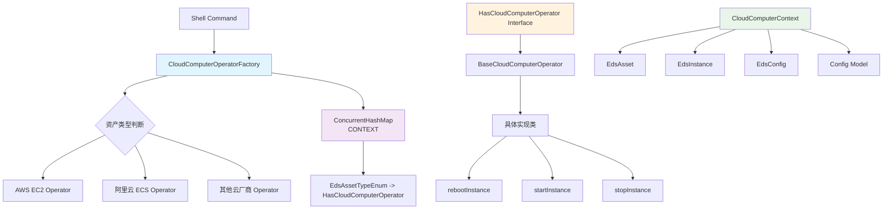
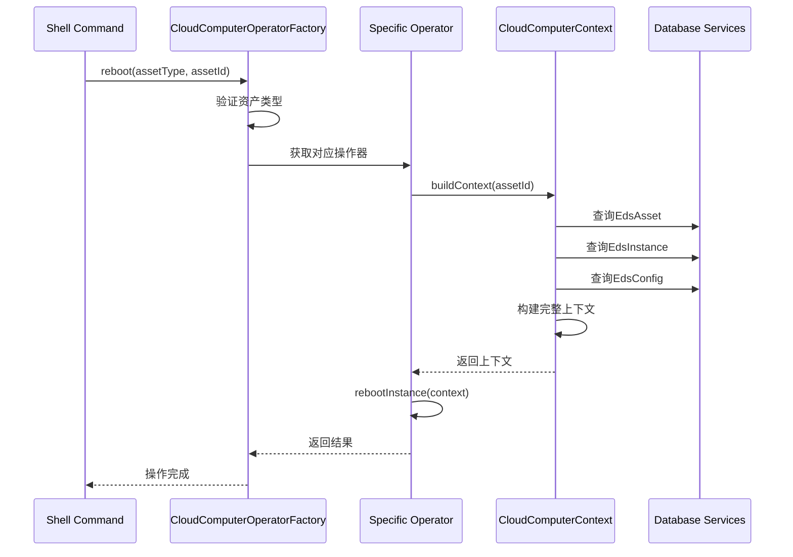

# CloudComputerOperatorFactory 架构分析文档

## 架构概述

`CloudComputerOperatorFactory` 是一个工厂模式实现，用于管理不同云厂商的计算机操作器，提供统一的云计算机操作接口。

## 架构图



## 核心组件分析

### 1. 工厂类 (CloudComputerOperatorFactory)

```java
// 注册中心 - 线程安全的Map
private static final Map<EdsAssetTypeEnum, HasCloudComputerOperator<?, ?>> CONTEXT = new ConcurrentHashMap<>();

// 统一操作接口
public static void reboot(String assetType, Integer assetId)
public static void start(String assetType, Integer assetId)  
public static void stop(String assetType, Integer assetId)
```

**设计特点**：
- **单例模式**: 私有构造函数，静态方法访问
- **注册机制**: 通过 `register()` 方法注册操作器
- **类型安全**: 使用枚举类型作为键值
- **异常处理**: 统一的异常抛出机制

### 2. 操作器接口 (HasCloudComputerOperator)

```java
public interface HasCloudComputerOperator<Config, Computer> extends EdsAssetTypeOfAnnotate, InitializingBean {
    void reboot(Integer assetId);
    void start(Integer assetId);
    void stop(Integer assetId);
    
    // 自动注册机制
    default void afterPropertiesSet() {
        CloudComputerOperatorFactory.register(this);
    }
}
```

**设计亮点**：
- **泛型设计**: 支持不同的配置和计算机类型
- **自动注册**: 通过 `InitializingBean` 实现自动注册
- **标准化接口**: 统一的操作方法定义

### 3. 基础操作器 (BaseCloudComputerOperator)

```java
public abstract class BaseCloudComputerOperator<Config, Computer> 
    implements HasCloudComputerOperator<Config, Computer> {
    
    // 上下文构建
    protected CloudComputerContext<Config> buildContext(Integer assetId)
    
    // 抽象方法 - 子类实现
    protected abstract String rebootInstance(CloudComputerContext<Config> context);
    protected abstract String startInstance(CloudComputerContext<Config> context);
    protected abstract String stopInstance(CloudComputerContext<Config> context);
}
```

**核心功能**：
- **上下文构建**: 统一的资源上下文构建逻辑
- **配置加载**: 支持凭据模板渲染
- **异常处理**: 完善的错误检查和异常抛出
- **模板方法**: 定义操作流程，子类实现具体逻辑

### 4. 上下文对象 (CloudComputerContext)

```java
@Data
@Builder
public class CloudComputerContext<Config extends IEdsConfigModel> {
    private EdsAsset asset;        // 资产信息
    private EdsInstance edsInstance; // 实例信息  
    private EdsConfig edsConfig;   // 配置信息
    private Config config;         // 解析后的配置
}
```

## 执行流程图



## 设计模式应用

### 1. 工厂模式
- 根据资产类型创建对应的操作器
- 隐藏具体实现细节

### 2. 策略模式  
- 不同云厂商有不同的操作策略
- 运行时动态选择策略

### 3. 模板方法模式
- `BaseCloudComputerOperator` 定义操作模板
- 子类实现具体的操作逻辑

### 4. 注册模式
- 操作器自动注册到工厂
- 支持插件化扩展

## 扩展性设计

### 添加新的云厂商支持

1. **实现操作器接口**：
```java
@Component
public class TencentCloudComputerOperator extends BaseCloudComputerOperator<TencentConfig, TencentComputer> {
    @Override
    public String getAssetType() {
        return EdsAssetTypeEnum.TENCENT_CVM.name();
    }
    
    // 实现具体操作方法...
}
```

2. **自动注册**: 通过 `@Component` 和 `afterPropertiesSet()` 自动注册

## 关键文件位置

- **工厂类**: `cratos-eds/src/main/java/com/baiyi/cratos/eds/computer/CloudComputerOperatorFactory.java`
- **接口定义**: `cratos-eds/src/main/java/com/baiyi/cratos/eds/computer/HasCloudComputerOperator.java`
- **基础类**: `cratos-eds/src/main/java/com/baiyi/cratos/eds/computer/BaseCloudComputerOperator.java`
- **上下文**: `cratos-eds/src/main/java/com/baiyi/cratos/eds/computer/context/CloudComputerContext.java`

## 优势总结

1. **统一接口**: 屏蔽不同云厂商的API差异
2. **类型安全**: 使用枚举和泛型确保类型安全
3. **易于扩展**: 插件化架构，易于添加新的云厂商
4. **配置灵活**: 支持凭据模板和动态配置加载
5. **异常统一**: 统一的异常处理机制
6. **线程安全**: 使用 `ConcurrentHashMap` 确保并发安全

## 使用示例

```java
// Shell命令调用
CloudComputerOperatorFactory.reboot("AWS_EC2", 123);
CloudComputerOperatorFactory.start("ALIYUN_ECS", 456);
CloudComputerOperatorFactory.stop("TENCENT_CVM", 789);
```

这个架构很好地体现了面向对象设计原则，具有良好的可维护性和扩展性。
