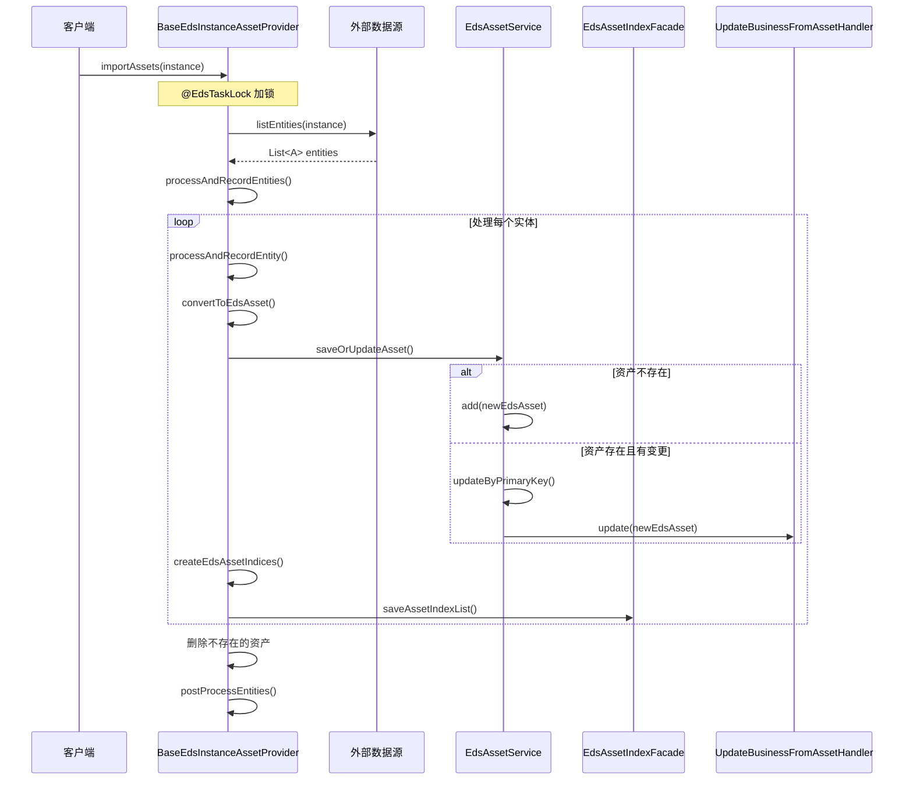
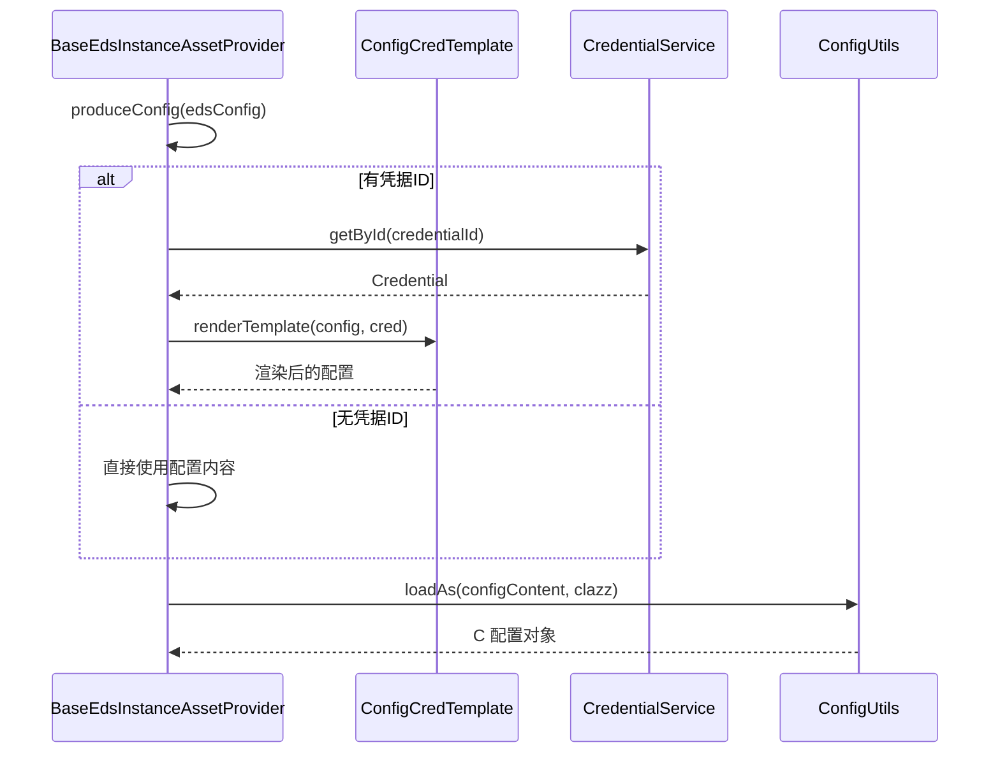
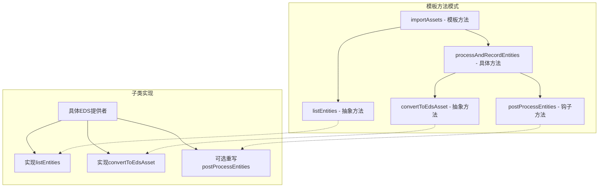
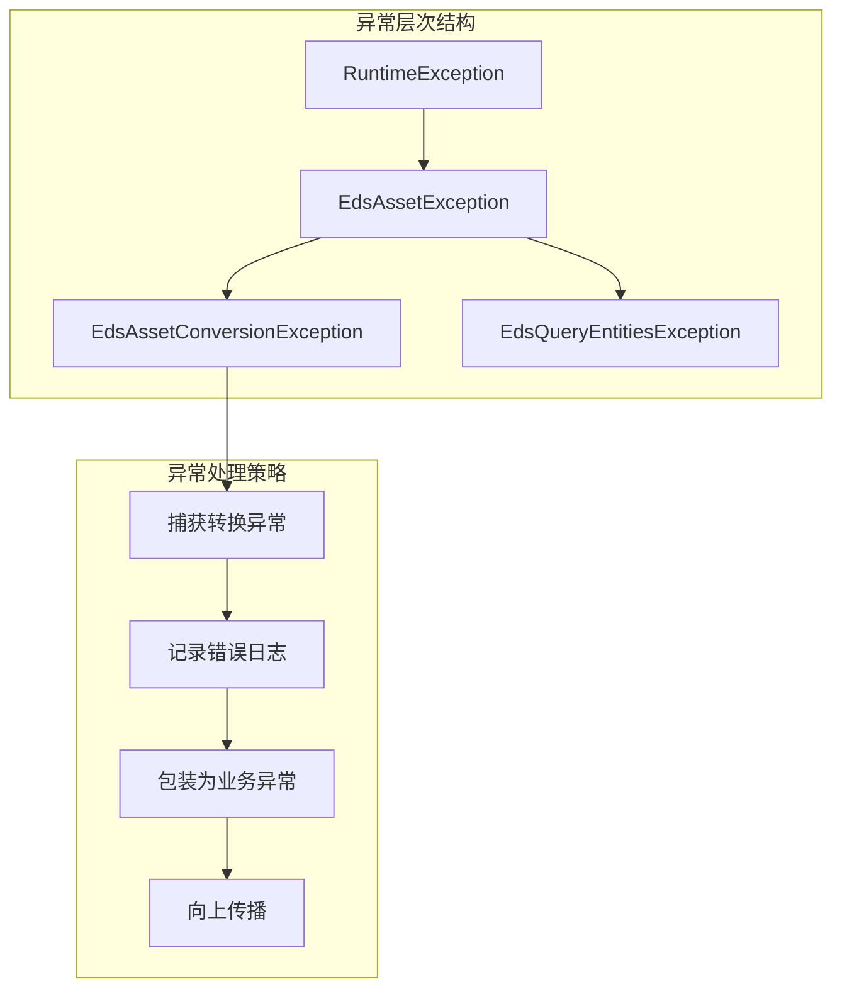
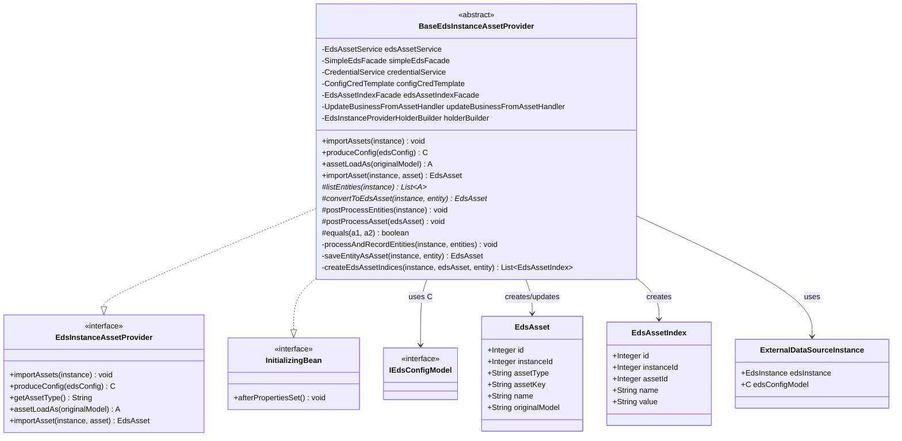

# 🏗️ BaseEdsInstanceAssetProvider 深度架构分析

## 📋 概述

`BaseEdsInstanceAssetProvider` 是Cratos系统中EDS（External Data Source）核心模块的抽象基类，负责管理外部数据源实例的资产导入、转换、存储和索引功能。它是整个EDS资产管理体系的核心基础设施。

---

## 🎯 核心职责

### 1️⃣ 资产生命周期管理
- **资产导入**: 从外部数据源获取实体数据
- **资产转换**: 将外部实体转换为内部资产模型
- **资产存储**: 保存或更新资产到数据库
- **资产索引**: 创建和维护资产索引

### 2️⃣ 配置管理
- **配置加载**: 支持凭据模板渲染的配置加载
- **泛型配置**: 基于泛型的类型安全配置处理

### 3️⃣ 数据同步
- **增量同步**: 智能识别新增、更新、删除的资产
- **批量处理**: 高效的批量资产处理机制

---

## 🏗️ 整体架构图

```mermaid
graph TB
    subgraph CoreLayer["核心层"]
        BASE[BaseEdsInstanceAssetProvider]
        INTERFACE[EdsInstanceAssetProvider接口]
        INIT[InitializingBean]
    end
    
    subgraph DependencyLayer["依赖层"]
        EAS[EdsAssetService]
        SEF[SimpleEdsFacade]
        CS[CredentialService]
        CCT[ConfigCredTemplate]
        EAIF[EdsAssetIndexFacade]
        UBFAH[UpdateBusinessFromAssetHandler]
        HBUILDER[EdsInstanceProviderHolderBuilder]
    end
    
    subgraph DataLayer["数据层"]
        EDSASSET[EdsAsset]
        EDSINDEX[EdsAssetIndex]
        EDSCONFIG[EdsConfig]
        CREDENTIAL[Credential]
    end
    
    subgraph ProcessLayer["处理层"]
        IMPORT[importAssets]
        CONVERT[convertToEdsAsset]
        SAVE[saveEntityAsAsset]
        INDEX[createEdsAssetIndices]
    end
    
    subgraph UtilLayer["工具层"]
        BUILDER[EdsAssetBuilder]
        COMPARER[EdsAssetComparer]
        UTILS[AssetUtils/ConfigUtils]
        HOLDER[EdsInstanceProviderHolder]
    end
    
    %% 继承关系
    BASE -.-> INTERFACE
    BASE -.-> INIT
    
    %% 依赖关系
    BASE --> EAS
    BASE --> SEF
    BASE --> CS
    BASE --> CCT
    BASE --> EAIF
    BASE --> UBFAH
    BASE --> HBUILDER
    
    %% 数据关系
    EAS --> EDSASSET
    EAIF --> EDSINDEX
    CS --> CREDENTIAL
    
    %% 处理流程
    IMPORT --> CONVERT
    CONVERT --> SAVE
    SAVE --> INDEX
    
    %% 工具使用
    SAVE --> BUILDER
    SAVE --> COMPARER
    CONVERT --> UTILS
    BASE --> HOLDER
    
    %% 样式定义
    classDef coreStyle fill:#e3f2fd,stroke:#1976d2,stroke-width:3px
    classDef depStyle fill:#f3e5f5,stroke:#7b1fa2,stroke-width:2px
    classDef dataStyle fill:#e8f5e8,stroke:#388e3c,stroke-width:2px
    classDef processStyle fill:#fff3e0,stroke:#f57c00,stroke-width:2px
    classDef utilStyle fill:#fce4ec,stroke:#c2185b,stroke-width:2px
    
    class BASE,INTERFACE,INIT coreStyle
    class EAS,SEF,CS,CCT,EAIF,UBFAH,HBUILDER depStyle
    class EDSASSET,EDSINDEX,EDSCONFIG,CREDENTIAL dataStyle
    class IMPORT,CONVERT,SAVE,INDEX processStyle
    class BUILDER,COMPARER,UTILS,HOLDER utilStyle
```



---

## 🔧 核心组件分析

### 1. 类定义和泛型设计

```java
public abstract class BaseEdsInstanceAssetProvider<C extends IEdsConfigModel, A> 
    implements EdsInstanceAssetProvider<C, A>, InitializingBean
```

**泛型参数**:
- `C extends IEdsConfigModel`: 配置模型类型
- `A`: 资产实体类型

**接口实现**:
- `EdsInstanceAssetProvider<C, A>`: 核心业务接口
- `InitializingBean`: Spring生命周期接口

### 2. 依赖注入架构

```java
@AllArgsConstructor
public abstract class BaseEdsInstanceAssetProvider<C extends IEdsConfigModel, A> {
    private final EdsAssetService edsAssetService;           // 资产服务
    private final SimpleEdsFacade simpleEdsFacade;           // EDS门面
    protected final CredentialService credentialService;     // 凭据服务
    private final ConfigCredTemplate configCredTemplate;     // 配置模板
    protected final EdsAssetIndexFacade edsAssetIndexFacade; // 索引门面
    private final UpdateBusinessFromAssetHandler updateBusinessFromAssetHandler; // 业务更新处理器
    private final EdsInstanceProviderHolderBuilder holderBuilder; // 持有者构建器
}
```

**依赖分析**:
- **服务层依赖**: 通过构造函数注入，确保依赖的不可变性
- **门面模式**: 使用Facade简化复杂子系统的调用
- **模板模式**: ConfigCredTemplate提供配置渲染能力
- **构建者模式**: 多个Builder类提供对象构建能力

---

## 🔄 核心业务流程

### 资产导入流程图



### 配置加载流程图



---

## 📊 方法分类和职责

### 🔒 核心抽象方法
| 方法 | 职责 | 实现要求 |
|------|------|----------|
| `listEntities()` | 从外部数据源获取实体列表 | 子类必须实现 |
| `convertToEdsAsset()` | 将外部实体转换为EDS资产 | 子类必须实现 |
| `getAssetType()` | 返回资产类型枚举 | 子类必须实现 |

### 🔧 核心业务方法
| 方法 | 职责 | 特性 |
|------|------|------|
| `importAssets()` | 导入资产主流程 | @EdsTaskLock锁保护 |
| `saveEntityAsAsset()` | 保存实体为资产 | 事务性操作 |
| `processAndRecordEntities()` | 批量处理实体 | 增量同步逻辑 |

### 🛠️ 工具方法
| 方法 | 职责 | 用途 |
|------|------|------|
| `createEdsAssetIndex()` | 创建资产索引 | 多种类型重载 |
| `configLoadAs()` | 加载配置对象 | 泛型类型安全 |
| `assetLoadAs()` | 加载资产对象 | 泛型类型安全 |
| `newEdsAssetBuilder()` | 创建资产构建器 | 建造者模式 |
---

## 🔍 技术细节深度分析

### 1. 泛型设计模式

```java
// 泛型类型推断机制
@SuppressWarnings("unchecked")
protected C configLoadAs(String configContent) {
    // 通过反射获取泛型参数C的实际类型
    Class<C> clazz = Generics.find(this.getClass(), BaseEdsInstanceAssetProvider.class, 0);
    return ConfigUtils.loadAs(configContent, clazz);
}

@SuppressWarnings("unchecked")
@Override
public A assetLoadAs(String originalModel) {
    // 通过反射获取泛型参数A的实际类型
    Class<A> clazz = Generics.find(this.getClass(), BaseEdsInstanceAssetProvider.class, 1);
    return AssetUtils.loadAs(originalModel, clazz);
}
```

**技术亮点**:
- **类型安全**: 编译时类型检查，运行时类型推断
- **反射机制**: 通过`Generics.find()`获取泛型实际类型
- **零配置**: 子类无需显式指定类型信息

### 2. 分布式锁机制

```java
@Override
@EdsTaskLock(instanceId = "#instance.edsInstance.id")
public void importAssets(ExternalDataSourceInstance<C> instance) {
    List<A> entities = listEntities(instance);
    processAndRecordEntities(instance, entities);
}
```

**锁机制分析**:
- **SpEL表达式**: `#instance.edsInstance.id` 动态获取锁键
- **实例级锁**: 每个EDS实例独立加锁，避免全局阻塞
- **防重复导入**: 确保同一实例的资产导入操作串行化

### 3. 增量同步算法

```java
private void processAndRecordEntities(ExternalDataSourceInstance<C> instance, List<A> entities) {
    // 1. 获取现有资产ID集合
    Set<Integer> idSet = getExistingAssetIds(instance);
    
    // 2. 处理每个实体，从集合中移除仍存在的资产ID
    entities.forEach(e -> processAndRecordEntity(instance, idSet, e));
    
    // 3. 删除不再存在的资产（剩余在集合中的ID）
    if (!CollectionUtils.isEmpty(idSet)) {
        log.info("Delete eds instance asset: instance={}, assetIds={}", 
                instance.getEdsInstance().getInstanceName(), 
                Joiner.on("|").join(idSet));
        idSet.forEach(simpleEdsFacade::deleteEdsAssetById);
    }
    
    // 4. 后处理
    postProcessEntities(instance);
}
```

**算法特点**:
- **O(n)时间复杂度**: 单次遍历完成增量识别
- **内存高效**: 使用Set进行快速查找和删除
- **原子性操作**: 确保数据一致性

### 4. 资产比较机制

```java
private EdsAsset saveOrUpdateAsset(EdsAsset newEdsAsset) {
    EdsAsset edsAsset = edsAssetService.getByUniqueKey(newEdsAsset);
    if (edsAsset == null) {
        // 新增资产
        edsAssetService.add(newEdsAsset);
    } else {
        newEdsAsset.setId(edsAsset.getId());
        // 使用比较器判断是否需要更新
        if (!equals(edsAsset, newEdsAsset)) {
            edsAssetService.updateByPrimaryKey(newEdsAsset);
            // 更新绑定的业务资产
            updateBusinessFromAssetHandler.update(newEdsAsset);
        }
    }
    return newEdsAsset;
}

protected boolean equals(EdsAsset a1, EdsAsset a2) {
    return EdsAssetComparer.SAME.compare(a1, a2);
}
```

**比较策略**:
- **可扩展比较**: 子类可重写`equals`方法自定义比较逻辑
- **默认比较器**: 使用`EdsAssetComparer.SAME`进行深度比较
- **业务联动**: 资产更新时自动更新关联的业务数据

---

## 🏗️ 设计模式应用

### 1. 模板方法模式



### 2. 建造者模式

```java
protected EdsAssetBuilder<C, A> newEdsAssetBuilder(ExternalDataSourceInstance<C> instance, A entity) {
    return EdsAssetBuilder.newBuilder(instance, entity)
            .assetTypeOf(getAssetType());
}
```

### 3. 门面模式

```java
// 通过门面简化复杂操作
private final SimpleEdsFacade simpleEdsFacade;
private final EdsAssetIndexFacade edsAssetIndexFacade;
```

### 4. 策略模式

```java
// 可插拔的比较策略
protected boolean equals(EdsAsset a1, EdsAsset a2) {
    return EdsAssetComparer.SAME.compare(a1, a2);
}
```

---

## 📈 性能优化策略

### 1. 批量操作优化

```java
// 批量保存索引
edsAssetIndexFacade.saveAssetIndexList(edsAsset.getId(), indices);

// 批量删除资产
idSet.forEach(simpleEdsFacade::deleteEdsAssetById);
```

### 2. 内存管理

```java
// 使用Set进行快速查找，避免O(n²)复杂度
Set<Integer> idSet = getExistingAssetIds(instance);

// 及时清理不需要的资产ID
idSet.remove(asset.getId());
```

### 3. 懒加载机制

```java
// 按需获取Holder，避免不必要的对象创建
protected EdsInstanceProviderHolder<C, A> getHolder(int instanceId) {
    return (EdsInstanceProviderHolder<C, A>) holderBuilder.newHolder(instanceId, getAssetType());
}
```

---

## 🔐 异常处理机制

### 异常层次结构



### 异常处理代码

```java
protected EdsAsset saveEntityAsAsset(ExternalDataSourceInstance<C> instance, A entity) {
    try {
        EdsAsset edsAsset = saveAsset(convertToEdsAsset(instance, entity));
        List<EdsAssetIndex> indices = createEdsAssetIndices(instance, edsAsset, entity);
        edsAssetIndexFacade.saveAssetIndexList(edsAsset.getId(), indices);
        return edsAsset;
    } catch (EdsAssetConversionException e) {
        log.error("Asset conversion error. {}", e.getMessage());
        throw new EdsAssetException("Asset conversion error. {}", e.getMessage());
    }
}
```

**异常处理特点**:
- **分层异常**: 不同层次的异常类型，便于问题定位
- **日志记录**: 详细的错误日志，便于调试和监控
- **异常转换**: 将底层异常转换为业务异常
- **失败快速**: 遇到异常立即停止处理，避免数据不一致

---

## 🔧 扩展点设计

### 1. 抽象方法扩展点

```java
// 必须实现的扩展点
protected abstract List<A> listEntities(ExternalDataSourceInstance<C> instance) 
    throws EdsQueryEntitiesException;

protected abstract EdsAsset convertToEdsAsset(ExternalDataSourceInstance<C> instance, A entity) 
    throws EdsAssetConversionException;
```

### 2. 钩子方法扩展点

```java
// 可选重写的扩展点
protected void postProcessEntities(ExternalDataSourceInstance<C> instance) {
    // 子类可重写进行后处理
}

protected void postProcessAsset(EdsAsset edsAsset) {
    // 子类可重写进行资产后处理
}
```

### 3. 策略方法扩展点

```java
// 可自定义的比较策略
protected boolean equals(EdsAsset a1, EdsAsset a2) {
    return EdsAssetComparer.SAME.compare(a1, a2);
}

// 可自定义的索引创建策略
protected List<EdsAssetIndex> convertToEdsAssetIndexList(
    ExternalDataSourceInstance<C> instance, EdsAsset edsAsset, A entity) {
    return Collections.emptyList();
}
```

---

## 📊 类图关系


---

## 🚀 实际应用场景

### 1. AWS EC2实例提供者示例

```java
@Component
public class AwsEc2InstanceProvider extends BaseEdsInstanceAssetProvider<AwsConfig, Instance> {
    
    @Override
    public String getAssetType() {
        return EdsAssetTypeEnum.AWS_EC2_INSTANCE.name();
    }
    
    @Override
    protected List<Instance> listEntities(ExternalDataSourceInstance<AwsConfig> instance) 
            throws EdsQueryEntitiesException {
        try {
            // 调用AWS SDK获取EC2实例列表
            return awsEc2Client.describeInstances(instance.getEdsConfigModel())
                    .getReservations()
                    .stream()
                    .flatMap(reservation -> reservation.getInstances().stream())
                    .collect(Collectors.toList());
        } catch (Exception e) {
            throw new EdsQueryEntitiesException("Failed to query AWS EC2 instances", e);
        }
    }
    
    @Override
    protected EdsAsset convertToEdsAsset(ExternalDataSourceInstance<AwsConfig> instance, Instance entity) 
            throws EdsAssetConversionException {
        return newEdsAssetBuilder(instance, entity)
                .assetKeyOf(entity.getInstanceId())
                .nameOf(getInstanceName(entity))
                .regionOf(entity.getPlacement().getAvailabilityZone())
                .build();
    }
    
    @Override
    protected List<EdsAssetIndex> convertToEdsAssetIndexList(
            ExternalDataSourceInstance<AwsConfig> instance, EdsAsset edsAsset, Instance entity) {
        List<EdsAssetIndex> indices = Lists.newArrayList();
        
        // 创建各种索引
        indices.add(createEdsAssetIndex(edsAsset, "instanceType", entity.getInstanceType()));
        indices.add(createEdsAssetIndex(edsAsset, "state", entity.getState().getName()));
        indices.add(createEdsAssetIndex(edsAsset, "vpcId", entity.getVpcId()));
        indices.add(createEdsAssetIndex(edsAsset, "subnetId", entity.getSubnetId()));
        
        return indices;
    }
}
```

### 2. Kubernetes Pod提供者示例

```java
@Component
public class KubernetesPodProvider extends BaseEdsInstanceAssetProvider<KubernetesConfig, V1Pod> {
    
    @Override
    public String getAssetType() {
        return EdsAssetTypeEnum.KUBERNETES_POD.name();
    }
    
    @Override
    protected List<V1Pod> listEntities(ExternalDataSourceInstance<KubernetesConfig> instance) 
            throws EdsQueryEntitiesException {
        try {
            // 调用Kubernetes API获取Pod列表
            return kubernetesClient.listPods(instance.getEdsConfigModel())
                    .getItems();
        } catch (Exception e) {
            throw new EdsQueryEntitiesException("Failed to query Kubernetes pods", e);
        }
    }
    
    @Override
    protected EdsAsset convertToEdsAsset(ExternalDataSourceInstance<KubernetesConfig> instance, V1Pod entity) 
            throws EdsAssetConversionException {
        return newEdsAssetBuilder(instance, entity)
                .assetKeyOf(entity.getMetadata().getName())
                .nameOf(entity.getMetadata().getName())
                .regionOf(entity.getMetadata().getNamespace())
                .build();
    }
    
    @Override
    protected void postProcessAsset(EdsAsset edsAsset) {
        // Pod特殊后处理逻辑
        log.debug("Post processing Kubernetes pod asset: {}", edsAsset.getName());
    }
}
```

---

## 📊 监控和指标

### 1. 性能监控指标

```java
// 可以通过AOP或Micrometer添加的监控指标
public class EdsAssetProviderMetrics {
    
    // 导入耗时监控
    @Timed(name = "eds.asset.import.duration", description = "EDS asset import duration")
    public void importAssets(ExternalDataSourceInstance<C> instance) {
        // 原有逻辑
    }
    
    // 资产数量监控
    @Gauge(name = "eds.asset.count", description = "EDS asset count by type")
    public long getAssetCount(String assetType) {
        return edsAssetService.countByType(assetType);
    }
    
    // 错误率监控
    @Counter(name = "eds.asset.conversion.errors", description = "EDS asset conversion errors")
    public void recordConversionError(String assetType, String error) {
        // 记录转换错误
    }
}
```

### 2. 日志监控

```java
// 结构化日志输出
log.info("EDS asset import started: instance={}, type={}, expectedCount={}", 
         instance.getEdsInstance().getInstanceName(), 
         getAssetType(), 
         entities.size());

log.info("EDS asset import completed: instance={}, type={}, processed={}, created={}, updated={}, deleted={}", 
         instance.getEdsInstance().getInstanceName(),
         getAssetType(),
         processedCount,
         createdCount, 
         updatedCount,
         deletedCount);
```

---

## ⚠️ 注意事项和最佳实践

### 1. 性能优化建议

| 场景 | 建议 | 原因 |
|------|------|------|
| **大量资产导入** | 分批处理，避免内存溢出 | 防止OOM异常 |
| **频繁更新** | 实现智能比较，减少不必要的更新 | 提升性能，减少数据库压力 |
| **索引创建** | 只创建必要的索引 | 避免存储空间浪费 |
| **异常处理** | 记录详细的错误信息 | 便于问题排查 |

### 2. 扩展开发指南

```java
// 1. 继承基类
public class CustomEdsProvider extends BaseEdsInstanceAssetProvider<CustomConfig, CustomEntity> {
    
    // 2. 实现必要的抽象方法
    @Override
    public String getAssetType() {
        return "CUSTOM_ASSET_TYPE";
    }
    
    @Override
    protected List<CustomEntity> listEntities(ExternalDataSourceInstance<CustomConfig> instance) 
            throws EdsQueryEntitiesException {
        // 实现获取实体逻辑
    }
    
    @Override
    protected EdsAsset convertToEdsAsset(ExternalDataSourceInstance<CustomConfig> instance, CustomEntity entity) 
            throws EdsAssetConversionException {
        // 实现转换逻辑
    }
    
    // 3. 可选：重写钩子方法
    @Override
    protected void postProcessEntities(ExternalDataSourceInstance<CustomConfig> instance) {
        // 自定义后处理逻辑
    }
    
    // 4. 可选：自定义比较逻辑
    @Override
    protected boolean equals(EdsAsset a1, EdsAsset a2) {
        // 自定义比较逻辑
        return customCompare(a1, a2);
    }
}
```

### 3. 常见问题和解决方案

| 问题 | 原因 | 解决方案 |
|------|------|----------|
| **内存溢出** | 一次性加载大量数据 | 实现分页或流式处理 |
| **性能缓慢** | 频繁的数据库操作 | 使用批量操作，优化SQL |
| **数据不一致** | 并发导入冲突 | 使用分布式锁，确保串行化 |
| **转换失败** | 数据格式不匹配 | 增强异常处理，提供默认值 |

---

## 🎯 总结

### 🏆 设计优势

1. **高度抽象**: 通过模板方法模式，提供了统一的资产导入框架
2. **类型安全**: 泛型设计确保编译时类型检查
3. **扩展性强**: 丰富的扩展点，支持各种外部数据源
4. **性能优化**: 增量同步、批量操作、分布式锁等优化策略
5. **异常安全**: 完善的异常处理机制，确保数据一致性

### 🔧 技术特色

- **反射机制**: 自动推断泛型类型，减少配置
- **Spring集成**: 深度集成Spring生态，支持依赖注入和生命周期管理
- **分布式锁**: 防止并发导入冲突
- **建造者模式**: 简化复杂对象的创建
- **策略模式**: 可插拔的比较和处理策略

### 📈 应用价值

1. **统一标准**: 为所有EDS提供者提供统一的开发标准
2. **开发效率**: 大幅减少重复代码，提升开发效率
3. **维护性**: 集中的业务逻辑，便于维护和升级
4. **可靠性**: 经过充分测试的基础框架，确保系统稳定性

### 🚀 未来演进方向

1. **响应式编程**: 支持异步和流式处理
2. **云原生**: 更好的容器化和微服务支持
3. **AI集成**: 智能的资产分类和异常检测
4. **多租户**: 支持多租户的资产隔离

---

**文档版本**: v1.0  
**创建时间**: 2025-08-22  
**分析范围**: BaseEdsInstanceAssetProvider核心架构  
**技术栈**: Spring Boot + 泛型编程 + 设计模式 + 分布式锁
