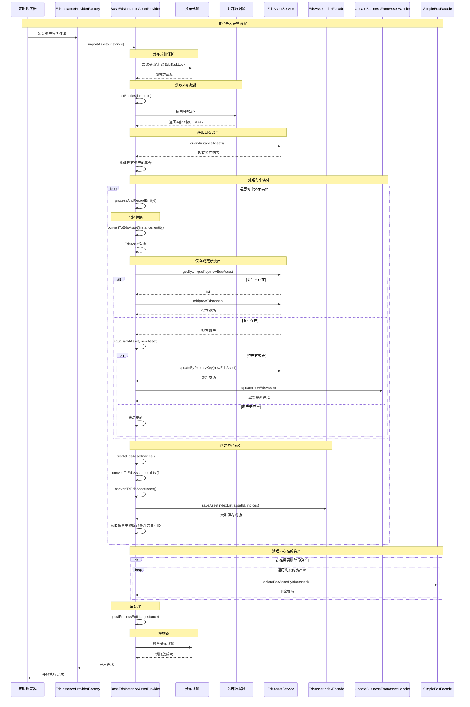
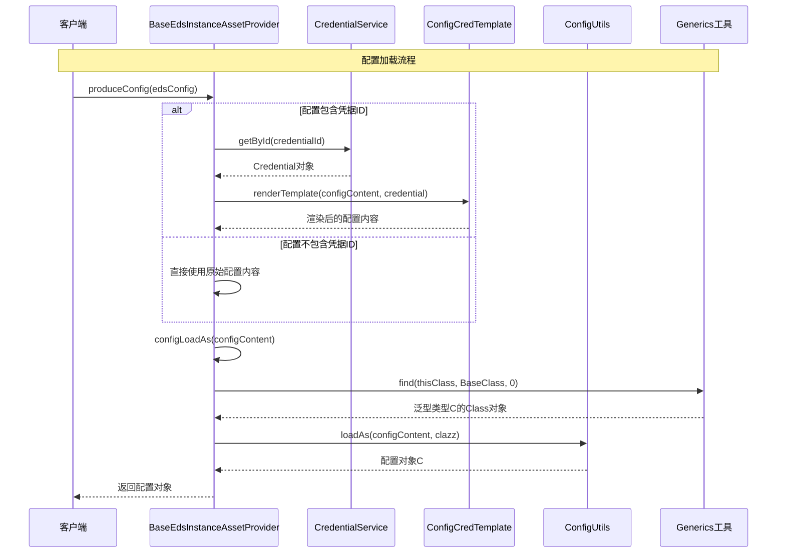
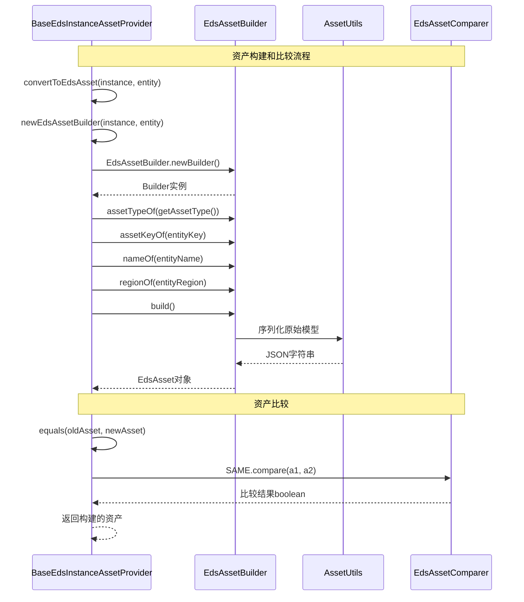
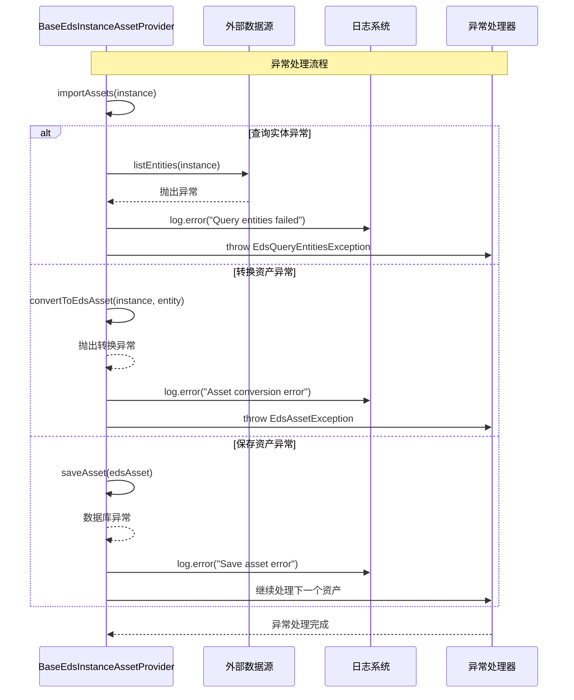
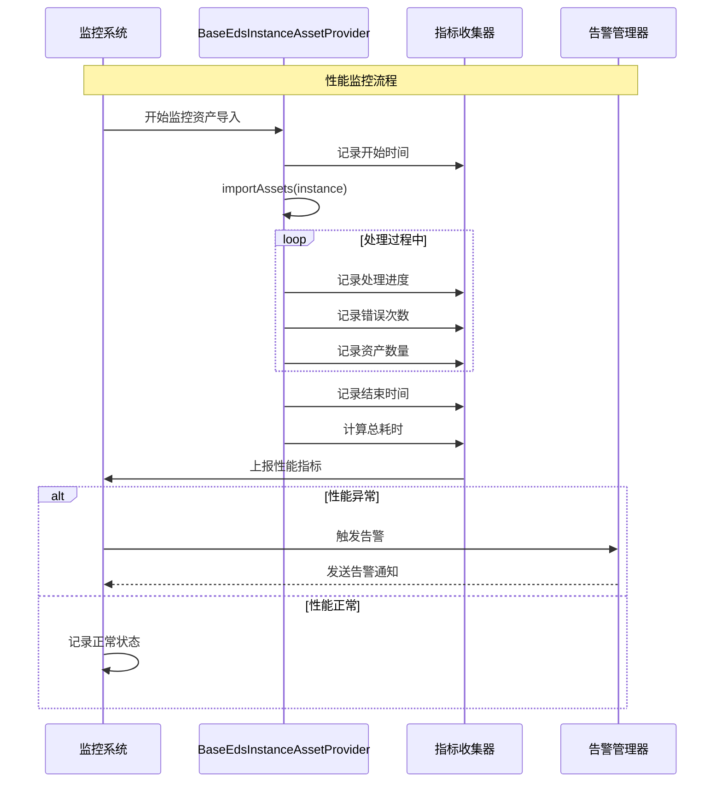

# BaseEdsInstanceAssetProvider 完整时序图

## 🔄 完整资产导入流程时序图

## 🔧 配置加载流程时序图

## 🏗️ 资产构建流程时序图

## 🔍 异常处理流程时序图

## 📊 性能监控流程时序图

---

**说明**: 这些时序图展示了BaseEdsInstanceAssetProvider在不同场景下的完整交互流程，包括正常流程、异常处理、配置加载和性能监控等方面，为理解系统运行机制提供了详细的可视化参考。
