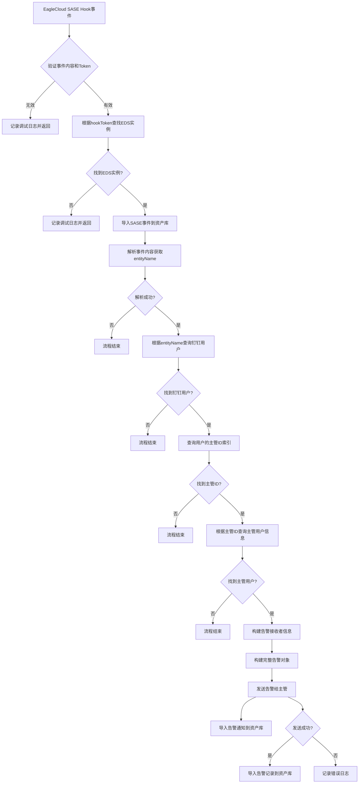

# EagleCloud SASE 数据安全告警处理系统

## 概述

`EagleCloudSaseFacadeImpl` 是一个企业级数据安全事件处理系统的核心实现，负责处理来自 EagleCloud SASE 平台的安全告警事件，并通过钉钉将告警信息路由给相关管理人员。

## 系统架构

### 核心组件

- **EagleCloudSaseFacadeImpl**: 主要业务逻辑处理器
- **DataSecurityAlertSender**: 告警消息发送服务
- **EdsInstanceProviderHolder**: 资产数据导入管理器
- **EdsAssetService**: 资产数据访问服务
- **EdsAssetIndexService**: 资产索引服务

### 依赖关系

```
EagleCloudSaseFacadeImpl
├── EdsEagleCloudSaseInstanceManager (实例管理)
├── EdsInstanceProviderHolderBuilder (资产导入构建器)
├── EdsAssetService (资产服务)
├── EdsAssetIndexService (资产索引服务)
└── DataSecurityAlertSender (告警发送器)
```

## 主要功能

### 1. 事件消费处理 (`consumeEvent`)

**输入参数:**
- `saseHook`: SASE Hook 事件对象
- `hookToken`: Hook 验证令牌

**处理流程:**

1. **事件验证**
   - 验证事件内容和 Hook Token 的有效性
   - 根据 Token 查找对应的 EDS 实例

2. **事件录入**
   - 将原始 SASE 事件导入到资产库
   - 资产类型: `EAGLECLOUD_SASE_DATA_SECURITY_EVENT`

3. **用户关系解析**
   - 从事件内容中提取 `entityName`（用户标识）
   - 查询对应的钉钉用户信息
   - 获取用户的主管信息

4. **告警构建与发送**
   - 构建告警接收者信息
   - 创建完整的告警对象
   - 发送告警给主管用户

5. **告警记录管理**
   - 导入告警通知记录
   - 导入告警发送记录（如果成功）

### 2. 告警发送 (`sendAlert`)

**功能:**
- 调用 `DataSecurityAlertSender` 发送告警消息
- 记录告警发送结果
- 异常处理和日志记录

## 数据模型

### 事件对象结构

```java
EagleCloudEventParam.SaseHook {
    String content;      // 事件内容
    String actionUrl;    // 处理链接
    String title;        // 告警标题
    String dataTime;     // 数据时间
    Long timestamp;      // 时间戳
}
```

### 告警对象结构

```java
EagleCloudEventParam.Alert {
    String actionUrl;           // 处理链接
    String title;              // 告警标题
    String dataTime;           // 数据时间
    Long timestamp;            // 时间戳
    String text;               // 告警文本
    Content content;           // 解析后的内容
    Receiver receiver;         // 接收者信息
}
```

## 资产类型管理

系统管理以下几种资产类型：

1. **EAGLECLOUD_SASE_DATA_SECURITY_EVENT**: 原始安全事件
2. **DINGTALK_USER**: 钉钉用户信息
3. **EAGLECLOUD_SASE_DATA_SECURITY_ALERT_NOTIFICATION**: 告警通知记录
4. **EAGLECLOUD_SASE_DATA_SECURITY_ALERT_RECORD**: 告警发送记录

## 错误处理

### 验证失败场景

- 事件内容或 Hook Token 为空
- 找不到对应的 EDS 实例
- 无法解析事件内容
- 找不到对应的钉钉用户
- 用户没有配置主管信息
- 找不到主管用户信息

### 异常处理

- 告警发送失败时记录错误日志
- 各个验证步骤都有对应的调试日志
- 使用 try-catch 包装关键操作

## 配置要求

### 必需的索引配置

- `DINGTALK_MANAGER_USER_ID`: 用户主管ID索引

### 实例配置

- EagleCloud SASE 实例需要配置有效的 Hook Token
- 钉钉用户数据需要同步到资产库
- 用户主管关系需要建立索引

## 使用示例

```java
@Autowired
private EagleCloudSaseFacade eagleCloudSaseFacade;

// 处理 SASE Hook 事件
EagleCloudEventParam.SaseHook saseHook = // ... 构建事件对象
String hookToken = "your-hook-token";

eagleCloudSaseFacade.consumeEvent(saseHook, hookToken);
```

## 监控和日志

### 日志级别

- **DEBUG**: 验证失败、流程中断信息
- **ERROR**: 告警发送失败等严重错误

### 关键监控点

- 事件处理成功率
- 告警发送成功率
- 用户关系解析成功率
- 资产导入成功率

## 扩展性

系统设计支持以下扩展：

1. **多种告警渠道**: 通过 `DataSecurityAlertSender` 接口扩展
2. **多种事件源**: 通过 `EdsInstanceProviderHolder` 支持不同数据源
3. **自定义告警规则**: 可在事件处理流程中添加规则引擎
4. **告警升级机制**: 可扩展多级告警路由

## 最佳实践

1. **定期检查用户主管关系**: 确保告警能正确路由
2. **监控告警发送状态**: 及时发现和处理发送失败
3. **配置合适的日志级别**: 便于问题排查
4. **定期清理历史告警记录**: 避免数据膨胀

## 流程图


