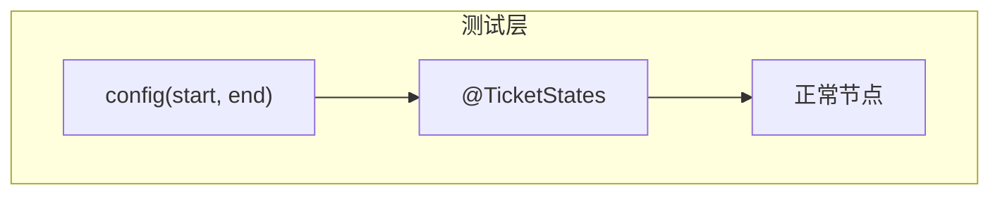

# Mermaid语法测试

## 测试修复后的语法

```mermaid
graph TB
    subgraph TestLayer["测试层"]
        NODE1["config(start, end)"]
        NODE2["@TicketStates"]
        NODE3[正常节点]
    end
    
    NODE1 --> NODE2
    NODE2 --> NODE3
```

如果这个图表能正常渲染，说明语法修复成功。
