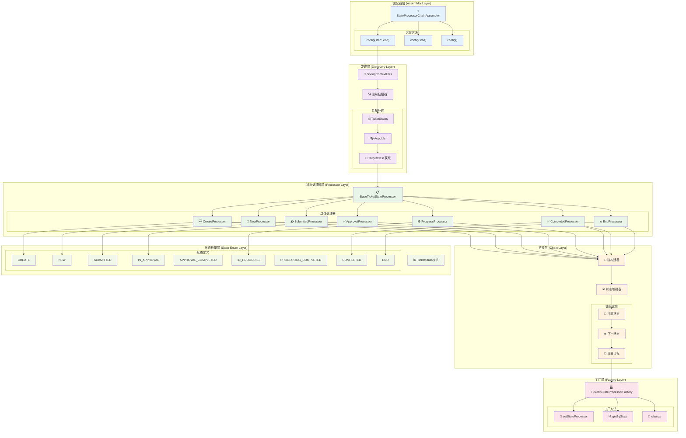
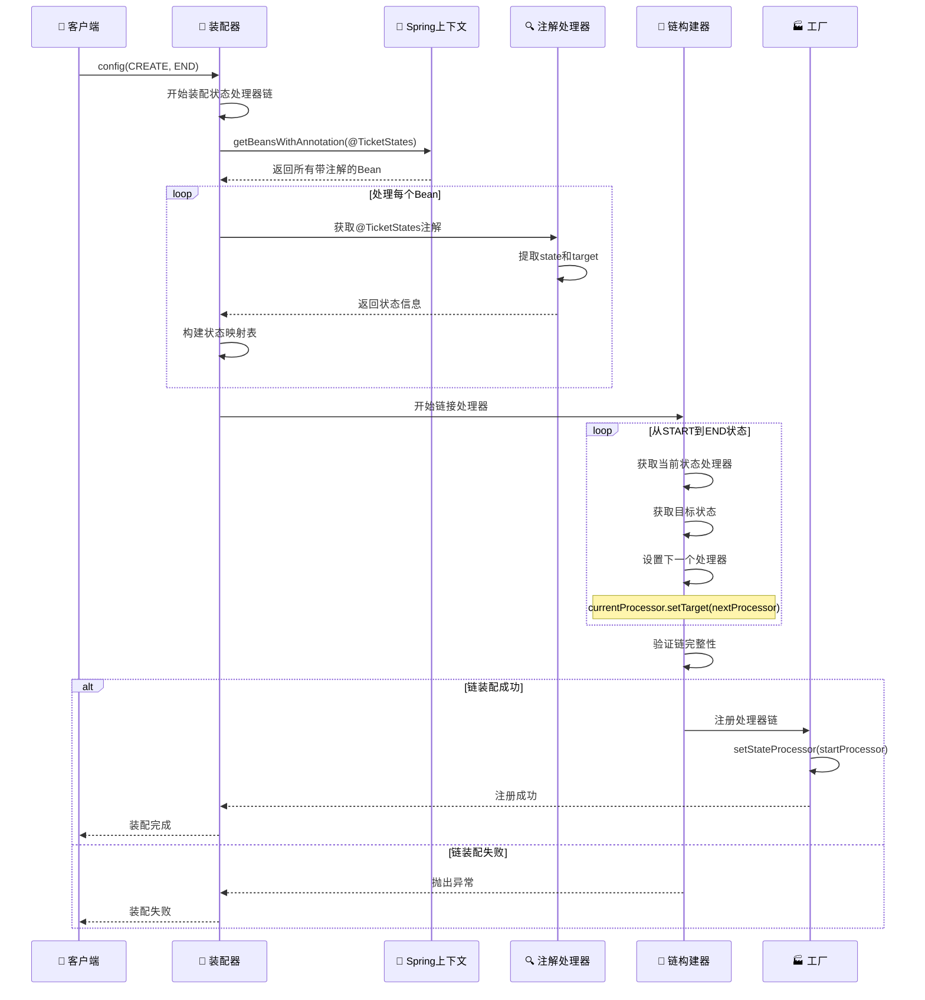
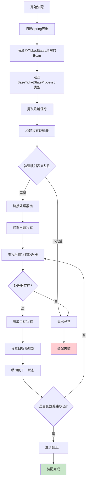
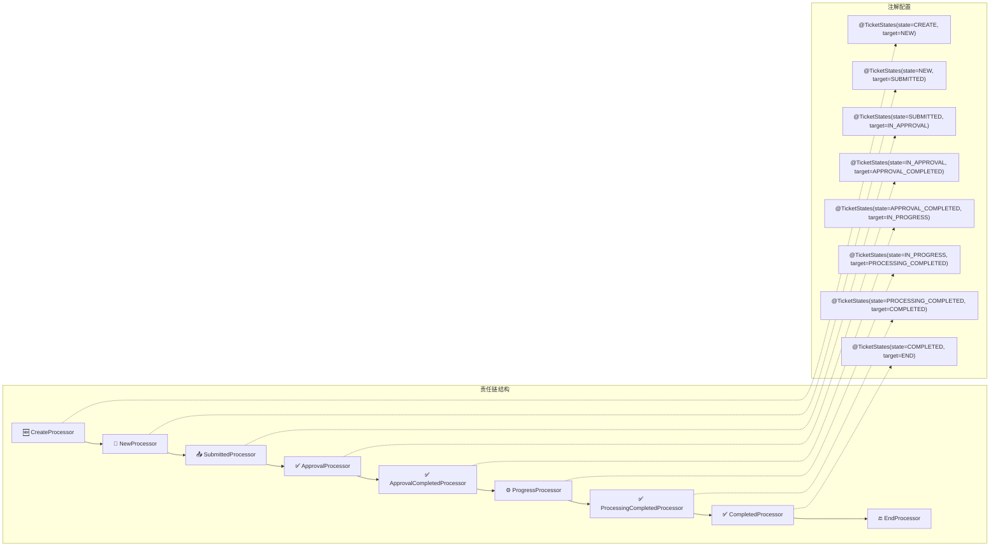
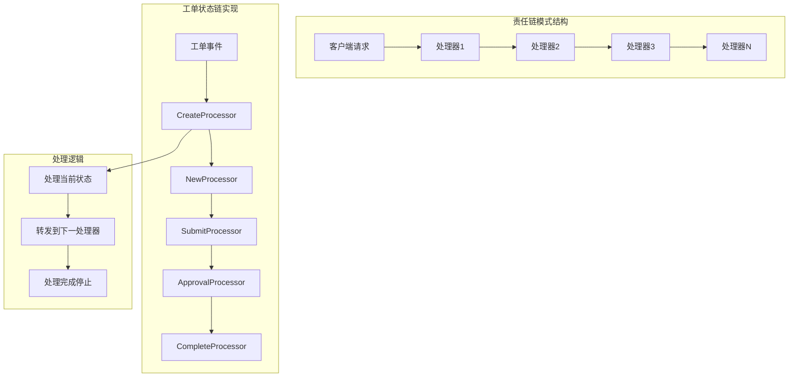
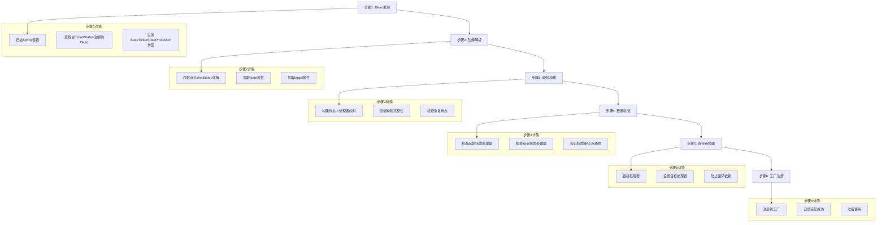

# 🔗 状态处理器链装配器架构分析

## 📋 概述

`StateProcessorChainAssembler` 是Cratos工单系统中的核心组件，负责自动发现和装配状态处理器链。它通过注解驱动的方式，将各个状态处理器按照状态转换顺序链接成责任链模式，实现了工单状态的自动化流转管理。

---

## 🏗️ 整体架构图



---

## 🔄 装配流程详解

### 1️⃣ 自动装配流程



### 2️⃣ 状态处理器发现机制



### 3️⃣ 责任链模式实现



---

## 🏷️ 核心组件分析

### 1. 状态处理器链装配器 (StateProcessorChainAssembler)

```java
@Slf4j
@Component
public class StateProcessorChainAssembler {
    
    /**
     * 核心装配方法 - 完整配置
     */
    public void config(TicketState startState, TicketState endState) throws NullPointerException {
        log.info("Starting automatic assembly of work order state processor chain: {} -> {}", 
                startState, endState);

        // 1. 发现所有带@TicketStates注解的Bean
        Map<String, Object> annotatedBeans = SpringContextUtils.getContext()
                .getBeansWithAnnotation(TicketStates.class);

        // 2. 构建状态处理器映射表
        Map<TicketState, BaseTicketStateProcessor<?>> stateProcessorMap = Maps.newHashMap();
        annotatedBeans.values().stream()
                .filter(bean -> bean instanceof BaseTicketStateProcessor<?>)
                .forEach(bean -> {
                    BaseTicketStateProcessor<?> processor = (BaseTicketStateProcessor<?>) bean;
                    TicketState processorState = AopUtils.getTargetClass(processor)
                            .getAnnotation(TicketStates.class).state();
                    stateProcessorMap.put(processorState, processor);
                });

        // 3. 链接处理器形成责任链
        TicketState currentState = startState;
        int maxIterations = stateProcessorMap.size();
        int iterationCount = 0;

        while (!currentState.equals(endState) && iterationCount < maxIterations) {
            BaseTicketStateProcessor<?> currentProcessor = stateProcessorMap.get(currentState);
            if (Objects.isNull(currentProcessor)) {
                throw new NullPointerException(String.format(
                        "State processor not found for state '%s'", currentState));
            }

            TicketState nextState = AopUtils.getTargetClass(currentProcessor)
                    .getAnnotation(TicketStates.class).target();

            log.info("Linking processor: {} ({} -> {})", 
                    currentProcessor.getClass().getSimpleName(), 
                    currentState.name(), nextState.name());

            currentProcessor.setTarget(stateProcessorMap.get(nextState));
            currentState = nextState;
            iterationCount++;
        }

        // 4. 注册装配好的链到工厂
        TicketInStateProcessorFactory.setStateProcessor(stateProcessorMap.get(startState));
        log.info("State processor chain assembly completed successfully");
    }
}
```

**核心特性**:
- 🔍 **自动发现**: 通过Spring容器自动发现所有状态处理器
- 🏷️ **注解驱动**: 基于`@TicketStates`注解配置状态转换关系
- 🔗 **责任链模式**: 自动链接处理器形成完整的责任链
- 🛡️ **安全检查**: 防止循环依赖和缺失处理器的情况
- 📊 **灵活配置**: 支持自定义起始和结束状态

### 2. 状态注解 (@TicketStates)

```java
@Target({ElementType.TYPE})
@Retention(RetentionPolicy.RUNTIME)
@Inherited
@Documented
public @interface TicketStates {
    TicketState state();                    // 当前状态
    TicketState target() default TicketState.END;  // 目标状态
}
```

**注解特性**:
- 🎯 **状态定义**: 明确定义处理器负责的状态
- ➡️ **转换目标**: 指定下一个状态转换目标
- 🔄 **默认结束**: 默认目标状态为END
- 📝 **运行时保留**: 支持运行时反射获取

### 3. 状态处理器工厂 (TicketInStateProcessorFactory)

```java
@SuppressWarnings({"rawtypes", "unchecked"})
public class TicketInStateProcessorFactory<Event extends WorkOrderTicketParam.HasTicketNo> {

    private static TicketStateProcessor stateProcessor;

    public static <Event extends WorkOrderTicketParam.HasTicketNo> void setStateProcessor(
            BaseTicketStateProcessor<Event> stateProcessor) {
        TicketInStateProcessorFactory.stateProcessor = stateProcessor;
    }

    public static TicketStateProcessor getByState(TicketState ticketState) {
        return Optional.ofNullable(stateProcessor.getByState(ticketState))
                .orElseThrow(() -> new IllegalStateException(
                        "No state processor found for ticket state: " + ticketState));
    }

    public static <Event> void change(TicketState ticketState, TicketStateChangeAction action,
                                      TicketEvent<Event> ticketEvent) {
        getByState(ticketState).change(action, ticketEvent);
    }
}
```

**工厂特性**:
- 🏭 **单例模式**: 全局唯一的状态处理器链入口
- 🔍 **状态查找**: 根据状态快速定位对应处理器
- 🔄 **状态变更**: 统一的状态变更入口
- ⚠️ **异常处理**: 处理器不存在时抛出明确异常

---

## 📊 状态处理器映射表

### 完整状态转换链

| 处理器类 | 当前状态 | 目标状态 | 主要功能 |
|---------|---------|---------|----------|
| `TicketCreateStateProcessor` | CREATE | NEW | 工单创建和初始化 |
| `TicketNewStateProcessor` | NEW | SUBMITTED | 工单编辑和准备提交 |
| `TicketSubmittedStateProcessor` | SUBMITTED | IN_APPROVAL | 工单提交和进入审批 |
| `TicketInApprovalStateProcessor` | IN_APPROVAL | APPROVAL_COMPLETED | 审批流程处理 |
| `TicketApprovalCompletedStateProcessor` | APPROVAL_COMPLETED | IN_PROGRESS | 审批完成后处理 |
| `TicketInProgressStateProcessor` | IN_PROGRESS | PROCESSING_COMPLETED | 工单执行处理 |
| `TicketProcessingCompletedStateProcessor` | PROCESSING_COMPLETED | COMPLETED | 执行完成后处理 |
| `TicketCompletedStateProcessor` | COMPLETED | END | 工单完成和清理 |

### 状态处理器注解示例

```java
// 创建状态处理器
@Component
@TicketStates(state = TicketState.CREATE, target = TicketState.NEW)
public class TicketCreateStateProcessor extends BaseTicketStateProcessor<WorkOrderTicketParam.CreateTicket> {
    // 处理工单创建逻辑
}

// 审批状态处理器
@Component
@TicketStates(state = TicketState.IN_APPROVAL, target = TicketState.APPROVAL_COMPLETED)
public class TicketInApprovalStateProcessor extends BaseTicketStateProcessor<WorkOrderTicketParam.ApprovalTicket> {
    // 处理审批逻辑
}

// 完成状态处理器
@Component
@TicketStates(state = TicketState.COMPLETED, target = TicketState.END)
public class TicketCompletedStateProcessor extends BaseTicketStateProcessor<WorkOrderTicketParam.SimpleTicketNo> {
    // 处理工单完成逻辑
}
```

---
## 🔧 装配算法深度分析

### 1. 核心装配算法

```java
// 核心链接算法
public void config(TicketState startState, TicketState endState) {
    // 1. 发现阶段
    Map<String, Object> annotatedBeans = SpringContextUtils.getContext()
            .getBeansWithAnnotation(TicketStates.class);
    
    // 2. 映射构建阶段
    Map<TicketState, BaseTicketStateProcessor<?>> stateProcessorMap = Maps.newHashMap();
    annotatedBeans.values().stream()
            .filter(bean -> bean instanceof BaseTicketStateProcessor<?>)
            .forEach(bean -> {
                BaseTicketStateProcessor<?> processor = (BaseTicketStateProcessor<?>) bean;
                TicketState processorState = AopUtils.getTargetClass(processor)
                        .getAnnotation(TicketStates.class).state();
                stateProcessorMap.put(processorState, processor);
            });
    
    // 3. 链接阶段
    TicketState currentState = startState;
    int maxIterations = stateProcessorMap.size();
    int iterationCount = 0;

    while (!currentState.equals(endState) && iterationCount < maxIterations) {
        BaseTicketStateProcessor<?> currentProcessor = stateProcessorMap.get(currentState);
        
        // 安全检查
        if (Objects.isNull(currentProcessor)) {
            throw new NullPointerException("State processor not found for state: " + currentState);
        }

        // 获取下一个状态
        TicketState nextState = AopUtils.getTargetClass(currentProcessor)
                .getAnnotation(TicketStates.class).target();

        // 链接处理器
        currentProcessor.setTarget(stateProcessorMap.get(nextState));
        
        currentState = nextState;
        iterationCount++;
    }
    
    // 4. 注册阶段
    TicketInStateProcessorFactory.setStateProcessor(stateProcessorMap.get(startState));
}
```

### 2. 装配配置方法

```java
// 方法重载提供不同的配置选项
public class StateProcessorChainAssembler {
    
    // 完整配置 - 自定义起始和结束状态
    public void config(TicketState startState, TicketState endState) {
        // 完整的装配逻辑
    }
    
    // 简化配置 - 自定义起始状态，默认结束状态为END
    public void config(TicketState startState) {
        config(startState, TicketState.END);
    }
    
    // 默认配置 - 标准的CREATE到END的完整链
    public void config() {
        config(TicketState.CREATE, TicketState.END);
    }
}
```

**配置灵活性**:
- 🎯 **完整控制**: 可以指定任意起始和结束状态
- 🔄 **部分链**: 可以只装配部分状态链
- 📋 **标准链**: 提供默认的完整状态链配置

### 3. 异常处理和验证

```java
// 异常处理机制
public void config(TicketState startState, TicketState endState) {
    try {
        // 装配逻辑...
        
        // 循环检测
        if (iterationCount >= maxIterations) {
            log.error("State processor chain assembly failed: Maximum iteration limit ({}) reached. " +
                     "This indicates a circular dependency or missing end state processor. " +
                     "Current state: {}, Target end state: {}", 
                     maxIterations, currentState, endState);
            throw new IllegalStateException("Circular dependency detected in state processor chain");
        }
        
        // 完整性验证
        validateChainCompleteness(stateProcessorMap, startState, endState);
        
    } catch (Exception e) {
        log.error("Failed to assemble state processor chain: {}", e.getMessage(), e);
        throw new RuntimeException("State processor chain assembly failed", e);
    }
}

// 链完整性验证
private void validateChainCompleteness(Map<TicketState, BaseTicketStateProcessor<?>> stateProcessorMap,
                                     TicketState startState, TicketState endState) {
    // 验证起始处理器存在
    if (!stateProcessorMap.containsKey(startState)) {
        throw new IllegalStateException("Start state processor not found: " + startState);
    }
    
    // 验证结束处理器存在
    if (!stateProcessorMap.containsKey(endState)) {
        throw new IllegalStateException("End state processor not found: " + endState);
    }
    
    // 验证链的连通性
    validateChainConnectivity(stateProcessorMap, startState, endState);
}
```

---

## 🎯 设计模式分析

### 1. 责任链模式 (Chain of Responsibility)



### 2. 工厂模式 (Factory Pattern)

```java
// 状态处理器工厂
public class TicketInStateProcessorFactory {
    private static TicketStateProcessor stateProcessor;  // 链的头节点
    
    // 设置处理器链
    public static void setStateProcessor(BaseTicketStateProcessor stateProcessor) {
        TicketInStateProcessorFactory.stateProcessor = stateProcessor;
    }
    
    // 根据状态获取处理器
    public static TicketStateProcessor getByState(TicketState ticketState) {
        return stateProcessor.getByState(ticketState);
    }
    
    // 触发状态变更
    public static void change(TicketState ticketState, TicketStateChangeAction action,
                             TicketEvent ticketEvent) {
        getByState(ticketState).change(action, ticketEvent);
    }
}
```

### 3. 模板方法模式 (Template Method)

```java
// 基础状态处理器模板
public abstract class BaseTicketStateProcessor<Event> implements TicketStateProcessor<Event> {
    
    // 模板方法 - 定义处理流程
    @Override
    public final void process(TicketEvent<Event> event) {
        try {
            preProcess(event);      // 前置处理
            doProcess(event);       // 核心处理逻辑
            postProcess(event);     // 后置处理
            
            // 责任链传递
            if (targetProcessor != null) {
                targetProcessor.process(event);
            }
        } catch (Exception e) {
            handleException(event, e);
        }
    }
    
    // 抽象方法 - 子类实现
    protected abstract void doProcess(TicketEvent<Event> event);
    
    // 钩子方法 - 子类可选择性重写
    protected void preProcess(TicketEvent<Event> event) {}
    protected void postProcess(TicketEvent<Event> event) {}
    protected void handleException(TicketEvent<Event> event, Exception e) {
        log.error("状态处理器执行异常: {}", e.getMessage(), e);
    }
}
```

---

## 🔄 装配过程可视化

### 装配步骤详解



### 装配配置示例

```java
// 配置示例
@Configuration
public class WorkOrderStateConfiguration {
    
    @Autowired
    private StateProcessorChainAssembler assembler;
    
    @PostConstruct
    public void initStateProcessorChain() {
        // 标准配置 - CREATE到END的完整链
        assembler.config();
        
        // 或者自定义配置
        // assembler.config(TicketState.CREATE, TicketState.COMPLETED);
    }
}
```

---

## ⚠️ 注意事项和最佳实践

### 1. 装配安全检查

| 检查项 | 说明 | 异常类型 |
|--------|------|----------|
| **处理器存在性** | 每个状态必须有对应处理器 | `NullPointerException` |
| **循环依赖检测** | 防止状态转换形成循环 | `IllegalStateException` |
| **链完整性** | 确保从起始到结束状态连通 | `IllegalStateException` |
| **注解完整性** | 所有处理器必须有@TicketStates注解 | `AnnotationMissingException` |
| **类型匹配** | Bean必须是BaseTicketStateProcessor类型 | `ClassCastException` |

### 2. 常见问题及解决方案

| 问题 | 可能原因 | 解决方案 |
|------|----------|----------|
| **处理器未找到** | 缺少某个状态的处理器 | 实现缺失状态的处理器类 |
| **循环依赖** | 状态转换形成环路 | 检查注解的target配置 |
| **装配超时** | 状态链过长或存在死循环 | 检查状态转换逻辑 |
| **注解缺失** | 处理器类缺少@TicketStates注解 | 添加必要的注解 |
| **Spring容器异常** | Bean注册失败 | 检查Spring配置 |

### 3. 最佳实践

#### 🎯 状态处理器设计
```java
// 推荐的状态处理器实现
@Component
@TicketStates(state = TicketState.IN_PROGRESS, target = TicketState.PROCESSING_COMPLETED)
public class TicketInProgressStateProcessor extends BaseTicketStateProcessor<WorkOrderTicketParam.SimpleTicketNo> {
    
    @Override
    protected void doProcess(TicketEvent<WorkOrderTicketParam.SimpleTicketNo> event) {
        // 1. 参数验证
        validateEvent(event);
        
        // 2. 业务逻辑处理
        processBusinessLogic(event);
        
        // 3. 状态更新
        updateTicketState(event);
        
        // 4. 通知发送
        sendNotifications(event);
    }
    
    @Override
    protected void preProcess(TicketEvent<WorkOrderTicketParam.SimpleTicketNo> event) {
        // 前置检查
        log.info("开始处理工单: {}", event.getData().getTicketNo());
    }
    
    @Override
    protected void postProcess(TicketEvent<WorkOrderTicketParam.SimpleTicketNo> event) {
        // 后置处理
        log.info("完成处理工单: {}", event.getData().getTicketNo());
    }
    
    @Override
    protected void handleException(TicketEvent<WorkOrderTicketParam.SimpleTicketNo> event, Exception e) {
        // 异常处理
        log.error("处理工单异常: ticketNo={}, error={}", 
                 event.getData().getTicketNo(), e.getMessage(), e);
        // 可以在这里实现重试逻辑或者错误恢复
    }
}
```

#### 🔗 链接配置建议
```java
// 推荐的状态转换配置
@TicketStates(state = TicketState.CREATE, target = TicketState.NEW)          // 创建->新建
@TicketStates(state = TicketState.NEW, target = TicketState.SUBMITTED)       // 新建->已提交
@TicketStates(state = TicketState.SUBMITTED, target = TicketState.IN_APPROVAL) // 已提交->审批中
// ... 其他状态转换
```

---

## 📊 监控和调试

### 1. 装配过程监控

```java
// 装配过程日志示例
2025-08-22 10:00:00 INFO  StateProcessorChainAssembler - Starting automatic assembly of work order state processor chain: CREATE -> END
2025-08-22 10:00:00 INFO  StateProcessorChainAssembler - Discovered 8 state processors with @TicketStates annotation
2025-08-22 10:00:00 INFO  StateProcessorChainAssembler - Linking processor: TicketCreateStateProcessor (CREATE -> NEW)
2025-08-22 10:00:00 INFO  StateProcessorChainAssembler - Linking processor: TicketNewStateProcessor (NEW -> SUBMITTED)
2025-08-22 10:00:00 INFO  StateProcessorChainAssembler - Linking processor: TicketSubmittedStateProcessor (SUBMITTED -> IN_APPROVAL)
2025-08-22 10:00:00 INFO  StateProcessorChainAssembler - Linking processor: TicketInApprovalStateProcessor (IN_APPROVAL -> APPROVAL_COMPLETED)
2025-08-22 10:00:00 INFO  StateProcessorChainAssembler - Linking processor: TicketApprovalCompletedStateProcessor (APPROVAL_COMPLETED -> IN_PROGRESS)
2025-08-22 10:00:00 INFO  StateProcessorChainAssembler - Linking processor: TicketInProgressStateProcessor (IN_PROGRESS -> PROCESSING_COMPLETED)
2025-08-22 10:00:00 INFO  StateProcessorChainAssembler - Linking processor: TicketProcessingCompletedStateProcessor (PROCESSING_COMPLETED -> COMPLETED)
2025-08-22 10:00:00 INFO  StateProcessorChainAssembler - Linking processor: TicketCompletedStateProcessor (COMPLETED -> END)
2025-08-22 10:00:00 INFO  StateProcessorChainAssembler - State processor chain assembly completed successfully
```

### 2. 调试工具

```java
// 状态链调试工具
@Component
public class StateChainDebugger {
    
    public void printChainStructure() {
        TicketStateProcessor processor = TicketInStateProcessorFactory.getByState(TicketState.CREATE);
        
        System.out.println("=== 状态处理器链结构 ===");
        int index = 1;
        while (processor != null) {
            TicketStates annotation = processor.getClass().getAnnotation(TicketStates.class);
            System.out.printf("%d. %s: %s -> %s%n", 
                            index++, 
                            processor.getClass().getSimpleName(),
                            annotation.state().name(),
                            annotation.target().name());
            processor = processor.getTarget();
        }
        System.out.println("=== 链结构打印完成 ===");
    }
    
    public void validateChainIntegrity() {
        // 验证链的完整性
        Set<TicketState> visitedStates = new HashSet<>();
        TicketStateProcessor processor = TicketInStateProcessorFactory.getByState(TicketState.CREATE);
        
        while (processor != null) {
            TicketStates annotation = processor.getClass().getAnnotation(TicketStates.class);
            TicketState currentState = annotation.state();
            
            if (visitedStates.contains(currentState)) {
                throw new IllegalStateException("检测到循环依赖: " + currentState);
            }
            
            visitedStates.add(currentState);
            processor = processor.getTarget();
        }
        
        System.out.println("链完整性验证通过，访问了 " + visitedStates.size() + " 个状态");
    }
}
```

---

## 🎯 总结

状态处理器链装配器是Cratos工单系统的核心基础设施，它提供了：

### ✅ 核心优势

1. **🤖 自动化装配**:
   - 基于注解的自动发现机制
   - 无需手动配置处理器链
   - 支持动态添加新的状态处理器

2. **🔗 责任链模式**:
   - 清晰的状态转换逻辑
   - 松耦合的处理器设计
   - 易于扩展和维护

3. **🛡️ 安全可靠**:
   - 完整的异常处理机制
   - 循环依赖检测
   - 链完整性验证

4. **📊 灵活配置**:
   - 支持自定义起始和结束状态
   - 支持部分状态链装配
   - 提供默认配置选项

### 🚀 技术特色

- **注解驱动**: 通过`@TicketStates`注解声明状态转换关系
- **反射机制**: 使用AOP工具获取真实类的注解信息
- **Spring集成**: 深度集成Spring容器的Bean管理
- **工厂模式**: 统一的状态处理器获取和调用入口

这个装配器为整个工单系统提供了强大而灵活的状态管理基础，是实现复杂工单流程的关键技术组件。

---

**文档版本**: v1.0  
**创建时间**: 2025-08-22  
**分析范围**: Cratos状态处理器链装配器  
**技术栈**: Spring Boot + 责任链模式 + 注解驱动 + 反射机制
