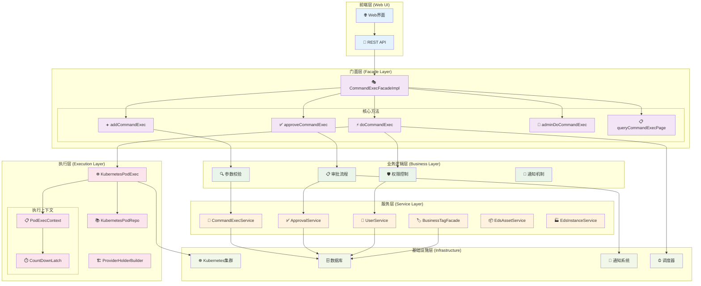
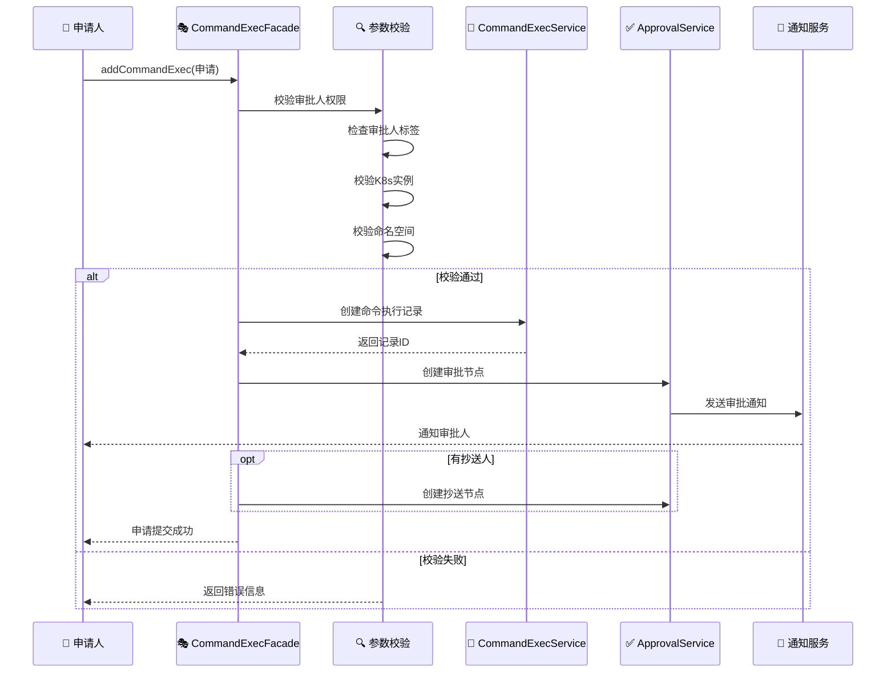
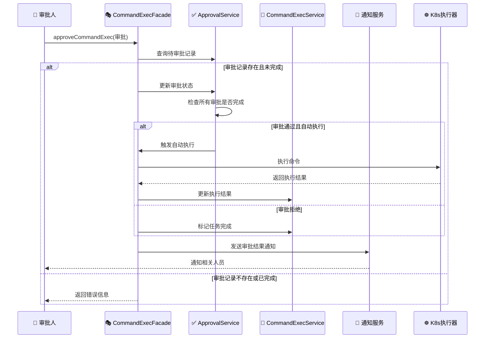
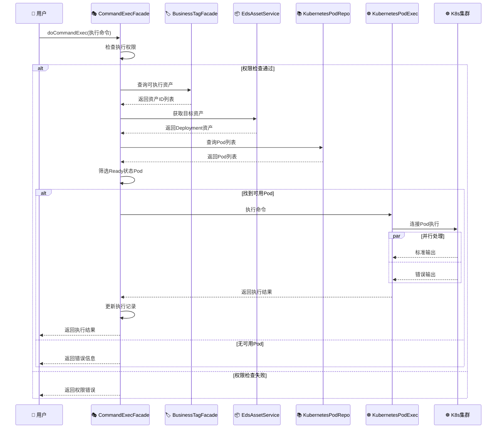
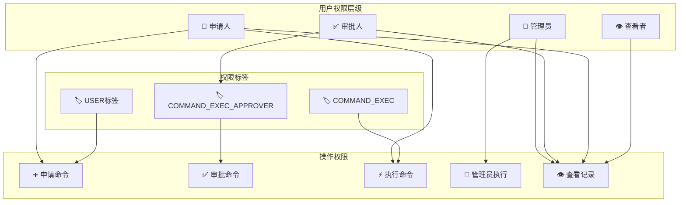
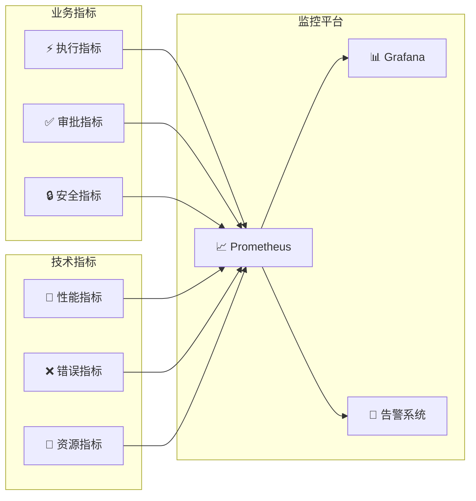

# 🚀 命令执行门面类深度架构分析

## 📋 概述

基于Cratos系统的`CommandExecFacadeImpl`类深度分析，该类实现了企业级的Kubernetes Pod命令执行功能，包含完整的审批流程、权限控制和安全执行机制。

---

## 🏗️ 整体架构图



---

## 🔄 核心业务流程

### 1️⃣ 命令申请流程



### 2️⃣ 审批流程



### 3️⃣ 命令执行流程



---

## 🏷️ 核心组件深度分析

### 1. 门面类主体结构

```java
@Slf4j
@Component
@RequiredArgsConstructor
public class CommandExecFacadeImpl implements CommandExecFacade {
    
    // 依赖注入 - 11个核心服务
    private final CommandExecService commandExecService;
    private final CommandExecApprovalService commandExecApprovalService;
    private final UserService userService;
    private final BusinessTagFacade businessTagFacade;
    private final EdsInstanceService edsInstanceService;
    private final CommandExecWrapper commandExecWrapper;
    private final KubernetesPodExec kubernetesPodExec;
    private final KubernetesPodRepo kubernetesPodRepo;
    private final EdsInstanceProviderHolderBuilder holderBuilder;
    private final EdsAssetService edsAssetService;
    private final CommandExecNoticeFacade commandExecNoticeFacade;
    
    private static final long DEFAULT_MAX_WAITING_TIME = 10L;
}
```

**设计特点**:
- 🏗️ **门面模式**: 统一对外接口，隐藏复杂的内部逻辑
- 💉 **依赖注入**: 使用`@RequiredArgsConstructor`自动注入11个依赖
- 📝 **日志记录**: 集成Slf4j日志框架
- ⚙️ **配置管理**: 定义默认等待时间常量

### 2. 命令申请处理 (addCommandExec)

```java
@Override
@SetSessionUserToParam(desc = "Set ApplyUser to CommandExecParam")
@Transactional(rollbackFor = CommandExecException.class)
public void addCommandExec(CommandExecParam.AddCommandExec addCommandExec) {
    // 1. 参数转换
    CommandExec commandExec = addCommandExec.toTarget();
    
    // 2. 审批人校验
    User approverUser = userService.getByUsername(commandExec.getApprovedBy());
    if (!businessTagFacade.containsTag(BusinessTypeEnum.USER.name(), 
        approverUser.getId(), SysTagKeys.COMMAND_EXEC_APPROVER.getKey())) {
        throw new CommandExecException("审批人无审批资格");
    }
    
    // 3. K8s实例校验
    EdsInstance edsInstance = edsInstanceService.getById(instanceId);
    if (!EdsInstanceTypeEnum.KUBERNETES.name().equals(edsInstance.getEdsType())) {
        throw new CommandExecException("实例类型错误");
    }
    
    // 4. 构建执行目标
    CommandExecModel.ExecTarget execTarget = CommandExecModel.ExecTarget.builder()
        .instance(instance)
        .useDefaultExecContainer(addCommandExec.getExecTarget().isUseDefaultExecContainer())
        .maxWaitingTime(maxWaitingTime)
        .build();
    
    // 5. 保存记录并创建审批流程
    commandExecService.add(commandExec);
    createApproval(addCommandExec, commandExec);
}
```

**核心验证逻辑**:
1. **审批人验证**: 检查用户是否具有`COMMAND_EXEC_APPROVER`标签
2. **实例验证**: 确保目标实例是Kubernetes类型
3. **命名空间验证**: 验证命名空间参数不为空
4. **执行目标构建**: 创建包含实例信息的执行目标对象

### 3. 审批流程处理 (approveCommandExec)

```java
@Override
@SetSessionUserToParam
public void approveCommandExec(CommandExecParam.ApproveCommandExec approveCommandExec) {
    // 1. 获取命令执行记录
    CommandExec commandExec = commandExecService.getById(approveCommandExec.getCommandExecId());
    
    // 2. 状态检查
    if (Boolean.TRUE.equals(commandExec.getCompleted())) {
        throw new CommandExecException("命令已完成");
    }
    
    // 3. 查询待审批记录
    CommandExecApproval commandExecApproval = commandExecApprovalService.queryUnapprovedRecord(
        approveCommandExec.getCommandExecId(), approveCommandExec.getUsername());
    
    // 4. 更新审批状态
    CommandExecApprovalStatusEnum approvalStatus = CommandExecApprovalStatusEnum.valueOf(
        approveCommandExec.getApprovalAction());
    commandExecApproval.setApprovalStatus(approvalStatus.name());
    commandExecApproval.setApprovalCompleted(true);
    commandExecApproval.setApprovalAt(new Date());
    
    // 5. 检查是否可以自动执行
    if (commandExecApprovalService.approvalCompletedAndApproved(commandExec.getId())) {
        if (Boolean.TRUE.equals(commandExec.getAutoExec())) {
            autoCommandExec(commandExec);
        }
    }
    
    // 6. 发送通知
    commandExecNoticeFacade.sendApprovalResultNotice(commandExecApproval);
}
```

**审批状态机**:
```
待审批 → 审批中 → 审批完成
   ↓        ↓         ↓
 通知    状态更新   自动执行(可选)
```

### 4. 命令执行核心 (doCommandExec)

```java
@SuppressWarnings("unchecked")
private void doCommandExec(CommandExec commandExec, Long maxWaitingTime) {
    // 1. 解析执行目标
    CommandExecModel.ExecTarget execTarget = CommandExecModel.loadAs(commandExec);
    String namespace = execTarget.getInstance().getNamespace();
    
    // 2. 构建K8s提供者
    EdsInstanceProviderHolder<EdsKubernetesConfigModel.Kubernetes, ?> holder = 
        holderBuilder.newHolder(execTarget.getInstance().getId(), 
            EdsAssetTypeEnum.KUBERNETES_DEPLOYMENT.name());
    
    // 3. 创建执行上下文
    PodExecContext execContext = PodExecContext.builder()
        .maxWaitingTime(maxWaitingTime)
        .command(commandExec.getCommand())
        .build();
    
    // 4. 查询可执行资产
    List<Integer> assetIds = businessTagFacade.queryByBusinessTypeAndTagKey(
        BusinessTypeEnum.EDS_ASSET.name(), SysTagKeys.COMMAND_EXEC.getKey());
    
    // 5. 获取目标资产
    EdsAsset asset = getEdsAsset(execTarget, assetIds);
    
    // 6. 查询Pod列表
    List<Pod> pods = kubernetesPodRepo.list(kubernetes, namespace, asset.getName());
    
    // 7. 筛选Ready状态Pod
    Pod execPod = pods.stream()
        .filter(KubeUtils::isReadyOf)
        .findFirst()
        .orElseThrow(() -> new CommandExecException("无可用执行Pod"));
    
    // 8. 执行命令
    kubernetesPodExec.exec(kubernetes, namespace, execPod.getMetadata().getName(), 
        execContext, new CountDownLatch(1));
    
    // 9. 更新执行结果
    commandExec.setOutMsg(execContext.getOutMsg());
    commandExec.setErrorMsg(execContext.getErrorMsg());
    commandExec.setSuccess(execContext.getSuccess());
    commandExec.setCompleted(true);
    commandExec.setCompletedAt(new Date());
    commandExecService.updateByPrimaryKey(commandExec);
}
```

**执行流程关键点**:
1. **资产筛选**: 只执行带有`COMMAND_EXEC`标签的资产
2. **Pod筛选**: 只选择Ready状态的Pod执行
3. **并发控制**: 使用`CountDownLatch`控制执行同步
4. **结果记录**: 完整记录标准输出、错误输出和执行状态

---

## 🔐 安全机制分析

### 权限控制矩阵



### 安全检查清单

| 检查项 | 检查内容 | 实现方式 |
|--------|----------|----------|
| **身份认证** | 用户身份验证 | `@SetSessionUserToParam` |
| **权限验证** | 审批人资格检查 | `businessTagFacade.containsTag()` |
| **资源验证** | K8s实例类型检查 | `EdsInstanceTypeEnum.KUBERNETES` |
| **目标验证** | 执行目标资产检查 | `COMMAND_EXEC`标签验证 |
| **状态验证** | 任务状态检查 | `commandExec.getCompleted()` |
| **并发控制** | 分布式锁 | `@SchedulerLock` |
| **事务控制** | 数据一致性 | `@Transactional` |

---

## ⚡ 性能优化策略

### 1. 并发控制优化

```java
// 分布式锁防止重复执行
@SchedulerLock(name = SchedulerLockNameConstants.DO_COMMAND_EXEC, 
               lockAtMostFor = "10s", lockAtLeastFor = "10s")
public void doCommandExec(CommandExecParam.DoCommandExec doCommandExec) {
    // 执行逻辑
}
```

### 2. 数据库优化

```java
// 事务控制，异常回滚
@Transactional(rollbackFor = CommandExecException.class)
public void addCommandExec(CommandExecParam.AddCommandExec addCommandExec) {
    // 业务逻辑
}
```

### 3. 资源筛选优化

```java
// 流式处理，提前过滤
Pod execPod = pods.stream()
    .filter(KubeUtils::isReadyOf)  // 只选择Ready状态Pod
    .findFirst()                   // 找到第一个即返回
    .orElseThrow(() -> new CommandExecException("无可用执行Pod"));
```

### 4. 异步通知优化

```java
// 异步发送通知，不阻塞主流程
commandExecNoticeFacade.sendApprovalNotice(approver);
commandExecNoticeFacade.sendApprovalResultNotice(commandExecApproval);
```

---

## 📊 监控指标设计

### 关键性能指标 (KPI)

| 指标类型 | 指标名称 | 目标值 | 监控方式 |
|---------|---------|--------|---------|
| 🚀 **性能** | 命令执行时间 | < 30s | 执行时长统计 |
| 🚀 **性能** | 审批响应时间 | < 2h | 审批时长统计 |
| ✅ **成功率** | 命令执行成功率 | > 95% | 成功/失败比例 |
| ✅ **成功率** | 审批通过率 | > 80% | 通过/拒绝比例 |
| 🔒 **安全** | 权限验证失败率 | < 1% | 权限检查统计 |
| 📊 **业务** | 日均命令执行量 | 监控趋势 | 执行次数统计 |
| 📊 **业务** | 平均审批时长 | < 4h | 审批流程统计 |

### 监控架构



---

## 🎯 总结与建议

### ✅ 架构优势

1. **🏗️ 清晰的分层架构**:
   - 门面层统一对外接口
   - 业务层处理核心逻辑
   - 服务层提供基础能力

2. **🔐 完善的安全机制**:
   - 多层权限验证
   - 标签驱动的访问控制
   - 完整的审批流程

3. **⚡ 高性能设计**:
   - 分布式锁防并发
   - 流式处理优化性能
   - 异步通知不阻塞

4. **🛡️ 可靠性保障**:
   - 事务控制保证一致性
   - 异常处理机制完善
   - 状态检查防重复执行

### 🔧 改进建议

1. **📊 监控增强**:
   - 添加更详细的执行指标
   - 实现链路追踪
   - 增加业务告警

2. **🚀 性能优化**:
   - Pod选择策略优化
   - 批量操作支持
   - 缓存机制引入

3. **🔒 安全加固**:
   - 命令内容审计
   - 敏感操作二次确认
   - 操作日志完整记录

4. **🔄 流程优化**:
   - 支持多级审批
   - 审批流程可配置
   - 自动化程度提升

这个命令执行门面类体现了企业级应用的设计理念，为Kubernetes环境下的安全命令执行提供了完整的解决方案。
