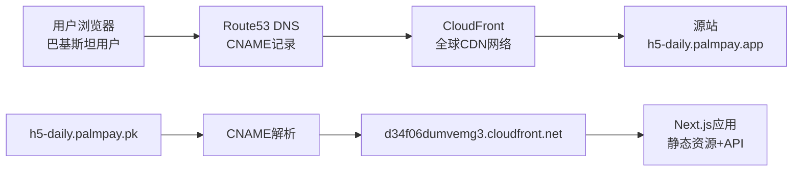
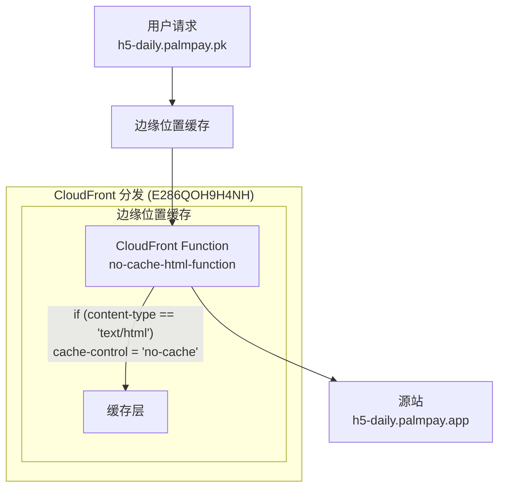
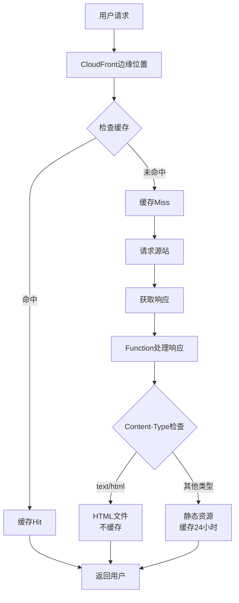
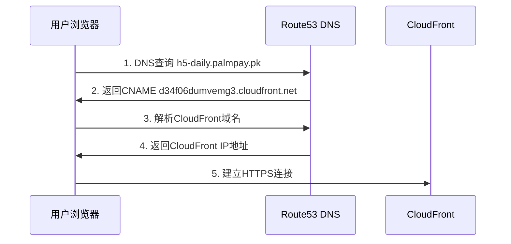
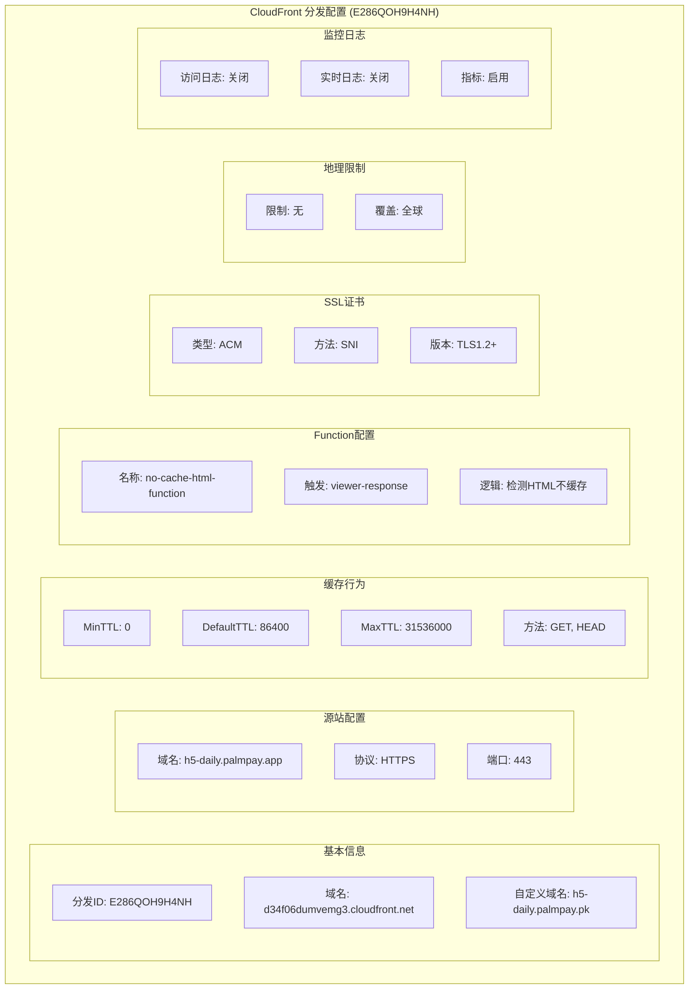
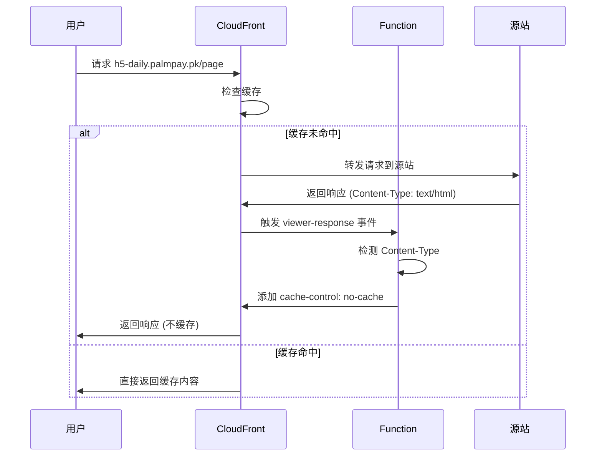
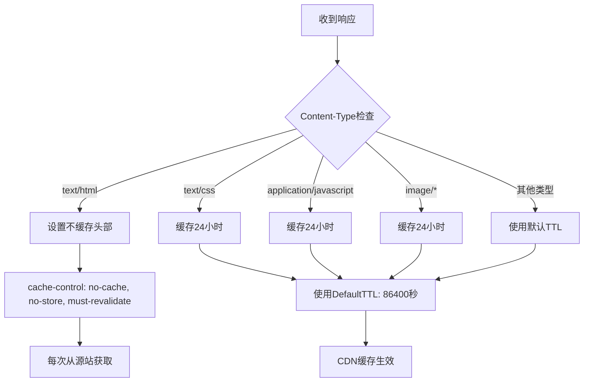

# h5-daily.palmpay.pk 架构图

## 整体架构流程图

```mermaid
graph LR
    A[用户浏览器<br/>巴基斯坦用户] --> B[Route53 DNS<br/>CNAME记录]
    B --> C[CloudFront<br/>全球CDN网络]
    C --> D[源站<br/>h5-daily.palmpay.app]
    
    A1[h5-daily.palmpay.pk] --> B1[CNAME解析]
    B1 --> C1[d34f06dumvemg3.cloudfront.net]
    C1 --> D1[Next.js应用<br/>静态资源+API]
```

## 详细组件架构图

```mermaid
graph TB
    subgraph "CloudFront 分发 (E286QOH9H4NH)"
        subgraph "边缘位置缓存"
            CF[CloudFront Function<br/>no-cache-html-function]
            CACHE[缓存层]
        end
    end
    
    USER[用户请求<br/>h5-daily.palmpay.pk] --> EDGE[边缘位置缓存]
    EDGE --> CF
    CF --> ORIGIN[源站<br/>h5-daily.palmpay.app]
    
    CF --> |"if (content-type == 'text/html')<br/>cache-control = 'no-cache'"| CACHE
```

## 缓存策略流程图

```mermaid
flowchart TD
    A[用户请求] --> B[CloudFront边缘位置]
    B --> C{检查缓存}
    C -->|命中| D[缓存Hit]
    C -->|未命中| E[缓存Miss]
    
    E --> F[请求源站]
    F --> G[获取响应]
    G --> H[Function处理响应]
    
    H --> I{Content-Type检查}
    I -->|text/html| J[HTML文件<br/>不缓存]
    I -->|其他类型| K[静态资源<br/>缓存24小时]
    
    D --> L[返回用户]
    J --> L
    K --> L
```

## DNS解析流程图

```mermaid
sequenceDiagram
    participant U as 用户浏览器
    participant R as Route53 DNS
    participant C as CloudFront
    
    U->>R: 1. DNS查询 h5-daily.palmpay.pk
    R->>U: 2. 返回CNAME d34f06dumvemg3.cloudfront.net
    U->>R: 3. 解析CloudFront域名
    R->>U: 4. 返回CloudFront IP地址
    U->>C: 5. 建立HTTPS连接
```

## 组件详细配置图

```mermaid
graph TB
    subgraph "CloudFront 分发配置 (E286QOH9H4NH)"
        subgraph "基本信息"
            ID[分发ID: E286QOH9H4NH]
            DOMAIN[域名: d34f06dumvemg3.cloudfront.net]
            CUSTOM[自定义域名: h5-daily.palmpay.pk]
        end
        
        subgraph "源站配置"
            ORIGIN_DOMAIN[域名: h5-daily.palmpay.app]
            PROTOCOL[协议: HTTPS]
            PORT[端口: 443]
        end
        
        subgraph "缓存行为"
            MIN_TTL[MinTTL: 0]
            DEFAULT_TTL[DefaultTTL: 86400]
            MAX_TTL[MaxTTL: 31536000]
            METHODS[方法: GET, HEAD]
        end
        
        subgraph "Function配置"
            FUNC_NAME[名称: no-cache-html-function]
            TRIGGER[触发: viewer-response]
            LOGIC[逻辑: 检测HTML不缓存]
        end
        
        subgraph "SSL证书"
            SSL_TYPE[类型: ACM]
            SSL_METHOD[方法: SNI]
            SSL_VERSION[版本: TLS1.2+]
        end
        
        subgraph "地理限制"
            GEO_LIMIT[限制: 无]
            COVERAGE[覆盖: 全球]
        end
        
        subgraph "监控日志"
            ACCESS_LOG[访问日志: 关闭]
            REALTIME_LOG[实时日志: 关闭]
            METRICS[指标: 启用]
        end
    end
```

## 请求处理时序图

```mermaid
sequenceDiagram
    participant U as 用户
    participant CF as CloudFront
    participant F as Function
    participant O as 源站
    
    U->>CF: 请求 h5-daily.palmpay.pk/page
    CF->>CF: 检查缓存
    
    alt 缓存未命中
        CF->>O: 转发请求到源站
        O->>CF: 返回响应 (Content-Type: text/html)
        CF->>F: 触发 viewer-response 事件
        F->>F: 检测 Content-Type
        F->>CF: 添加 cache-control: no-cache
        CF->>U: 返回响应 (不缓存)
    else 缓存命中
        CF->>U: 直接返回缓存内容
    end
```

## 缓存策略决策树

```mermaid
flowchart TD
    A[收到响应] --> B{Content-Type检查}
    B -->|text/html| C[设置不缓存头部]
    B -->|text/css| D[缓存24小时]
    B -->|application/javascript| E[缓存24小时]
    B -->|image/*| F[缓存24小时]
    B -->|其他类型| G[使用默认TTL]
    
    C --> H[cache-control: no-cache, no-store, must-revalidate]
    D --> I[使用DefaultTTL: 86400秒]
    E --> I
    F --> I
    G --> I
    
    H --> J[每次从源站获取]
    I --> K[CDN缓存生效]
```

这些Mermaid图表提供了更现代化和交互式的架构可视化，可以在支持Mermaid的平台（如GitHub、GitLab等）中直接渲染显示。
