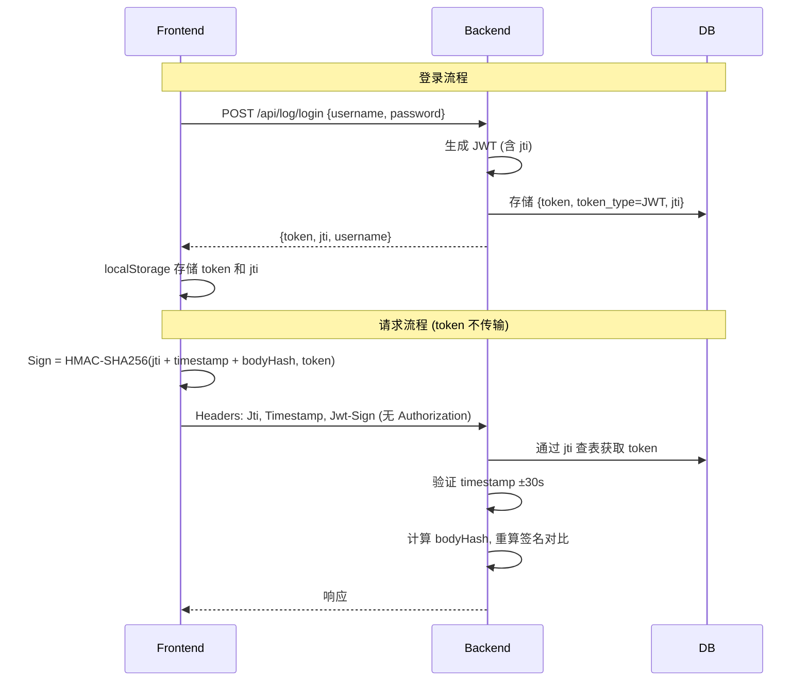

# Cratos JWT + 请求签名 实现文档

## 概述

实现 JWT 兼容模式认证 + 请求级签名，token 不在网络中传输，与现有 CLASSIC token 完全兼容。

## 架构设计



## 数据库变更

```sql
ALTER TABLE `user_token`
  MODIFY COLUMN `token` varchar(512) DEFAULT NULL COMMENT '登录唯一标识',
  ADD COLUMN `token_type` varchar(16) NOT NULL DEFAULT 'CLASSIC' COMMENT 'CLASSIC|JWT' AFTER `token`,
  ADD COLUMN `jti` char(36) DEFAULT NULL COMMENT 'JWT ID' AFTER `token_type`,
  ADD KEY `idx_jti` (`jti`);
```

## 签名算法

```
签名数据 = Jti + Timestamp + SHA256(encryptedBody)
密钥 = token (存储在服务端，不传输)
签名 = Base64(HMAC-SHA256(签名数据, 密钥))
```

- 无 body 或未加密时，bodyHash 为空字符串
- 有加密 body 时，bodyHash = SHA256(encryptedBody)

## 请求头

```http
POST /api/xxx HTTP/1.1
Content-Type: application/json
Jti: 3b1b3108-d855-4c4c-9f89-0dfcfe56c861
Timestamp: 1778293447134
Jwt-Sign: xK9mF2...Base64签名...
```

注意：**不传 Authorization header**，token 不暴露在网络中。

## 安全特性

| 威胁 | 防护方式 |
|------|---------|
| token 泄露 | token 不在请求中传输，只存 localStorage |
| 请求重放 | Timestamp ±30s 窗口，超时拒绝 |
| body 篡改 | encryptedBody 的 SHA256 绑定到签名 |
| 签名伪造 | 不知道 token 无法计算 HMAC |
| 主动注销 | 数据库 valid 字段置 false |
| body 内容保护 | 端到端 AES 加密 |

## 兼容性

| 客户端 | 认证方式 | 行为 |
|--------|---------|------|
| 新前端 | Jwt-Sign | 签名验证，token 不传输 |
| 旧前端 | Authorization: Bearer | 原有 JWT/CLASSIC 验证 |
| Robot | Authorization: Robot | 原有逻辑不变 |

后端通过检测 `Jwt-Sign` header 是否存在自动选择认证方式。

## 后端核心文件

| 文件 | 职责 |
|------|------|
| `JwtConfig.java` | JWT 密钥和过期时间配置 |
| `JwtUtil.java` | JWT 签发、验签、解析 |
| `RequestSignUtil.java` | 请求签名生成、验证、SHA256 |
| `UserTokenFacadeImpl.java` | 签发 JWT token，验证逻辑 |
| `AuthenticationTokenFilter.java` | 请求拦截，签名验证入口 |

## 前端核心文件

| 文件 | 职责 |
|------|------|
| `request-sign.service.ts` | HMAC-SHA256 签名生成 |
| `default.interceptor.ts` | 拦截请求，添加签名 headers，移除 Authorization |
| `log.service.ts` | 登录后存储 jti |

## 配置

```yaml
jwt:
  secret: ENC(加密后的高强度密钥)
  expiration: 86400000  # 24h
```

## 部署步骤

1. 执行 SQL 变更
2. 配置 `jwt.secret`（ENC 加密）
3. 部署后端
4. 部署前端
5. 旧客户端不受影响，自动兼容
