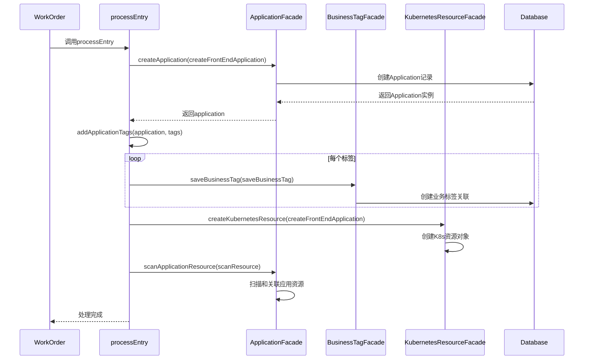
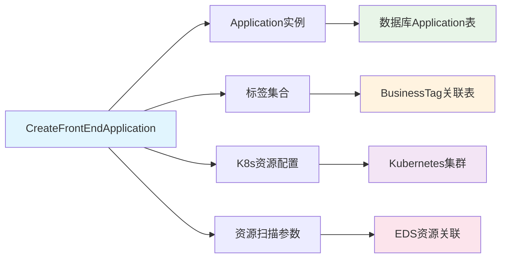

# processEntry 方法深度分析文档

## 方法概述

`processEntry` 是 `CreateFrontEndApplicationTicketEntryProvider` 类中的核心处理方法，负责执行前端应用创建工单的完整业务流程。

## 方法签名

```java
protected void processEntry(WorkOrderTicket workOrderTicket, 
                          WorkOrderTicketEntry entry,
                          ApplicationModel.CreateFrontEndApplication createFrontEndApplication) 
                          throws WorkOrderTicketException
```

## 详细执行步骤

### 1. 创建应用实例

```java
Application application = applicationFacade.createApplication(createFrontEndApplication);
```

**具体操作**：
- 调用 `ApplicationFacade.createApplication()` 方法
- 传入 `CreateFrontEndApplication` 模型参数
- 在数据库中创建新的 `Application` 记录
- 返回创建成功的应用实例

**涉及数据**：
- 应用名称 (`applicationName`)
- 域名信息 (`domain`)
- 映射路径 (`mappingsPath`)
- 仓库信息 (`repository`)

### 2. 添加应用标签

```java
addApplicationTags(application, createFrontEndApplication.getTags());
```

**具体操作**：
- 获取传入的标签集合 (`Map<String, String> tags`)
- 遍历每个标签键值对
- 通过 `tagService.getByTagKey()` 查找系统中的标签定义
- 为每个有效标签创建业务标签关联：

```java
BusinessTagParam.SaveBusinessTag saveBusinessTag = BusinessTagParam.SaveBusinessTag.builder()
    .businessType(BusinessTypeEnum.APPLICATION.name())  // 业务类型：应用
    .businessId(application.getId())                    // 业务ID：应用ID
    .tagId(tag.getId())                                // 标签ID
    .tagValue(value)                                   // 标签值
    .build();
businessTagFacade.saveBusinessTag(saveBusinessTag);
```

**处理逻辑**：
- **空标签检查**：如果标签为空则跳过
- **标签验证**：只处理系统中存在的标签
- **关联创建**：建立应用与标签的多对多关系

### 3. 创建Kubernetes资源

```java
kubernetesResourceFacade.createKubernetesResource(createFrontEndApplication);
```

**具体操作**：
- 调用 `WorkOrderKubernetesResourceFacade.createKubernetesResource()`
- 基于应用配置创建K8s资源对象
- 可能包括的资源类型：
  - **Deployment**（部署）
  - **Service**（服务）
  - **Ingress**（入口）
  - **ConfigMap**（配置映射）
  - **Secret**（密钥）

**资源创建依据**：
- 应用名称作为资源名称
- 域名和映射路径配置Ingress规则
- 仓库信息用于镜像构建配置

### 4. 扫描应用资源

```java
ApplicationParam.ScanResource scanResource = ApplicationParam.ScanResource.builder()
    .name(createFrontEndApplication.getApplicationName())
    .build();
applicationFacade.scanApplicationResource(scanResource);
```

**具体操作**：
- 构建资源扫描参数，指定应用名称
- 调用 `ApplicationFacade.scanApplicationResource()`
- 自动发现和关联应用相关的资源：
  - **K8s资源**（Pod、Service、Ingress等）
  - **GitLab项目资源**
  - **其他EDS资源**（External Data Source）

**扫描目的**：
- 建立应用与实际资源的关联关系
- 更新资源状态和元数据
- 为后续监控和管理提供数据基础

## 执行流程图



## 数据流转图



## 异常处理

方法可能抛出 `WorkOrderTicketException`，主要场景：

### 1. 应用创建异常
- 应用名称冲突
- 数据库连接失败
- 参数验证失败

### 2. 标签关联异常
- 标签不存在
- 业务标签创建失败
- 权限不足

### 3. K8s资源创建异常
- 集群连接失败
- 资源配置错误
- 命名空间不存在

### 4. 资源扫描异常
- EDS连接失败
- 资源发现超时
- 权限验证失败

## 事务性考虑

虽然代码中没有显式的事务注解，但整个流程应该在事务中执行：

### 建议的事务策略
```java
@Transactional(rollbackFor = Exception.class)
protected void processEntry(...) {
    // 方法实现
}
```

### 事务边界
- **成功场景**：所有步骤成功完成后提交事务
- **失败场景**：任何步骤失败时回滚所有数据库操作
- **补偿机制**：K8s资源创建失败时需要清理已创建的资源

## 性能考虑

### 1. 异步处理建议
```java
// K8s资源创建可以异步执行
@Async
public void createKubernetesResourceAsync(CreateFrontEndApplication app) {
    kubernetesResourceFacade.createKubernetesResource(app);
}
```

### 2. 批量操作优化
- 标签关联可以批量创建
- 资源扫描可以延迟执行

### 3. 缓存策略
- 标签定义可以缓存
- 应用配置模板可以预加载

## 监控和日志

### 建议的日志记录
```java
log.info("开始创建前端应用: {}", createFrontEndApplication.getApplicationName());
log.info("应用创建成功, ID: {}", application.getId());
log.info("标签关联完成, 数量: {}", tags.size());
log.info("K8s资源创建完成");
log.info("资源扫描完成");
```

### 监控指标
- 应用创建成功率
- 平均处理时间
- K8s资源创建成功率
- 资源扫描完成率

## 扩展点

### 1. 自定义处理步骤
```java
// 可以在各步骤之间插入自定义逻辑
protected void beforeCreateApplication(CreateFrontEndApplication app) {
    // 自定义预处理
}

protected void afterCreateApplication(Application application) {
    // 自定义后处理
}
```

### 2. 插件化支持
```java
// 支持插件化的处理器
List<ApplicationCreationProcessor> processors = getProcessors();
for (ApplicationCreationProcessor processor : processors) {
    processor.process(application, createFrontEndApplication);
}
```

## 最佳实践

### 1. 错误处理
- 使用具体的异常类型
- 提供详细的错误信息
- 记录完整的错误上下文

### 2. 资源管理
- 及时释放资源连接
- 使用连接池管理数据库连接
- 合理设置超时时间

### 3. 数据一致性
- 使用事务确保数据一致性
- 实现补偿机制处理分布式事务
- 定期检查数据完整性

## 总结

`processEntry` 方法实现了完整的前端应用自动化创建流程：

1. **数据持久化**：创建应用记录
2. **元数据管理**：建立标签关联
3. **基础设施**：创建K8s运行环境
4. **资源发现**：建立资源关联关系

这个方法是工单系统中应用创建自动化的核心实现，体现了DevOps中基础设施即代码（Infrastructure as Code）的理念，为前端应用的标准化部署提供了完整的解决方案。
