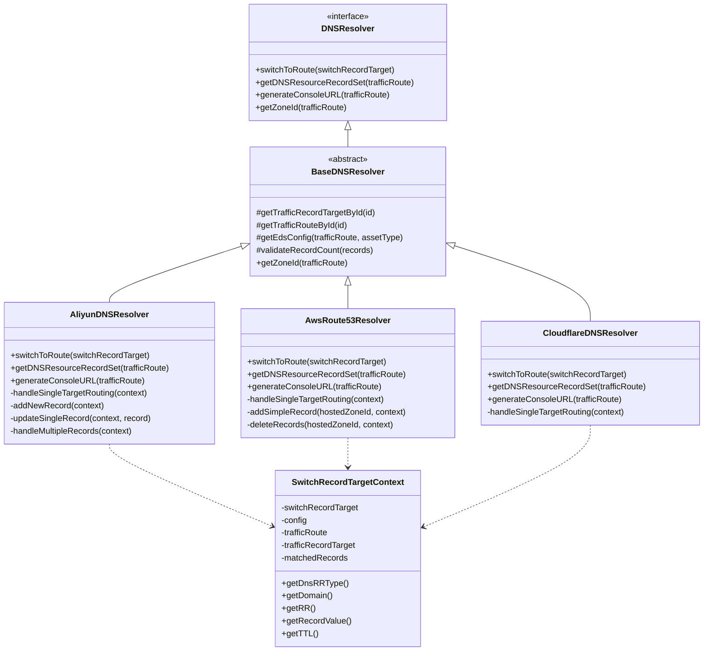
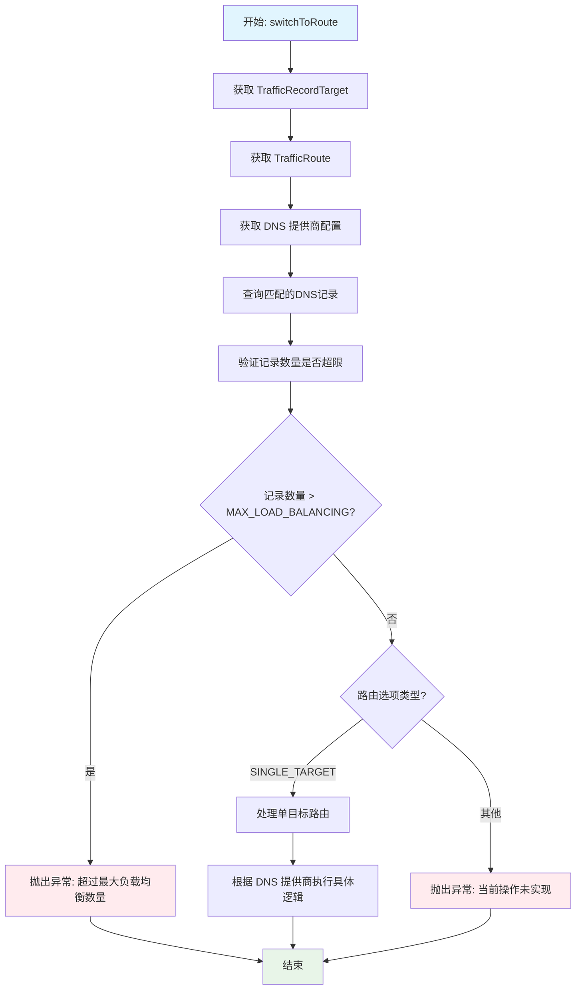
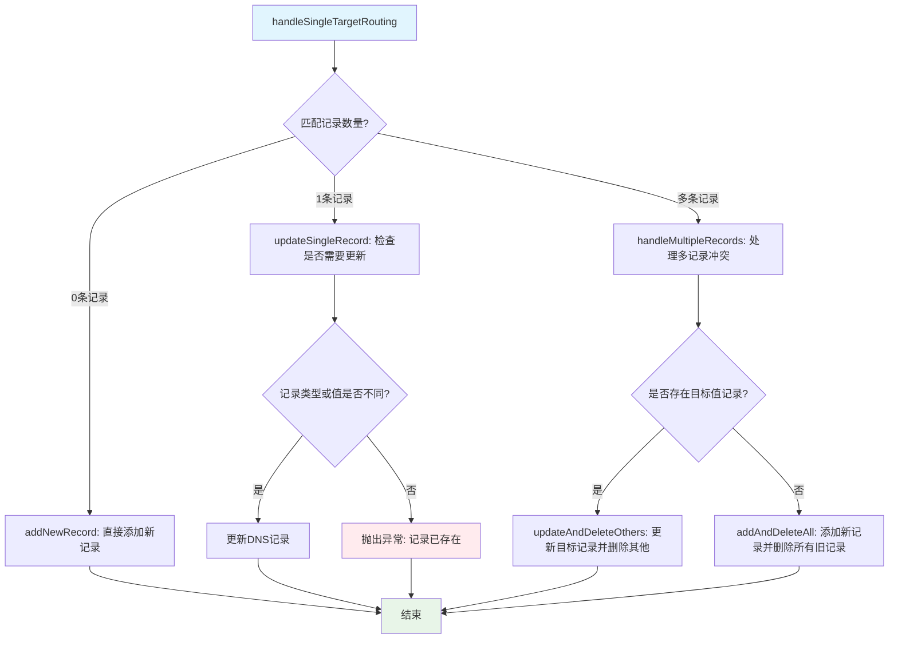

# DNS 路由切换逻辑文档

## 概述
DNS 路由切换系统支持多种 DNS 提供商（阿里云、AWS Route53、Cloudflare），实现流量路由的自动化切换。系统采用策略模式，为不同 DNS 提供商提供统一的接口。

## 架构设计



## 核心流程

### 主流程图



## DNS 提供商实现差异

### 1. 阿里云 DNS (AliyunDNSResolver)

#### 单目标路由处理逻辑



#### 核心方法

- **addNewRecord**: 添加新的 DNS 记录
- **updateSingleRecord**: 更新单条记录（检查类型和值是否需要更新）
- **handleMultipleRecords**: 处理多条记录的冲突情况
- **updateAndDeleteOthers**: 更新目标记录并删除其他记录
- **addAndDeleteAll**: 添加新记录并删除所有旧记录

### 2. AWS Route53 (AwsRoute53Resolver)

#### 处理策略
- **简化策略**: 先删除所有匹配记录，再添加新记录
- **路由策略感知**: 区分简单路由和加权路由
- **批量操作**: 使用 ChangeResourceRecordSets API 批量处理

#### 核心方法

- **deleteRecords**: 删除现有记录（根据路由策略决定是否删除）
- **addSimpleRecord**: 添加简单路由记录
- **支持加权路由**: 处理 Route53 特有的加权路由策略

### 3. Cloudflare DNS (CloudflareDNSResolver)

#### 特点
- **代理状态管理**: 支持 Cloudflare 的代理模式（橙色云朵）
- **API 限制处理**: 处理 Cloudflare API 的特殊限制

## 上下文对象 (SwitchRecordTargetContext)

### 作用
封装路由切换所需的所有上下文信息，提供统一的数据访问接口。

### 核心属性
```java
public class SwitchRecordTargetContext<Config, Record> {
    private TrafficRouteParam.SwitchRecordTarget switchRecordTarget;
    private Config config;                    // DNS 提供商配置
    private TrafficRoute trafficRoute;        // 路由配置
    private TrafficRecordTarget trafficRecordTarget; // 目标记录
    private List<Record> matchedRecords;      // 匹配的现有记录
}
```

### 便捷方法
- `getDnsRRType()`: 获取 DNS 记录类型
- `getDomain()`: 获取域名
- `getRR()`: 获取相对记录名
- `getRecordValue()`: 获取记录值
- `getTTL()`: 获取 TTL 值
- `getProxied()`: 获取代理状态（Cloudflare 专用）

## 安全控制

### 记录数量限制
```java
private static final int MAX_LOAD_BALANCING = 2;

protected void validateRecordCount(List<Record> matchedRecords) {
    if (!CollectionUtils.isEmpty(matchedRecords) && 
        matchedRecords.size() > MAX_LOAD_BALANCING) {
        TrafficRouteException.runtime(
            "Current routing load balancing count exceeds maximum: max routing count {}, current routing count {}",
            MAX_LOAD_BALANCING, matchedRecords.size()
        );
    }
}
```

### 异常处理
- **TrafficRouteException**: 统一的业务异常类型
- **参数验证**: 验证必要参数的存在性
- **状态检查**: 检查记录状态和操作的合法性

## 控制台 URL 生成

每个 DNS 提供商都实现了 `generateConsoleURL` 方法，生成对应管理控制台的直接链接：

- **阿里云**: `https://dnsnext.console.aliyun.com/authoritative/domains/{domain}?RRKeyWord={rr}`
- **AWS Route53**: Route53 控制台链接
- **Cloudflare**: Cloudflare DNS 管理页面链接

## 扩展性设计

### 新增 DNS 提供商
1. 继承 `BaseDNSResolver<Config, Record>`
2. 实现抽象方法：
   - `getTrafficRouteRecords`: 查询匹配记录
   - `handleSingleTargetRouting`: 处理单目标路由逻辑
3. 实现接口方法：
   - `switchToRoute`: 主入口方法
   - `getDNSResourceRecordSet`: 获取资源记录集
   - `generateConsoleURL`: 生成控制台链接

### 新增路由策略
在 `TrafficRoutingOptions` 枚举中添加新的路由选项，并在各 DNS 提供商中实现对应逻辑。

## 最佳实践

1. **幂等性**: 相同参数的多次调用应产生相同结果
2. **原子性**: 每次路由切换要么完全成功，要么完全失败
3. **日志记录**: 记录关键操作和异常信息
4. **配置验证**: 在操作前验证 DNS 提供商配置的有效性
5. **错误恢复**: 提供操作失败时的回滚机制

## 注意事项

- 目前只支持 `SINGLE_TARGET` 路由模式
- 负载均衡模式和其他高级路由策略尚未实现
- DNS 记录的 TTL 值会影响切换生效时间
- 不同 DNS 提供商的 API 限制和特性需要特别处理
