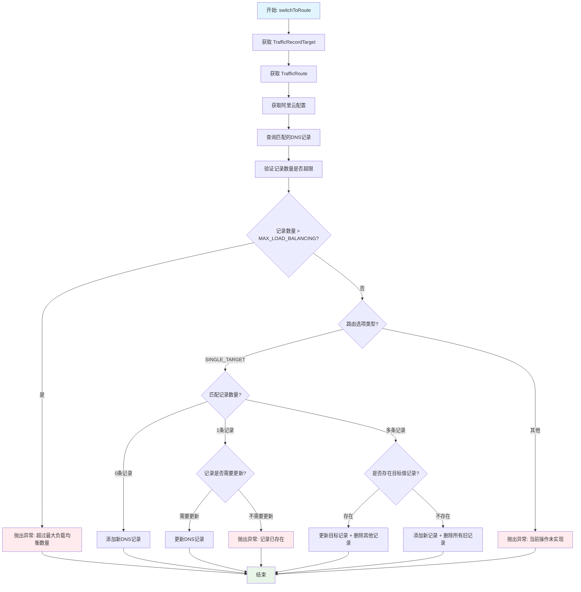

# switchToRoute 方法处理逻辑

## 概述
`switchToRoute` 方法负责处理阿里云 DNS 记录的路由切换逻辑，支持单目标路由模式。

## 流程图

## 处理逻辑说明

### 🔄 主流程
1. **数据准备**：获取目标记录、路由信息和阿里云配置
2. **记录查询**：查找匹配的DNS记录
3. **安全验证**：检查记录数量是否超过最大负载均衡限制

### 🎯 单目标路由处理
根据匹配记录数量分三种情况：

#### 无记录 (0条)
- 直接添加新的DNS记录

#### 单条记录 (1条)
- 检查是否需要更新（类型或值不同）
- 需要更新：执行更新操作
- 不需要更新：抛出"记录已存在"异常

#### 多条记录 (>1条)
- **存在目标值记录**：更新该记录，删除其他记录
- **不存在目标值记录**：添加新记录，删除所有旧记录

### ⚠️ 异常情况
- 记录数量超限
- 路由选项不支持
- 记录已存在且无需更新

## 方法拆分

原始的长方法已拆分为以下小方法：

1. **`switchToRoute`** - 主入口方法，协调整个流程
2. **`getMatchedRecords`** - 获取匹配的 DNS 记录
3. **`validateRecordCount`** - 验证记录数量是否超限
4. **`handleSingleTargetRouting`** - 处理单目标路由逻辑
5. **`addNewRecord`** - 添加新记录
6. **`updateSingleRecord`** - 更新单条记录
7. **`handleMultipleRecords`** - 处理多条记录的情况
8. **`updateAndDeleteOthers`** - 更新目标记录并删除其他记录
9. **`addAndDeleteAll`** - 添加新记录并删除所有旧记录

## 改进效果

✅ **职责单一**：每个方法只负责一个具体的业务逻辑
✅ **可读性提升**：方法名清晰表达业务意图
✅ **可测试性**：每个小方法都可以独立测试
✅ **可维护性**：修改某个逻辑只需要关注对应的方法
✅ **国际化**：异常消息使用英文，便于国际化部署

## 注意事项

- 该方法目前只支持 `SINGLE_TARGET` 路由模式
- 负载均衡模式尚未实现
- 所有DNS操作都通过阿里云API执行
- 异常处理使用自定义的 `TrafficRouteException`
