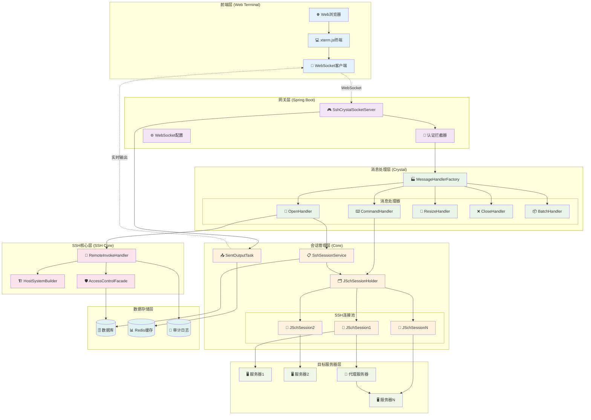
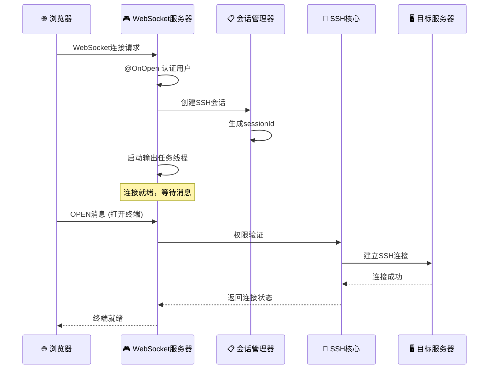
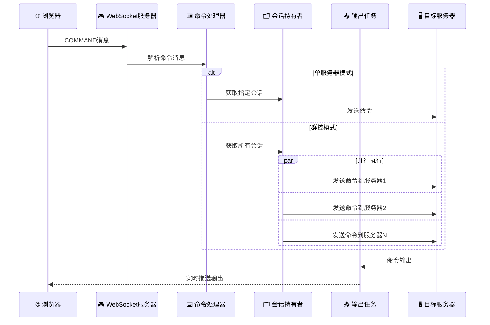
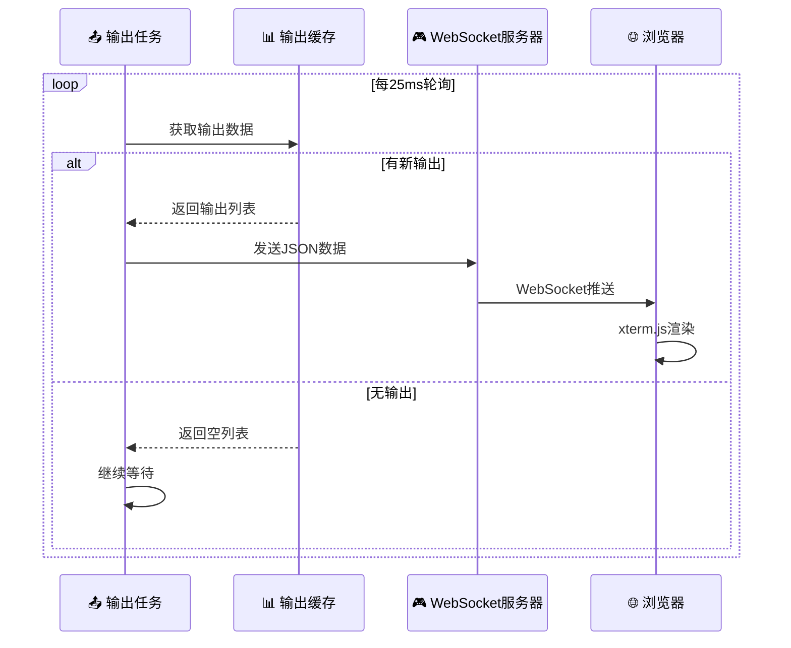
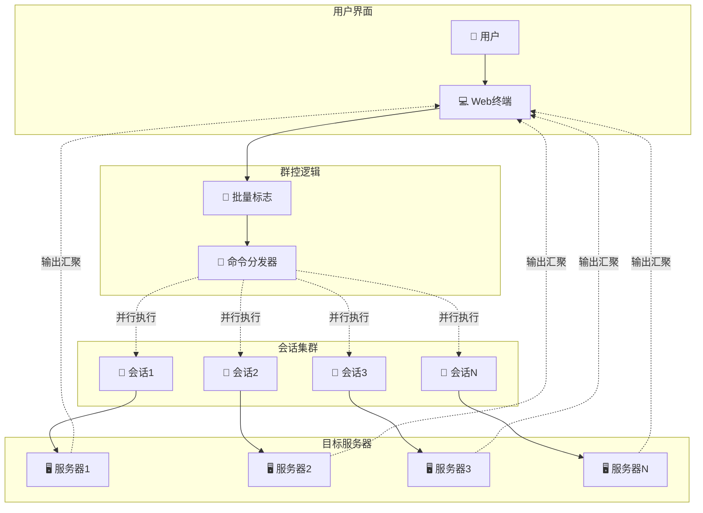
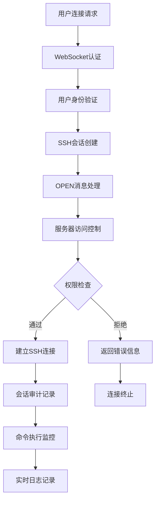
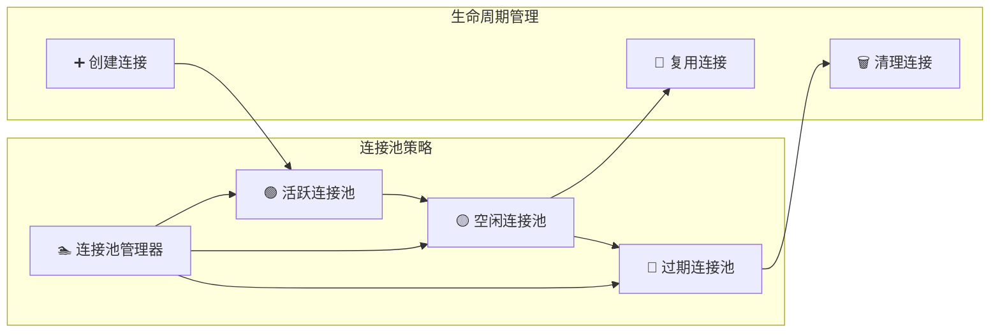
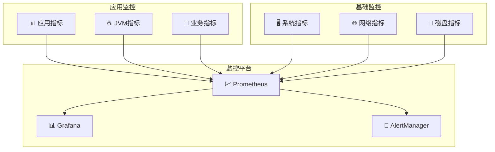

# 🌐 Web堡垒机深度架构分析

## 📋 概述

基于Cratos Web堡垒机系统的WebSocket SSH连接架构分析，该系统实现了基于WebSocket的实时SSH终端访问和群控管理功能。

---

## 🏗️ 整体系统架构



---

## 🔄 WebSocket消息流程

### 1️⃣ 连接建立流程



### 2️⃣ 命令执行流程



### 3️⃣ 实时输出流程



---

## 🏷️ 核心组件深度分析

### 1. WebSocket服务器 (SshCrystalSocketServer)

```java
@ServerEndpoint(value = "/socket/ssh/crystal/{username}")
@Component
public class SshCrystalSocketServer extends BaseSocketAuthenticationServer {
    
    // 核心属性
    private SshSession sshSession;
    private final String sessionId = UUID.randomUUID().toString();
    private String username;
    
    @OnOpen
    public void onOpen(Session session, @PathParam("username") String username) {
        // 1. 用户认证
        super.onOpen(session, username);
        
        // 2. 创建SSH会话
        SshSession sshSession = SshSessionBuilder.build(sessionId, username, host, SshSessionTypeEnum.WEB_SHELL);
        sshSessionService.add(sshSession);
        
        // 3. 启动输出任务 (JDK21 虚拟线程)
        Thread.ofVirtual().start(SentOutputTask.newTask(this.sessionId, session));
    }
    
    @OnMessage
    public void onMessage(Session session, String message) {
        // 消息路由到对应处理器
        SimpleState ss = new GsonBuilder().create().fromJson(message, SimpleState.class);
        SshCrystalMessageHandlerFactory.getByState(ss.getState())
            .handle(this.username, message, session, sshSession);
    }
}
```

**设计亮点**:
- 🧵 **虚拟线程**: 使用JDK21虚拟线程处理输出任务
- 🔀 **消息路由**: 基于状态的消息处理器路由
- 🔐 **认证集成**: 继承基础认证服务器
- 📊 **会话管理**: 统一的会话生命周期管理

### 2. 消息处理器工厂 (MessageHandlerFactory)

```java
public class SshCrystalMessageHandlerFactory {
    static Map<String, SshCrystalMessageHandler> context = new ConcurrentHashMap<>();
    
    public static SshCrystalMessageHandler getByState(String state) {
        SshCrystalMessageHandler handler = context.get(state);
        return handler != null ? handler : context.get(MessageState.UNKNOWN.name());
    }
    
    public static void register(SshCrystalMessageHandler bean) {
        context.put(bean.getState(), bean);
    }
}
```

**消息类型映射**:
| 消息状态 | 处理器 | 功能描述 |
|---------|--------|----------|
| `OPEN` | OpenMessageHandler | 建立SSH连接 |
| `COMMAND` | CommandMessageHandler | 执行命令 |
| `RESIZE` | ResizeMessageHandler | 调整终端尺寸 |
| `CLOSE` | CloseMessageHandler | 关闭单个连接 |
| `CLOSE_ALL` | CloseAllMessageHandler | 关闭所有连接 |
| `SET_BATCH_FLAG` | BatchFlagHandler | 设置群控模式 |
| `DUPLICATE` | DuplicateHandler | 复制会话 |

### 3. SSH会话持有者 (JSchSessionHolder)

```java
public class JSchSessionHolder {
    // 会话映射: sessionId -> (instanceId -> JSchSession)
    private static Map<String, ConcurrentHashMap<String, JSchSession>> jSchSessionMap = new ConcurrentHashMap<>();
    
    // 批量标志: sessionId -> isBatch
    private static Map<String, Boolean> batchMap = new ConcurrentHashMap<>();
    
    public static void addSession(JSchSession jSchSession) {
        ConcurrentHashMap<String, JSchSession> sessionMap = jSchSessionMap.computeIfAbsent(
            jSchSession.getSessionId(), k -> new ConcurrentHashMap<>());
        sessionMap.put(jSchSession.getInstanceId(), jSchSession);
    }
    
    public static JSchSession getSession(String sessionId, String instanceId) {
        Map<String, JSchSession> sessionMap = jSchSessionMap.get(sessionId);
        return sessionMap != null ? sessionMap.get(instanceId) : null;
    }
}
```

**数据结构设计**:
```
JSchSessionHolder
├── jSchSessionMap: Map<String, Map<String, JSchSession>>
│   ├── sessionId1
│   │   ├── instanceId1 -> JSchSession1
│   │   ├── instanceId2 -> JSchSession2
│   │   └── instanceIdN -> JSchSessionN
│   └── sessionId2
│       └── ...
└── batchMap: Map<String, Boolean>
    ├── sessionId1 -> true (群控模式)
    └── sessionId2 -> false (单控模式)
```

### 4. 实时输出任务 (SentOutputTask)

```java
public class SentOutputTask implements Runnable {
    @Override
    public void run() {
        try {
            while (session.isOpen()) {
                // 1. 获取输出数据
                List<SessionOutput> outputList = SessionOutputUtils.getOutput(sessionId);
                
                if (!CollectionUtils.isEmpty(outputList)) {
                    // 2. 序列化为JSON
                    String jsonStr = JSONUtils.writeValueAsString(outputList);
                    
                    // 3. 通过WebSocket发送
                    session.getBasicRemote().sendText(jsonStr);
                }
                
                // 4. 25ms轮询间隔
                TimeUnit.MILLISECONDS.sleep(25L);
            }
        } catch (InterruptedException | IOException e) {
            // 异常处理
        }
    }
}
```

**性能特性**:
- ⚡ **高频轮询**: 25ms轮询间隔，接近实时
- 🧵 **虚拟线程**: 轻量级线程，支持大量并发
- 📦 **批量发送**: 一次发送多个输出项
- 🔄 **自动清理**: 连接关闭时自动退出

---

## 🎯 群控功能实现

### 群控架构图



### 群控实现代码

```java
@Override
public void handle(String username, String message, Session session, SshSession sshSession) {
    SshCrystalMessage.Command commandMessage = toMessage(message);
    
    if (!hasBatchFlag(sshSession.getSessionId())) {
        // 单服务器模式
        inputCommand(sshSession.getSessionId(), commandMessage.getInstanceId(), commandMessage.getInput());
    } else {
        // 群控模式 - 并行执行
        Map<String, JSchSession> sessionMap = JSchSessionHolder.getSession(sshSession.getSessionId());
        sessionMap.keySet()
            .parallelStream()  // 并行流处理
            .forEach(instanceId -> inputCommand(sshSession.getSessionId(), instanceId, commandMessage.getInput()));
    }
}
```

**群控特性**:
- 🚩 **标志控制**: 通过batchFlag控制群控模式开关
- ⚡ **并行执行**: 使用parallelStream并行发送命令
- 🎯 **统一输出**: 所有服务器输出汇聚到同一终端
- 🔄 **实时同步**: 25ms轮询确保输出实时性

---

## 🔐 安全机制

### 访问控制流程



### 权限验证代码

```java
@Override
public void handle(String username, String message, Session session, SshSession sshSession) {
    SshCrystalMessage.Open openMessage = toMessage(message);
    
    // 1. 访问控制验证
    AccessControlVO.AccessControl accessControl = serverAccessControlFacade.generateAccessControl(
        username, openMessage.getAssetId());
    
    if (!accessControl.isPass()) {
        // 权限验证失败
        sendHostSystemErrMsgToSession(session, sshSession.getSessionId(), 
            openMessage.getInstanceId(), AUTH_FAIL_STATUS, accessControl.getMessage());
        return;
    }
    
    // 2. 建立SSH连接
    HostSystem hostSystem = HostSystemBuilder.buildHostSystem(
        openMessage.getInstanceId(), asset, serverAccount, credential);
    
    // 3. 审计日志记录
    // ...
}
```

---

## 📊 性能优化策略

### 1. 连接池管理



### 2. 虚拟线程优化

```java
// JDK21 虚拟线程 - 轻量级并发
Thread.ofVirtual().start(SentOutputTask.newTask(this.sessionId, session));

// 传统线程池 vs 虚拟线程对比
┌─────────────────┬──────────────┬──────────────┐
│     特性        │   传统线程    │   虚拟线程    │
├─────────────────┼──────────────┼──────────────┤
│   内存占用      │    ~2MB      │    ~KB       │
│   创建开销      │     高       │     极低     │
│   并发数量      │   受限制     │   近乎无限   │
│   上下文切换    │     重       │     轻       │
│   适用场景      │  CPU密集型   │  IO密集型    │
└─────────────────┴──────────────┴──────────────┘
```

### 3. 输出缓存优化

```java
public class SessionOutputUtils {
    // 使用ConcurrentHashMap保证线程安全
    private static final Map<String, Queue<SessionOutput>> outputMap = new ConcurrentHashMap<>();
    
    public static void addOutput(String sessionId, SessionOutput output) {
        outputMap.computeIfAbsent(sessionId, k -> new ConcurrentLinkedQueue<>()).offer(output);
    }
    
    public static List<SessionOutput> getOutput(String sessionId) {
        Queue<SessionOutput> queue = outputMap.get(sessionId);
        if (queue == null || queue.isEmpty()) {
            return Collections.emptyList();
        }
        
        // 批量获取，减少锁竞争
        List<SessionOutput> result = new ArrayList<>();
        SessionOutput output;
        while ((output = queue.poll()) != null) {
            result.add(output);
        }
        return result;
    }
}
```

---

## 📈 监控指标

### 关键性能指标 (KPI)

| 指标类型 | 指标名称 | 目标值 | 监控方式 |
|---------|---------|--------|---------|
| 🚀 **性能** | WebSocket连接延迟 | < 100ms | 实时监控 |
| 🚀 **性能** | 命令响应时间 | < 500ms | 性能统计 |
| 🚀 **性能** | 输出推送延迟 | < 50ms | 轮询监控 |
| 🔗 **连接** | 并发连接数 | < 1000 | 连接计数 |
| 🔗 **连接** | 连接成功率 | > 99% | 成功率统计 |
| 💾 **资源** | 内存使用率 | < 80% | JVM监控 |
| 💾 **资源** | CPU使用率 | < 70% | 系统监控 |
| 🛡️ **安全** | 认证失败率 | < 1% | 安全审计 |

### 监控架构



---

## 🎯 总结

Cratos Web堡垒机系统体现了以下技术特点：

### ✅ 技术优势

1. **🧵 现代并发模型**: 
   - JDK21虚拟线程支持大规模并发
   - 25ms高频轮询实现准实时输出

2. **🏗️ 模块化架构**: 
   - 消息处理器工厂模式
   - 分层清晰，职责明确

3. **🚀 高性能设计**: 
   - ConcurrentHashMap保证线程安全
   - 并行流处理群控命令

4. **🔐 安全可控**: 
   - 多层权限验证
   - 完整审计追踪

### 🔧 改进建议

1. **📊 监控增强**: 
   - 添加更详细的性能指标
   - 实现分布式链路追踪

2. **🔄 容错机制**: 
   - 连接断线重连
   - 消息重试机制

3. **⚡ 性能优化**: 
   - 输出缓存分片
   - 连接池预热

4. **🛡️ 安全加固**: 
   - 会话超时管理
   - 异常行为检测

这个Web堡垒机系统为企业提供了强大的远程服务器管理能力，是现代云原生环境下不可或缺的运维基础设施。
