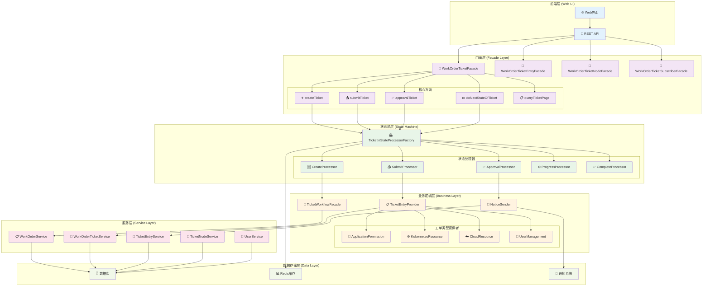
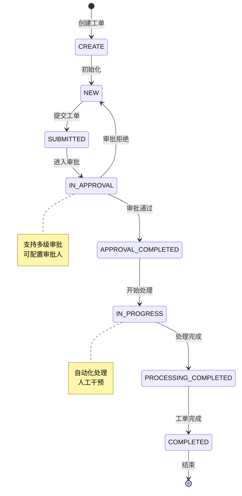
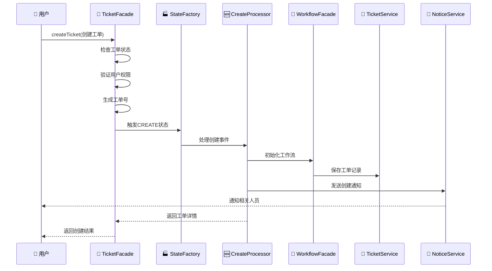
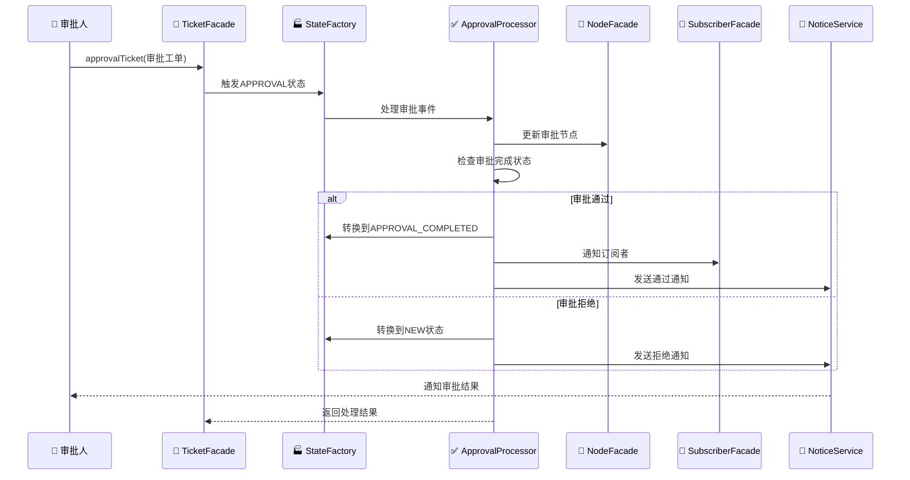
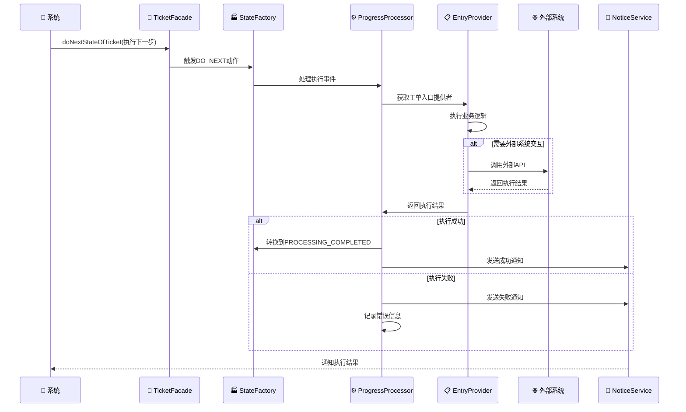
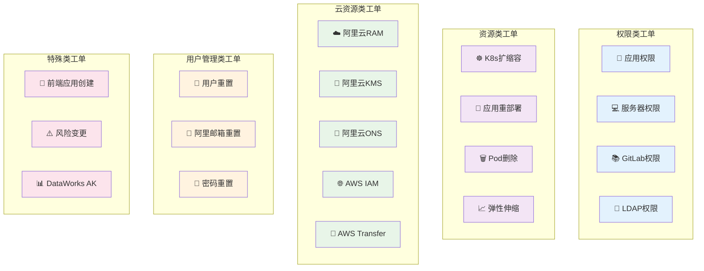
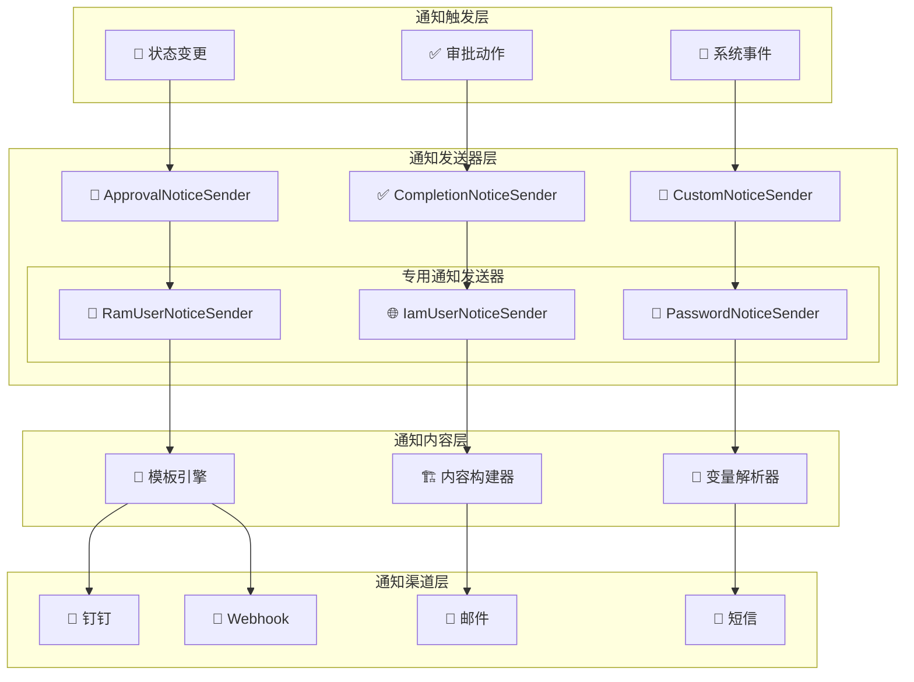
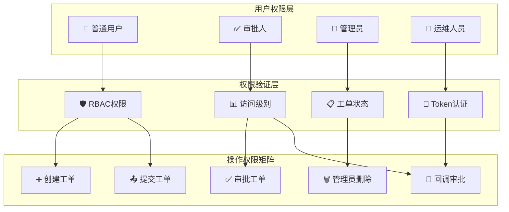
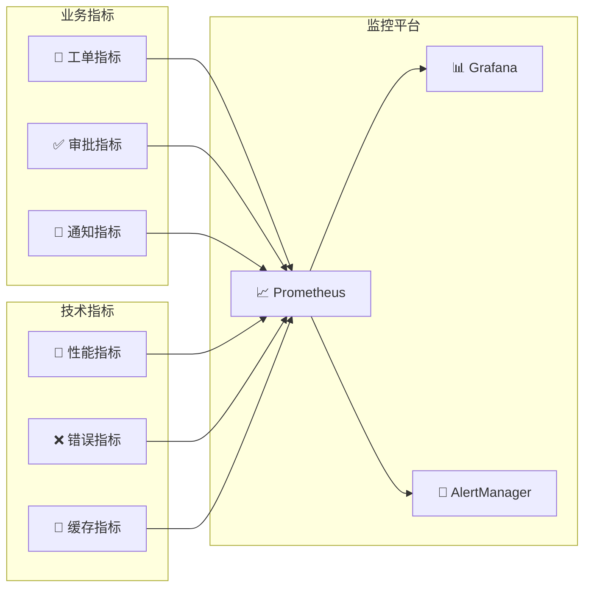

# 🎫 工单系统深度架构分析

## 📋 概述

基于Cratos工单系统的深度架构分析，该系统实现了企业级的工单流程管理，包含完整的状态机驱动、审批流程、通知机制和多种工单类型支持。

---

## 🏗️ 整体系统架构



---

## 🔄 工单状态机流程

### 工单状态转换图



### 状态机核心组件

| 状态 | 中文名称 | 处理器 | 主要功能 |
|------|---------|--------|----------|
| `CREATE` | 创建 | CreateProcessor | 工单初始化、基础验证 |
| `NEW` | 新建 | NewProcessor | 等待提交、内容编辑 |
| `SUBMITTED` | 已提交 | SubmitProcessor | 提交验证、流程启动 |
| `IN_APPROVAL` | 审批中 | ApprovalProcessor | 审批流程、通知发送 |
| `APPROVAL_COMPLETED` | 审批完成 | ApprovalCompletedProcessor | 审批结果处理 |
| `IN_PROGRESS` | 处理中 | ProgressProcessor | 业务逻辑执行 |
| `PROCESSING_COMPLETED` | 处理完成 | ProcessingCompletedProcessor | 结果验证 |
| `COMPLETED` | 完成 | CompleteProcessor | 工单关闭、通知 |

---
## 🎯 核心业务流程

### 1️⃣ 工单创建流程



### 2️⃣ 工单审批流程



### 3️⃣ 工单执行流程



---

## 🏷️ 核心组件深度分析

### 1. 工单门面类 (WorkOrderTicketFacadeImpl)

```java
@Component
@RequiredArgsConstructor
public class WorkOrderTicketFacadeImpl implements WorkOrderTicketFacade {
    
    // 核心依赖服务 - 10个
    private final WorkOrderService workOrderService;
    private final WorkOrderTicketService workOrderTicketService;
    private final WorkOrderTicketWrapper workOrderTicketWrapper;
    private final WorkOrderTicketDetailsWrapper workOrderTicketDetailsWrapper;
    private final RbacRoleFacade rbacRoleFacade;
    private final WorkOrderTicketEntryService workOrderTicketEntryService;
    private final WorkOrderTicketEntryFacade workOrderTicketEntryFacade;
    private final WorkOrderTicketNodeFacade workOrderTicketNodeFacade;
    private final WorkOrderTicketSubscriberFacade workOrderTicketSubscriberFacade;
    
    @Override
    @Transactional(rollbackFor = Exception.class)
    public WorkOrderTicketVO.TicketDetails createTicket(WorkOrderTicketParam.CreateTicket createTicket) {
        // 1. 获取工单模板
        WorkOrder workOrder = workOrderService.getByWorkOrderKey(createTicket.getWorkOrderKey());
        
        // 2. 状态检查 - 开发中的工单需要运维权限
        if (WorkOrderStatus.DEVELOPING.equals(WorkOrderStatus.valueOf(workOrder.getStatus()))) {
            if (!rbacRoleFacade.verifyRoleAccessLevelByUsername(AccessLevel.OPS)) {
                throw new WorkOrderException("工单开发中，请等待工单完成");
            }
        }
        
        // 3. 生成工单号
        final String ticketNo = PasswordGenerator.generateTicketNo();
        createTicket.setTicketNo(ticketNo);
        
        // 4. 触发状态机
        TicketEvent<WorkOrderTicketParam.CreateTicket> event = TicketEvent.of(createTicket);
        TicketInStateProcessorFactory.change(TicketState.CREATE, TicketStateChangeAction.CREATE, event);
        
        // 5. 返回工单详情
        return makeTicketDetails(ticketNo);
    }
}
```

**设计特点**:
- 🎭 **门面模式**: 统一工单操作接口
- 🔄 **事务管理**: 确保数据一致性
- 🎫 **工单号生成**: 唯一标识符生成
- 🏭 **状态机驱动**: 通过事件触发状态转换

### 2. 状态机工厂 (TicketInStateProcessorFactory)

```java
public class TicketInStateProcessorFactory {
    
    // 状态处理器映射
    private static final Map<String, TicketStateProcessor> PROCESSOR_MAP = new ConcurrentHashMap<>();
    
    public static void change(TicketState currentState, TicketStateChangeAction action, TicketEvent event) {
        String key = buildKey(currentState, action);
        TicketStateProcessor processor = PROCESSOR_MAP.get(key);
        
        if (processor == null) {
            throw new TicketStateProcessorException("未找到状态处理器: " + key);
        }
        
        processor.process(event);
    }
    
    private static String buildKey(TicketState state, TicketStateChangeAction action) {
        return state.name() + "_" + action.name();
    }
}
```

**状态处理器映射表**:
| 当前状态 | 动作 | 目标状态 | 处理器 |
|---------|------|---------|--------|
| CREATE | CREATE | NEW | CreateTicketStateProcessor |
| NEW | SUBMIT | SUBMITTED | SubmitTicketStateProcessor |
| SUBMITTED | APPROVAL | IN_APPROVAL | ApprovalTicketStateProcessor |
| IN_APPROVAL | APPROVAL | APPROVAL_COMPLETED | ApprovalCompletedStateProcessor |
| APPROVAL_COMPLETED | DO_NEXT | IN_PROGRESS | ProgressTicketStateProcessor |
| IN_PROGRESS | DO_NEXT | PROCESSING_COMPLETED | ProcessingCompletedStateProcessor |
| PROCESSING_COMPLETED | DO_NEXT | COMPLETED | CompleteTicketStateProcessor |

### 3. 基础状态处理器 (BaseTicketStateProcessor)

```java
@SuppressWarnings("unchecked")
@Slf4j
@RequiredArgsConstructor
public abstract class BaseTicketStateProcessor<Event extends WorkOrderTicketParam.HasTicketNo> 
    implements TicketStateProcessor<Event> {
    
    // 核心依赖服务
    protected final UserService userService;
    protected final WorkOrderService workOrderService;
    protected final WorkOrderTicketService workOrderTicketService;
    protected final WorkOrderTicketNodeService workOrderTicketNodeService;
    protected final WorkOrderTicketSubscriberFacade workOrderTicketSubscriberFacade;
    protected final WorkOrderTicketNodeFacade workOrderTicketNodeFacade;
    protected final WorkOrderTicketEntryService workOrderTicketEntryService;
    protected final TicketWorkflowFacade ticketWorkflowFacade;
    
    // 责任链模式
    private TicketStateProcessor<Event> targetProcessor;
    
    @Override
    public TicketStateProcessor setTarget(TicketStateProcessor processor) {
        this.targetProcessor = processor;
        return this.targetProcessor;
    }
    
    // 模板方法模式
    @Override
    public final void process(TicketEvent<Event> event) {
        try {
            // 前置处理
            preProcess(event);
            
            // 核心处理逻辑
            doProcess(event);
            
            // 后置处理
            postProcess(event);
            
            // 责任链传递
            if (targetProcessor != null) {
                targetProcessor.process(event);
            }
        } catch (Exception e) {
            handleException(event, e);
        }
    }
    
    // 抽象方法，子类实现
    protected abstract void doProcess(TicketEvent<Event> event);
    
    // 钩子方法，子类可选择性重写
    protected void preProcess(TicketEvent<Event> event) {}
    protected void postProcess(TicketEvent<Event> event) {}
    protected void handleException(TicketEvent<Event> event, Exception e) {
        log.error("状态处理器执行异常: {}", e.getMessage(), e);
        throw new TicketStateProcessorException("状态处理失败", e);
    }
}
```

**设计模式应用**:
- 🔗 **责任链模式**: 支持多个处理器串联
- 📋 **模板方法模式**: 统一处理流程框架
- 🏭 **工厂模式**: 动态创建状态处理器
- 🎯 **策略模式**: 不同状态的不同处理策略

---
## 🎫 工单类型体系

### 工单类型分类图



### 工单类型枚举映射

| 工单Key | 中文名称 | 分类 | 主要功能 |
|---------|---------|------|----------|
| `APPLICATION_PERMISSION` | 应用权限 | 权限类 | 应用访问权限申请 |
| `COMPUTER_PERMISSION` | 服务器权限 | 权限类 | 服务器登录权限申请 |
| `APPLICATION_ELASTIC_SCALING` | 应用弹性伸缩 | 资源类 | K8s应用自动扩缩容 |
| `APPLICATION_REDEPLOY` | 应用重部署 | 资源类 | 应用重新部署 |
| `GITLAB_PROJECT_PERMISSION` | GitLab项目权限 | 权限类 | Git项目访问权限 |
| `ALIYUN_RAM_USER_PERMISSION` | 阿里云RAM用户 | 云资源类 | 阿里云用户权限管理 |
| `AWS_IAM_POLICY_PERMISSION` | AWS IAM策略 | 云资源类 | AWS权限策略管理 |
| `USER_RESET_PASSWORD` | 用户密码重置 | 用户管理类 | 重置用户登录密码 |
| `RISK_CHANGE` | 风险变更 | 特殊类 | 高风险操作申请 |

---

## 🔔 通知机制架构

### 通知系统架构图



### 通知发送器基类

```java
@Slf4j
@RequiredArgsConstructor
public abstract class BaseWorkOrderNoticeSender {
    
    protected final NotificationTemplateService notificationTemplateService;
    protected final DingtalkService dingtalkService;
    protected final EdsInstanceHelper edsInstanceHelper;
    protected final EdsConfigService edsConfigService;
    
    @Value("${cratos.language:en-us}")
    protected String language;
    
    /**
     * 发送通知
     */
    public void send(WorkOrderTicket ticket, Map<String, Object> variables) {
        try {
            // 1. 获取通知模板
            NotificationTemplate template = getNotificationTemplate();
            
            // 2. 构建消息内容
            String content = buildMessageContent(template, variables);
            
            // 3. 发送通知
            sendNotification(content, ticket);
            
        } catch (Exception e) {
            log.error("发送工单通知失败: ticketNo={}, error={}", ticket.getTicketNo(), e.getMessage(), e);
        }
    }
    
    /**
     * 获取通知模板 - 子类实现
     */
    protected abstract NotificationTemplate getNotificationTemplate();
    
    /**
     * 构建消息内容
     */
    protected String buildMessageContent(NotificationTemplate template, Map<String, Object> variables) {
        return BeetlUtil.renderTemplate(template.getContent(), variables);
    }
    
    /**
     * 发送通知到钉钉
     */
    protected void sendNotification(String content, WorkOrderTicket ticket) {
        // 查询钉钉机器人实例
        List<EdsInstance> robotInstances = edsInstanceHelper.queryValidEdsInstance(
            EdsInstanceTypeEnum.DINGTALK_ROBOT, "WorkOrderNotification");
        
        if (CollectionUtils.isEmpty(robotInstances)) {
            log.warn("未找到可用的钉钉机器人实例");
            return;
        }
        
        // 发送到所有机器人
        robotInstances.forEach(instance -> {
            try {
                EdsConfig config = edsConfigService.getById(instance.getConfigId());
                EdsDingtalkConfigModel.Robot robot = // 构建机器人配置
                
                DingtalkRobotModel.Msg message = DingtalkRobotModel.loadAs(content);
                dingtalkService.send(robot.getToken(), message);
                
            } catch (Exception e) {
                log.error("发送钉钉通知失败: instanceId={}, error={}", instance.getId(), e.getMessage());
            }
        });
    }
}
```

---

## 🔐 安全机制分析

### 权限控制架构



### 安全检查清单

| 检查项 | 检查内容 | 实现方式 | 代码示例 |
|--------|----------|----------|----------|
| **身份认证** | 用户身份验证 | `@SetSessionUserToParam` | 自动注入用户信息 |
| **权限验证** | RBAC角色检查 | `rbacRoleFacade.verifyRoleAccessLevelByUsername()` | 验证访问级别 |
| **状态验证** | 工单状态检查 | `WorkOrderStatus.DEVELOPING` | 开发中工单限制 |
| **Token认证** | 回调Token验证 | `@UserTokenAuth` | 外部回调安全 |
| **事务控制** | 数据一致性 | `@Transactional` | 事务回滚保护 |
| **操作审计** | 操作日志记录 | 日志记录 | 完整操作追踪 |

### 权限验证代码示例

```java
// 1. 工单状态权限检查
if (WorkOrderStatus.DEVELOPING.equals(WorkOrderStatus.valueOf(workOrder.getStatus()))) {
    if (!rbacRoleFacade.verifyRoleAccessLevelByUsername(AccessLevel.OPS)) {
        throw new WorkOrderException("工单开发中，需要运维权限");
    }
}

// 2. Token回调认证
@UserTokenAuth(ofTicketNo = "#callbackApprovalTicket.ticketNo", 
               ofUsername = "#callbackApprovalTicket.username", 
               ofToken = "#callbackApprovalTicket.token")
public HttpResult approvalTicket(WorkOrderTicketParam.CallbackApprovalTicket callbackApprovalTicket) {
    // 安全的回调处理
}

// 3. 用户会话注入
@SetSessionUserToParam(desc = "set Username")
public DataTable<WorkOrderTicketVO.Ticket> queryMyTicketPage(WorkOrderTicketParam.MyTicketPageQuery pageQuery) {
    // 自动注入当前用户信息
}
```

---
## ⚡ 性能优化策略

### 1. 状态机优化

```java
// 状态处理器缓存
private static final Map<String, TicketStateProcessor> PROCESSOR_CACHE = new ConcurrentHashMap<>();

// 预加载状态处理器
@PostConstruct
public void initProcessors() {
    // 预加载所有状态处理器到缓存
    Arrays.stream(TicketState.values())
        .forEach(state -> {
            Arrays.stream(TicketStateChangeAction.values())
                .forEach(action -> {
                    String key = buildKey(state, action);
                    TicketStateProcessor processor = createProcessor(state, action);
                    if (processor != null) {
                        PROCESSOR_CACHE.put(key, processor);
                    }
                });
        });
}
```

### 2. 数据库优化

```java
// 分页查询优化
@Override
public DataTable<WorkOrderTicket> queryPageByParam(WorkOrderTicketParam.TicketPageQuery pageQuery) {
    // 1. 索引优化 - 在ticket_no, ticket_state, created_time上建立复合索引
    // 2. 查询优化 - 只查询必要字段
    // 3. 缓存优化 - 热点数据Redis缓存
    return ticketMapper.queryPageByParam(pageQuery);
}

// 批量操作优化
@Transactional(rollbackFor = Exception.class)
public void batchUpdateTicketStatus(List<Integer> ticketIds, TicketState newState) {
    // 批量更新，减少数据库交互
    ticketMapper.batchUpdateStatus(ticketIds, newState.name());
}
```

### 3. 通知系统优化

```java
// 异步通知发送
@Async("notificationExecutor")
public CompletableFuture<Void> sendNotificationAsync(WorkOrderTicket ticket, Map<String, Object> variables) {
    return CompletableFuture.runAsync(() -> {
        send(ticket, variables);
    });
}

// 通知去重
private final Set<String> sentNotifications = ConcurrentHashMap.newKeySet();

public void sendNotificationWithDeduplication(String ticketNo, String notificationType) {
    String key = ticketNo + "_" + notificationType;
    if (sentNotifications.add(key)) {
        // 首次发送
        sendNotification();
        
        // 设置过期时间，避免内存泄漏
        scheduler.schedule(() -> sentNotifications.remove(key), 1, TimeUnit.HOURS);
    }
}
```

### 4. 缓存策略

```java
// Redis缓存工单详情
@Cacheable(value = "workorder:ticket:details", key = "#ticketNo", unless = "#result == null")
public WorkOrderTicketVO.TicketDetails getTicketDetailsFromCache(String ticketNo) {
    return makeTicketDetails(ticketNo);
}

// 缓存工单模板
@Cacheable(value = "workorder:template", key = "#workOrderKey")
public WorkOrder getWorkOrderTemplate(String workOrderKey) {
    return workOrderService.getByWorkOrderKey(workOrderKey);
}
```

---

## 📊 监控指标设计

### 关键性能指标 (KPI)

| 指标类型 | 指标名称 | 目标值 | 监控方式 |
|---------|---------|--------|---------|
| 🚀 **性能** | 工单创建响应时间 | < 2s | 接口响应时间 |
| 🚀 **性能** | 状态转换处理时间 | < 1s | 状态机执行时间 |
| 🚀 **性能** | 通知发送延迟 | < 30s | 异步任务监控 |
| ✅ **成功率** | 工单处理成功率 | > 95% | 成功/失败比例 |
| ✅ **成功率** | 通知发送成功率 | > 99% | 发送成功统计 |
| 📊 **业务** | 日均工单创建量 | 监控趋势 | 创建次数统计 |
| 📊 **业务** | 平均审批时长 | < 2h | 审批流程统计 |
| 📊 **业务** | 工单完成率 | > 90% | 完成状态统计 |

### 监控架构



### 监控指标实现

```java
// Micrometer指标收集
@Component
public class WorkOrderMetrics {
    
    private final Counter ticketCreatedCounter;
    private final Timer ticketProcessingTimer;
    private final Gauge activeTicketsGauge;
    
    public WorkOrderMetrics(MeterRegistry meterRegistry) {
        this.ticketCreatedCounter = Counter.builder("workorder.ticket.created")
            .description("工单创建总数")
            .register(meterRegistry);
            
        this.ticketProcessingTimer = Timer.builder("workorder.ticket.processing.time")
            .description("工单处理时间")
            .register(meterRegistry);
            
        this.activeTicketsGauge = Gauge.builder("workorder.ticket.active")
            .description("活跃工单数量")
            .register(meterRegistry, this, WorkOrderMetrics::getActiveTicketCount);
    }
    
    public void recordTicketCreated(String workOrderKey) {
        ticketCreatedCounter.increment(Tags.of("type", workOrderKey));
    }
    
    public void recordTicketProcessingTime(String ticketNo, Duration duration) {
        ticketProcessingTimer.record(duration);
    }
}
```

---

## 🎯 总结与建议

### ✅ 架构优势

1. **🏗️ 状态机驱动架构**:
   - 清晰的状态转换逻辑
   - 可扩展的状态处理器
   - 事件驱动的处理模式

2. **🎭 分层设计**:
   - 门面层统一接口
   - 业务层处理核心逻辑
   - 服务层提供基础能力

3. **🔔 完善的通知机制**:
   - 多渠道通知支持
   - 模板化消息内容
   - 异步通知处理

4. **🔐 安全可控**:
   - 多层权限验证
   - Token回调认证
   - 完整操作审计

### 🔧 改进建议

1. **📊 监控增强**:
   - 添加更详细的业务指标
   - 实现分布式链路追踪
   - 增加实时告警机制

2. **🚀 性能优化**:
   - 引入消息队列处理异步任务
   - 优化数据库查询和索引
   - 实现更智能的缓存策略

3. **🔄 流程优化**:
   - 支持并行审批流程
   - 实现工单模板可视化配置
   - 增加工单批量操作功能

4. **🛡️ 可靠性提升**:
   - 增加重试机制
   - 实现故障转移
   - 完善异常处理和恢复

### 🌟 技术亮点

1. **状态机模式**: 优雅地处理复杂的工单状态转换
2. **事件驱动**: 松耦合的事件处理机制
3. **模板方法**: 统一的处理流程框架
4. **责任链模式**: 灵活的处理器组合
5. **异步处理**: 高性能的通知发送机制

这个工单系统体现了企业级应用的设计理念，为复杂的业务流程管理提供了完整的解决方案，是现代企业数字化转型的重要基础设施。

---

**文档版本**: v1.0  
**创建时间**: 2025-08-21  
**分析范围**: Cratos工单系统核心架构  
**技术栈**: Spring Boot + 状态机 + 事件驱动 + 异步通知
