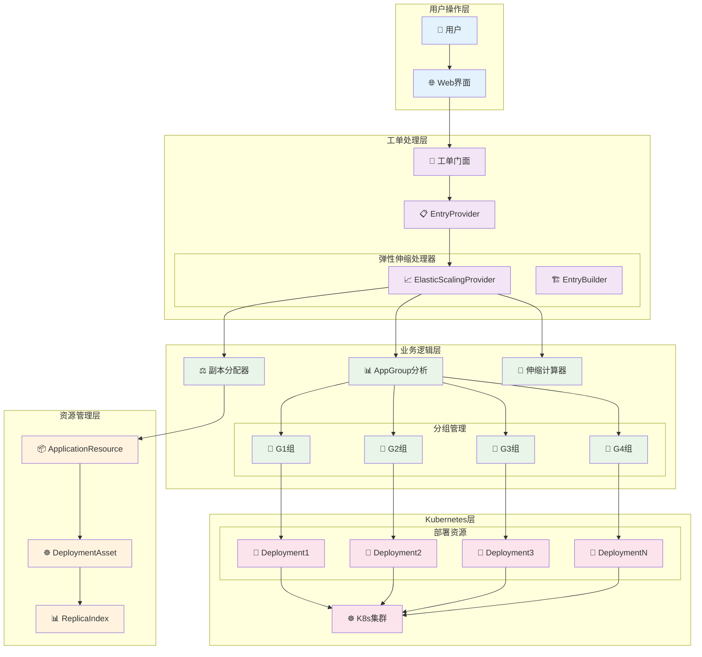
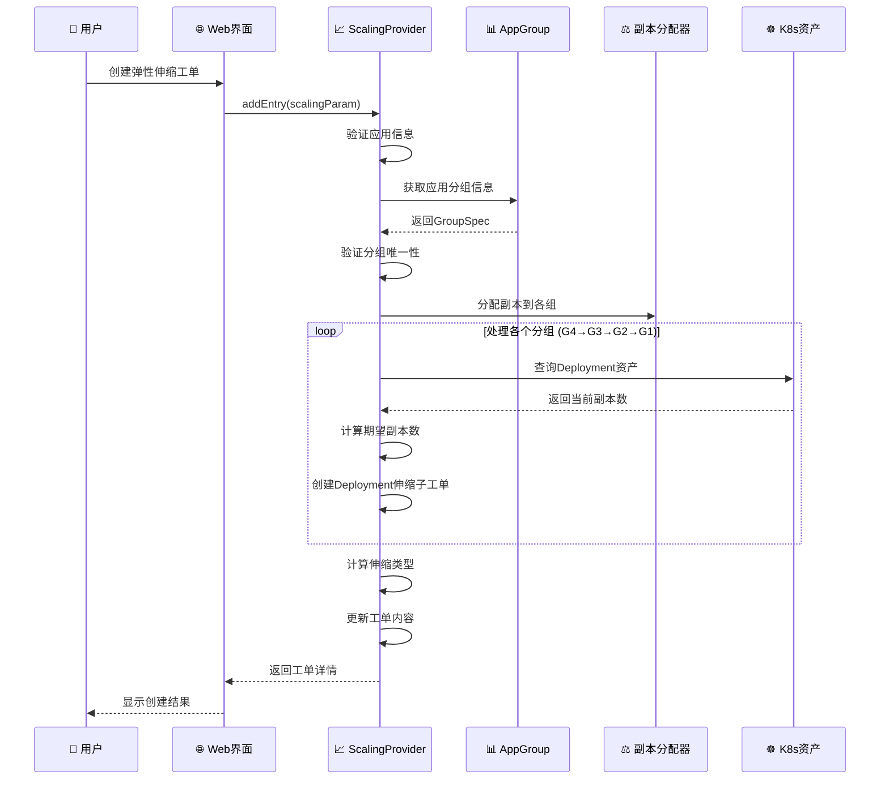
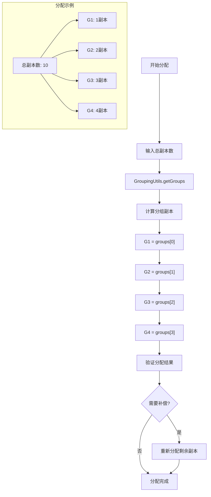
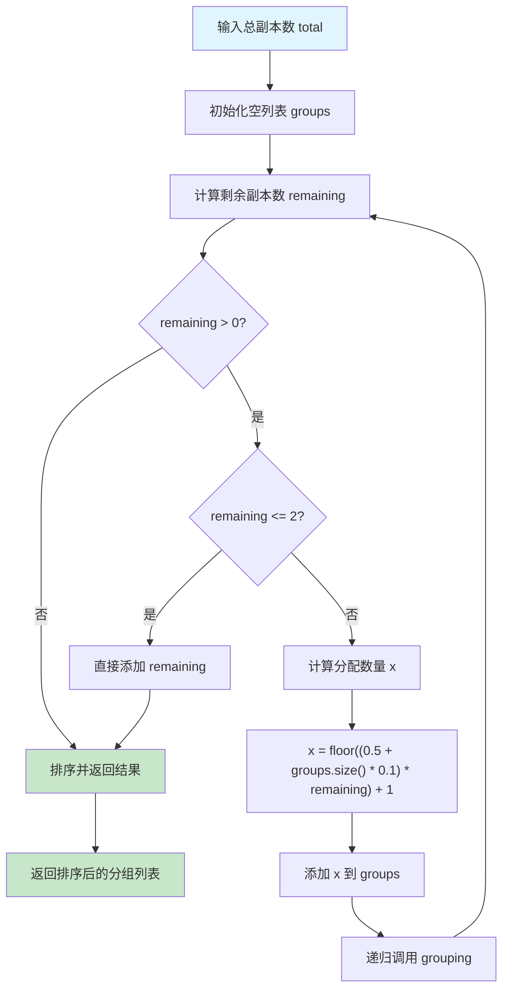
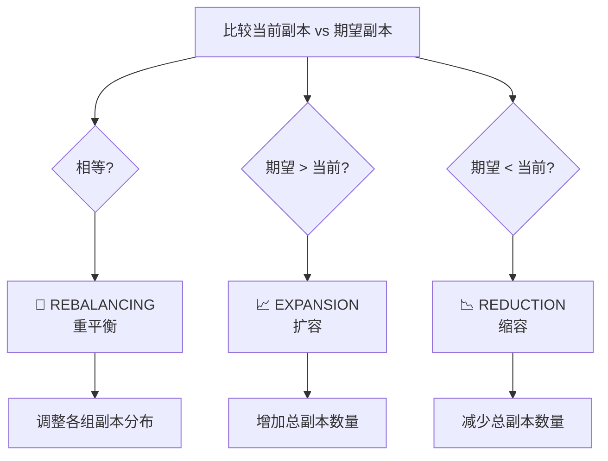
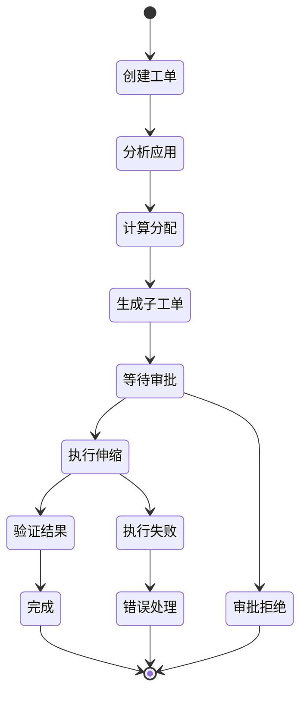

# 📈 应用弹性伸缩工单使用指南

## 📋 概述

应用弹性伸缩工单是Cratos工单系统中的核心功能之一，用于管理Kubernetes环境下应用的副本数量调整。该工单支持扩容、缩容和重平衡三种伸缩类型，并能智能分配副本到不同的部署组。

---

## 🏗️ 系统架构图



---

## 🔄 弹性伸缩流程

### 1️⃣ 工单创建流程



### 2️⃣ 副本分配算法



### 副本分配算法详解

#### 算法核心逻辑



#### 分配示例演示

```
示例1: 总副本数 = 10
├── 第1轮: remaining=10, x=floor((0.5+0*0.1)*10)+1=6, groups=[6]
├── 第2轮: remaining=4, x=floor((0.5+1*0.1)*4)+1=3, groups=[6,3]  
├── 第3轮: remaining=1, <=2直接添加, groups=[6,3,1]
└── 排序结果: [1,3,6] → G1=1, G2=3, G3=6, G4=0

示例2: 总副本数 = 15
├── 第1轮: remaining=15, x=floor((0.5+0*0.1)*15)+1=8, groups=[8]
├── 第2轮: remaining=7, x=floor((0.5+1*0.1)*7)+1=5, groups=[8,5]
├── 第3轮: remaining=2, <=2直接添加, groups=[8,5,2]
└── 排序结果: [2,5,8] → G1=2, G2=5, G3=8, G4=0

示例3: 总副本数 = 20
├── 第1轮: remaining=20, x=floor((0.5+0*0.1)*20)+1=11, groups=[11]
├── 第2轮: remaining=9, x=floor((0.5+1*0.1)*9)+1=6, groups=[11,6]
├── 第3轮: remaining=3, x=floor((0.5+2*0.1)*3)+1=3, groups=[11,6,3]
├── 第4轮: remaining=0, 结束
└── 排序结果: [3,6,11] → G1=3, G2=6, G3=11, G4=0
```



---

## 🎯 核心组件分析

### 1. 弹性伸缩提供者 (ApplicationElasticScalingTicketEntryProvider)

```java
@Component
@BusinessType(type = BusinessTypeEnum.APPLICATION)
@WorkOrderKey(key = WorkOrderKeys.APPLICATION_ELASTIC_SCALING)
public class ApplicationElasticScalingTicketEntryProvider 
    extends BaseTicketEntryProvider<ApplicationReplicasModel.ApplicationConfigurationChange, 
                                   WorkOrderTicketParam.AddApplicationElasticScalingTicketEntry> {
    
    // 核心依赖服务
    private final ApplicationResourceService applicationResourceService;
    private final ListAppGroup listAppGroup;
    private final EdsAssetService edsAssetService;
    private final EdsAssetIndexService edsAssetIndexService;
    
    @Override
    @Transactional(rollbackFor = {Exception.class})
    public WorkOrderTicketEntry addEntry(WorkOrderTicketParam.AddApplicationElasticScalingTicketEntry param) {
        // 1. 创建基础工单条目
        WorkOrderTicketEntry workOrderTicketEntry = super.addEntry(param);
        
        // 2. 添加应用部署资产
        addApplicationDeploymentAssets(param);
        
        // 3. 计算当前总副本数
        int currentReplicas = calculateCurrentReplicas(workOrderTicketEntry.getTicketId());
        
        // 4. 确定伸缩类型
        ElasticScalingTypes scalingType = getElasticScalingType(currentReplicas, expectedReplicas);
        
        // 5. 更新工单内容
        updateTicketEntry(workOrderTicketEntry, currentReplicas, scalingType);
        
        return workOrderTicketEntry;
    }
}
```

**核心特性**:

- 🎯 **工单类型**: `APPLICATION_ELASTIC_SCALING`
- 🏢 **业务类型**: `APPLICATION`
- 🔄 **事务管理**: 确保数据一致性
- 📊 **智能分析**: 自动计算伸缩类型和副本分配

### 2. 副本分配算法 (GroupingUtils)

```java
public static List<Integer> getGroups(int total) {
    List<Integer> groups = Lists.newArrayList();
    GroupingUtils.grouping(total, groups);
    return groups.stream()
        .sorted(Comparator.comparingInt(Integer::intValue))
        .toList();
}

public static void grouping(int total, List<Integer> groups) {
    int remaining = total - groups.stream().mapToInt(Integer::intValue).sum();
    
    if (remaining > 0) {
        if (remaining <= 2) {
            groups.add(remaining);
        } else {
            // 动态分配算法
            int x = (int) Math.floor((0.5 + groups.size() * 0.1) * remaining) + 1;
            groups.add(x);
            grouping(total, groups); // 递归分配
        }
    }
}
```

**分配策略**:

- 📊 **智能分配**: 基于数学算法的动态分配
- 🔄 **递归计算**: 确保所有副本都被分配
- ⚖️ **负载均衡**: 尽量平均分配到各个组
- 📈 **可扩展性**: 支持任意数量的副本分配

### 3. 伸缩类型枚举

```java
public enum ElasticScalingTypes {
    EXPANSION,    // 扩容：增加副本数量
    REDUCTION,    // 缩容：减少副本数量
    REBALANCING   // 重平衡：调整副本分布
}
```

**类型说明**:

| 类型 | 中文名称 | 触发条件 | 主要作用 |
|------|---------|----------|----------|
| `EXPANSION` | 扩容 | 期望副本 > 当前副本 | 增加应用处理能力 |
| `REDUCTION` | 缩容 | 期望副本 < 当前副本 | 节约资源成本 |
| `REBALANCING` | 重平衡 | 期望副本 = 当前副本 | 优化副本分布 |

---

## 📊 数据模型

### 应用配置变更模型

java
public class ApplicationReplicasModel {

```
@Data
public static class ApplicationConfigurationChange {
    private ApplicationVO.Application application;  // 应用信息
    private String namespace;                       // 命名空间
    private ApplicationConfig config;               // 配置信息
}

@Data
public static class ApplicationConfig {
    private Integer currentReplicas;    // 当前副本数
    private Integer expectedReplicas;   // 期望副本数
    private String elasticScalingType;  // 伸缩类型
}
```

}

### 工单表格展示

| Application Name | Namespace | Current Replicas | Expected Replicas | Scaling Type |
| --- | --- | --- | --- | --- |
| my-app | production | 6 | 10 | EXPANSION |
| web-service | staging | 4 | 2 | REDUCTION |
| api-gateway | default | 3 | 3 | REBALANCING |

---

## 🚀 使用指南

### 1. 创建弹性伸缩工单

#### 步骤1: 准备工单参数

```json
{
  "workOrderKey": "APPLICATION_ELASTIC_SCALING",
  "ticketId": 12345,
  "detail": {
    "application": {
      "name": "my-application",
      "id": 100
    },
    "namespace": "production",
    "config": {
      "expectedReplicas": 10
    }
  }
}
```

#### 步骤2: 提交工单申请

- 🌐 通过Web界面提交申请
- 📋 系统自动验证应用信息
- 🔍 检查应用分组配置
- ⚖️ 计算副本分配方案

#### 步骤3: 系统自动处理

- 📊 分析当前部署状态
- 🧮 计算伸缩类型和分配策略
- 🎯 创建子工单（Deployment级别）
- 📝 生成详细的执行计划

### 2. 副本分配示例

#### 场景1: 扩容操作

```
应用: web-service
当前副本: 6
期望副本: 15
伸缩类型: EXPANSION

分配结果:
├── G1组: 1副本 → 2副本 (+1)
├── G2组: 2副本 → 3副本 (+1)
├── G3组: 2副本 → 4副本 (+2)
└── G4组: 1副本 → 6副本 (+5)
```

#### 场景2: 缩容操作

```
应用: api-gateway
当前副本: 12
期望副本: 8
伸缩类型: REDUCTION

分配结果:
├── G1组: 3副本 → 1副本 (-2)
├── G2组: 3副本 → 2副本 (-1)
├── G3组: 3副本 → 2副本 (-1)
└── G4组: 3副本 → 3副本 (0)
```

#### 场景3: 重平衡操作

```
应用: data-processor
当前副本: 10
期望副本: 10
伸缩类型: REBALANCING

分配结果:
├── G1组: 4副本 → 1副本 (-3)
├── G2组: 2副本 → 2副本 (0)
├── G3组: 2副本 → 3副本 (+1)
└── G4组: 2副本 → 4副本 (+2)
```

### 3. 工单状态跟踪



---

## ⚠️ 注意事项

### 1. 前置条件检查

| 检查项 | 说明 | 错误处理 |
|--------|------|----------|
| **应用存在性** | 应用必须在系统中注册 | 抛出应用不存在异常 |
| **部署资源** | 应用必须有关联的Deployment | 抛出资源未找到异常 |
| **分组唯一性** | 应用只能有一个分组配置 | 抛出分组配置异常 |
| **命名空间** | 必须指定有效的命名空间 | 参数验证失败 |
| **副本数量** | 期望副本数必须为正整数 | 参数验证失败 |

### 2. 安全限制

```java
// 权限验证
@PreAuthorize("hasRole('APPLICATION_SCALING') or hasRole('ADMIN')")
public WorkOrderTicketEntry addEntry(AddApplicationElasticScalingTicketEntry param) {
    // 实现逻辑
}

// 资源限制
private void validateResourceLimits(int expectedReplicas) {
    if (expectedReplicas > MAX_REPLICAS_LIMIT) {
        throw new WorkOrderTicketException("副本数超过最大限制: " + MAX_REPLICAS_LIMIT);
    }
}
```

### 3. 最佳实践

#### 🎯 副本数量规划

- **生产环境**: 建议最少3个副本保证高可用
- **测试环境**: 可以使用1-2个副本节约资源
- **开发环境**: 通常1个副本即可

#### ⚖️ 分组策略

- **G1组**: 承载最少副本，通常用于核心服务
- **G4组**: 承载最多副本，用于处理主要负载
- **均衡分配**: 避免单点故障和负载不均

#### 🔄 伸缩时机

- **扩容时机**: 监控显示CPU/内存使用率持续高于80%
- **缩容时机**: 资源使用率持续低于30%且业务量下降
- **重平衡**: 定期优化副本分布，提高资源利用率

---

## 🔧 故障排查

### 常见问题及解决方案

| 问题 | 可能原因 | 解决方案 |
|------|----------|----------|
| **应用分组未找到** | 应用未配置分组信息 | 在应用管理中配置分组 |
| **部署资源为空** | 应用未关联Deployment | 检查应用资源绑定关系 |
| **副本分配失败** | 分组配置异常 | 验证分组配置的完整性 |
| **权限不足** | 用户无伸缩权限 | 申请相应的角色权限 |
| **工单创建失败** | 参数验证失败 | 检查输入参数的有效性 |

### 日志分析

```bash
# 查看工单处理日志
grep "ApplicationElasticScaling" /var/log/cratos/workorder.log

# 查看副本分配日志
grep "allocateReplicas" /var/log/cratos/workorder.log

# 查看错误日志
grep "ERROR.*ElasticScaling" /var/log/cratos/error.log
```

---

## 📈 监控指标

### 关键指标

| 指标名称 | 指标类型 | 说明 |
|---------|---------|------|
| `workorder.elastic.scaling.total` | Counter | 弹性伸缩工单总数 |
| `workorder.elastic.scaling.success.rate` | Gauge | 伸缩成功率 |
| `workorder.elastic.scaling.duration` | Timer | 伸缩处理时长 |
| `application.replicas.current` | Gauge | 应用当前副本数 |
| `application.replicas.expected` | Gauge | 应用期望副本数 |

### 告警规则

```yaml
# Prometheus告警规则
groups:
  - name: elastic-scaling
    rules:
      - alert: ElasticScalingFailed
        expr: workorder_elastic_scaling_success_rate < 0.95
        for: 5m
        labels:
          severity: warning
        annotations:
          summary: "弹性伸缩成功率过低"
          
      - alert: ScalingDurationTooLong
        expr: workorder_elastic_scaling_duration > 300
        for: 2m
        labels:
          severity: critical
        annotations:
          summary: "弹性伸缩处理时间过长"
```

---

## 🎯 总结

应用弹性伸缩工单是Cratos系统中的重要功能，它提供了：

### ✅ 核心优势

- 🎯 **智能分配**: 基于算法的副本智能分配
- 🔄 **多种模式**: 支持扩容、缩容、重平衡
- 📊 **可视化**: 清晰的工单表格展示
- 🛡️ **安全可控**: 完善的权限和参数验证
- 📈 **监控完善**: 全面的指标和告警机制

### 🚀 适用场景

- **业务高峰**: 快速扩容应对流量激增
- **成本优化**: 智能缩容节约资源成本
- **负载均衡**: 重平衡优化副本分布
- **容量规划**: 基于历史数据调整副本策略

这个功能为企业提供了灵活、安全、可控的应用伸缩能力，是现代云原生应用管理的重要工具。

