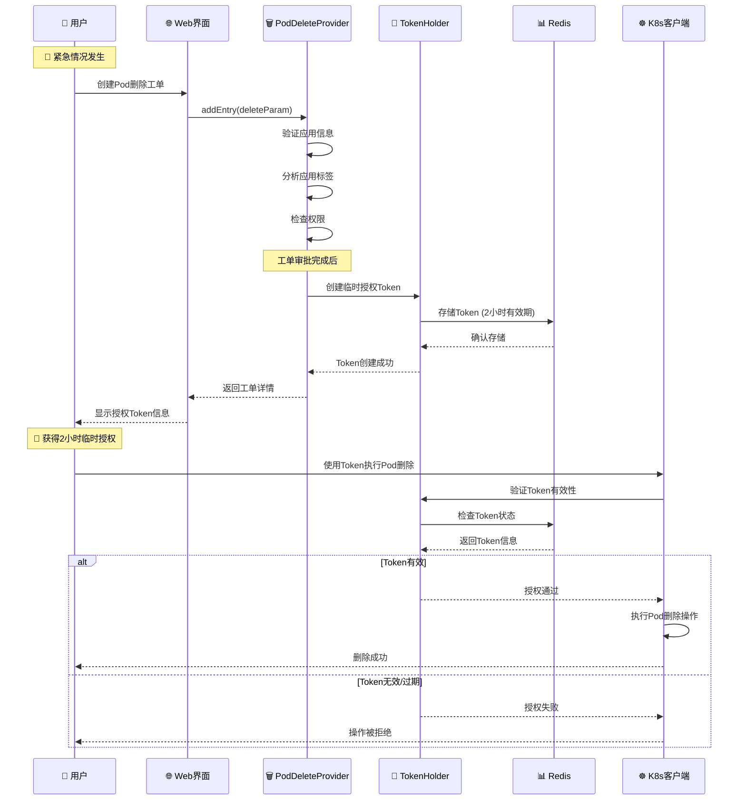
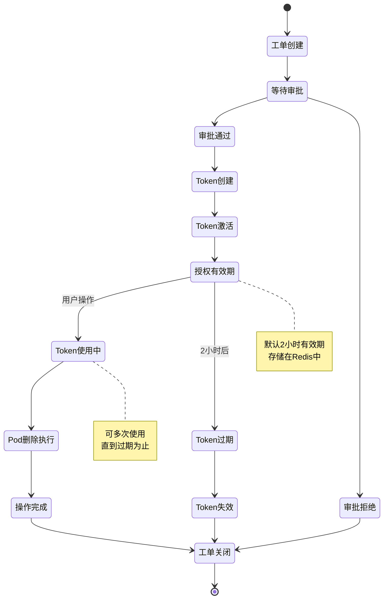
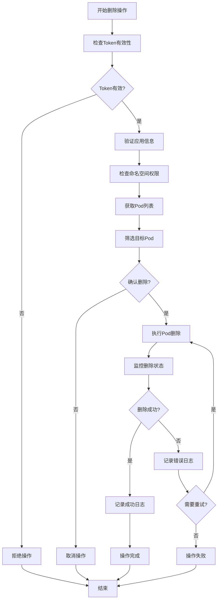

# 🚨 应用部署Pod删除工单使用指南

## 📋 概述

应用部署Pod删除工单是Cratos工单系统中的紧急处理功能，用于在紧急情况下快速删除应用的Pod实例。该工单属于紧急类工单，具有时效性授权机制，确保在紧急情况下能够快速响应，同时保证操作的安全性和可追溯性。

---

## 🏗️ 系统架构图


---

## 🔄 工单处理流程

### 1️⃣ 紧急工单创建流程



### 2️⃣ Token生命周期管理



### 3️⃣ Pod删除执行流程



---

## 🏷️ 核心组件分析

### 1. Pod删除工单提供者 (ApplicationDeploymentPodDeleteTicketEntryProvider)

```java
@Component
@BusinessType(type = BusinessTypeEnum.APPLICATION)
@WorkOrderKey(key = WorkOrderKeys.APPLICATION_DELETE_POD)
public class ApplicationDeploymentPodDeleteTicketEntryProvider 
    extends BaseTicketEntryProvider<ApplicationVO.Application, 
                                   WorkOrderTicketParam.AddApplicationDeletePodTicketEntry> {
    
    private final ApplicationDeletePodTokenHolder applicationDeletePodTokenHolder;
    
    @Override
    protected void processEntry(WorkOrderTicket workOrderTicket, WorkOrderTicketEntry entry,
                                ApplicationVO.Application application) throws WorkOrderTicketException {
        // 审批完成后2h内可以删除应用容器
        applicationDeletePodTokenHolder.setToken(workOrderTicket.getUsername(), 
                                                application.getApplicationName(),
                                                workOrderTicket);
    }
}
```

**核心特性**:
- 🎯 **工单类型**: `APPLICATION_DELETE_POD`
- 🏢 **业务类型**: `APPLICATION`
- ⏰ **时效授权**: 审批通过后2小时内有效
- 🔑 **Token机制**: 基于Redis的临时授权

### 2. Token持有者 (ApplicationDeletePodTokenHolder)

```java
@Component
@RequiredArgsConstructor
public class ApplicationDeletePodTokenHolder {
    
    private final RedisUtil redisUtil;
    private static final String KEY = "APPLICATION:DELETE:POD:TOKEN:USERNAME:{}:APPLICATION_NAME:{}";
    private static final long DEFAULT_EXPIRE = 2; // 2 hours
    
    public void setToken(String username, String applicationName, WorkOrderTicket ticket) {
        ApplicationDeletePodToken.Token token = ApplicationDeletePodToken.Token.builder()
            .username(username)
            .applicationName(applicationName)
            .ticketId(ticket.getId())
            .ticketNo(ticket.getTicketNo())
            .expires(ExpiredUtils.generateExpirationTime(DEFAULT_EXPIRE, TimeUnit.HOURS))
            .build();
        
        redisUtil.set(buildKey(username, applicationName), token, 60 * 60 * 2);
    }
    
    public ApplicationDeletePodToken.Token getToken(String username, String applicationName) {
        String key = buildKey(username, applicationName);
        if (redisUtil.hasKey(key)) {
            return (ApplicationDeletePodToken.Token) redisUtil.get(key);
        }
        return ApplicationDeletePodToken.Token.NO_TOKEN;
    }
}
```

**Token特性**:
- ⏰ **有效期**: 2小时自动过期
- 🔑 **唯一性**: 基于用户名和应用名生成唯一Key
- 📊 **存储**: Redis缓存存储，支持分布式
- 🛡️ **安全性**: 包含工单信息，可追溯操作来源

### 3. Token数据模型

```java
@Data
@Builder
public static class Token implements Serializable {
    private String username;           // 用户名
    private String applicationName;    // 应用名称
    private Integer ticketId;          // 工单ID
    private String ticketNo;           // 工单号
    private Date expires;              // 过期时间
    private Boolean valid;             // 是否有效
    private String desc;               // 描述信息
    
    public static final Token NO_TOKEN = Token.builder().valid(false).build();
}
```

---

## 📊 数据模型

### 工单表格展示

```markdown
| Application Name | Tags |
| --- | --- |
| web-service | env:production,team:backend,version:v1.2.0 |
| api-gateway | env:staging,team:platform,critical:true |
| data-processor | env:production,team:data,schedule:batch |
```

### Token存储结构

```json
{
  "username": "admin",
  "applicationName": "web-service",
  "ticketId": 12345,
  "ticketNo": "WO-2025-001234",
  "expires": "2025-08-22T10:00:00Z",
  "valid": true,
  "desc": "Temporary authorization on workOrder"
}
```

---

## 🚀 使用指南

### 1. 创建Pod删除工单

#### 步骤1: 准备工单参数
```json
{
  "workOrderKey": "APPLICATION_DELETE_POD",
  "ticketId": 12345,
  "detail": {
    "id": 100,
    "name": "web-service",
    "applicationName": "web-service",
    "businessTags": [
      {
        "tag": {
          "tagKey": "env",
          "tagValue": "production"
        }
      },
      {
        "tag": {
          "tagKey": "team", 
          "tagValue": "backend"
        }
      }
    ]
  }
}
```

#### 步骤2: 提交紧急工单
- 🚨 **紧急情况**: 应用出现严重故障需要重启
- 📋 **工单申请**: 通过Web界面提交删除申请
- ✅ **快速审批**: 紧急工单优先审批流程
- 🔑 **获得授权**: 审批通过后获得2小时临时授权

#### 步骤3: 执行Pod删除
```bash
# 使用API执行Pod删除
curl -X DELETE \
  -H "Authorization: Bearer ${TOKEN}" \
  -H "Content-Type: application/json" \
  "https://api.cratos.com/v1/applications/web-service/pods" \
  -d '{
    "namespace": "production",
    "selector": "app=web-service"
  }'
```

### 2. Token使用示例

#### 获取Token信息
```java
// Java代码示例
ApplicationDeletePodToken.Token token = applicationDeletePodTokenHolder
    .getToken("admin", "web-service");

if (token.getValid() && !ExpiredUtils.isExpired(token.getExpires())) {
    // Token有效，可以执行删除操作
    executePodDeletion(token);
} else {
    // Token无效或已过期
    throw new UnauthorizedException("Pod删除授权已过期");
}
```

#### 验证Token有效性
```java
public boolean validateToken(String username, String applicationName) {
    ApplicationDeletePodToken.Token token = getToken(username, applicationName);
    
    // 检查Token存在性
    if (token == ApplicationDeletePodToken.Token.NO_TOKEN) {
        return false;
    }
    
    // 检查Token有效性
    if (!token.getValid()) {
        return false;
    }
    
    // 检查Token是否过期
    if (ExpiredUtils.isExpired(token.getExpires())) {
        return false;
    }
    
    return true;
}
```

### 3. 紧急场景处理

#### 场景1: 应用Pod无响应
```
问题: web-service应用Pod全部无响应
解决方案:
1. 创建Pod删除工单
2. 紧急审批通过
3. 获得2小时删除授权
4. 批量删除无响应Pod
5. 等待新Pod自动创建
```

#### 场景2: 内存泄漏导致OOM
```
问题: api-gateway出现内存泄漏，频繁OOM
解决方案:
1. 创建紧急删除工单
2. 标注紧急级别
3. 快速审批流程
4. 删除问题Pod
5. 监控新Pod状态
```

#### 场景3: 配置错误需要重启
```
问题: 配置更新后Pod需要重启生效
解决方案:
1. 申请Pod删除权限
2. 审批通过获得Token
3. 滚动删除Pod实例
4. 验证新配置生效
```

---

## ⚠️ 安全注意事项

### 1. 权限控制

| 检查项 | 说明 | 实现方式 |
|--------|------|----------|
| **用户权限** | 只有授权用户可申请 | RBAC权限验证 |
| **应用权限** | 只能删除有权限的应用Pod | 应用权限检查 |
| **时间限制** | Token有2小时有效期 | Redis TTL机制 |
| **操作审计** | 所有操作完整记录 | 审计日志系统 |
| **紧急级别** | 紧急工单特殊标识 | 工单分类管理 |

### 2. 安全限制

```java
// 权限验证示例
@PreAuthorize("hasRole('EMERGENCY_OPERATOR') or hasRole('ADMIN')")
public void deletePods(String applicationName, String namespace) {
    // 验证Token
    if (!validateToken(getCurrentUser(), applicationName)) {
        throw new UnauthorizedException("无删除授权或授权已过期");
    }
    
    // 验证应用权限
    if (!hasApplicationPermission(getCurrentUser(), applicationName)) {
        throw new ForbiddenException("无应用操作权限");
    }
    
    // 执行删除操作
    podManager.deletePods(applicationName, namespace);
}
```

### 3. 操作限制

- ⏰ **时间窗口**: 仅在2小时授权期内有效
- 🎯 **应用范围**: 只能删除指定应用的Pod
- 👤 **用户绑定**: Token与申请用户绑定
- 📊 **操作记录**: 所有删除操作完整记录
- 🚨 **紧急标识**: 明确标识为紧急操作

---

## 🔧 故障排查

### 常见问题及解决方案

| 问题 | 可能原因 | 解决方案 |
|------|----------|----------|
| **Token获取失败** | Redis连接异常 | 检查Redis服务状态 |
| **Token已过期** | 超过2小时有效期 | 重新申请工单获得授权 |
| **权限不足** | 用户无紧急操作权限 | 申请相应角色权限 |
| **应用不存在** | 应用名称错误 | 验证应用名称正确性 |
| **Pod删除失败** | K8s集群异常 | 检查集群连接状态 |

### 监控指标

```yaml
# Prometheus监控指标
- name: pod_delete_token_created_total
  help: Pod删除Token创建总数
  type: counter
  
- name: pod_delete_token_expired_total  
  help: Pod删除Token过期总数
  type: counter
  
- name: pod_delete_operations_total
  help: Pod删除操作总数
  type: counter
  labels: [application, namespace, result]
  
- name: pod_delete_token_active_count
  help: 当前活跃Token数量
  type: gauge
```

### 告警规则

```yaml
# 告警配置
groups:
  - name: emergency-pod-delete
    rules:
      - alert: TooManyEmergencyTokens
        expr: pod_delete_token_active_count > 10
        for: 5m
        labels:
          severity: warning
        annotations:
          summary: "紧急删除Token数量过多"
          
      - alert: PodDeleteFailureRate
        expr: rate(pod_delete_operations_total{result="failed"}[5m]) > 0.1
        for: 2m
        labels:
          severity: critical
        annotations:
          summary: "Pod删除失败率过高"
```

---

## 📈 最佳实践

### 1. 使用场景

#### ✅ 适用场景
- 🚨 **应用故障**: Pod无响应需要紧急重启
- 💾 **内存泄漏**: OOM导致的Pod异常
- ⚙️ **配置更新**: 需要重启生效的配置变更
- 🔄 **版本回滚**: 紧急回滚需要删除新版本Pod
- 🛠️ **故障恢复**: 快速恢复服务可用性

#### ❌ 不适用场景
- 📅 **日常维护**: 计划内的维护操作
- 🔄 **常规重启**: 非紧急的重启需求
- 📊 **性能优化**: 非紧急的性能调优
- 🧪 **测试验证**: 测试环境的验证操作

### 2. 操作建议

#### 🎯 申请工单时
- 📝 **详细描述**: 清楚描述紧急情况和删除原因
- 🏷️ **准确标签**: 确保应用标签信息准确
- ⏰ **时间评估**: 评估2小时是否足够完成操作
- 👥 **通知相关人**: 提前通知相关团队成员

#### 🔑 使用Token时
- ✅ **及时验证**: 使用前验证Token有效性
- 🎯 **精确操作**: 只删除必要的Pod实例
- 📊 **监控状态**: 实时监控删除和重建状态
- 📝 **记录过程**: 详细记录操作过程和结果

#### 🔍 操作后检查
- 🚀 **Pod状态**: 确认新Pod正常启动
- 🌐 **服务可用**: 验证服务恢复正常
- 📊 **监控指标**: 检查应用性能指标
- 📋 **总结经验**: 记录问题原因和解决过程

---

## 🎯 总结

应用部署Pod删除工单是Cratos系统中的重要紧急处理功能，它提供了：

### ✅ 核心优势
- 🚨 **紧急响应**: 快速处理应用故障情况
- 🔑 **安全授权**: 基于Token的时效性授权机制
- 📊 **完整审计**: 所有操作可追溯和审计
- ⏰ **时间控制**: 2小时有效期防止权限滥用
- 🛡️ **权限隔离**: 用户和应用级别的权限控制

### 🚀 适用价值
- **故障恢复**: 快速恢复服务可用性
- **风险控制**: 限时授权降低安全风险
- **操作规范**: 标准化的紧急操作流程
- **责任追溯**: 完整的操作记录和审计

这个功能为企业提供了安全、可控、高效的紧急Pod删除能力，是现代云原生应用运维的重要工具。
