# 🚨 应用部署Pod删除工单使用指南

## 📋 概述

应用部署Pod删除工单是Cratos工单系统中的紧急处理功能，用于在紧急情况下快速删除应用的Pod实例。该工单属于紧急类工单，具有时效性授权机制，确保在紧急情况下能够快速响应，同时保证操作的安全性和可追溯性。

---

## 🏗️ 系统架构图

```mermaid
graph TB
    subgraph "用户操作层"
        USER[👤 用户]
        EMERGENCY[🚨 紧急情况]
        WEB_UI[🌐 Web界面]
    end
    
    subgraph "工单处理层"
        TICKET_FACADE[🎫 工单门面]
        ENTRY_PROVIDER[📋 PodDeleteProvider]
        
        subgraph "紧急处理器"
            DELETE_PROVIDER[🗑️ PodDeleteEntryProvider]
            ENTRY_BUILDER[🏗️ EntryBuilder]
        end
    end
    
    subgraph "授权管理层"
        TOKEN_HOLDER[🔑 TokenHolder]
        REDIS_CACHE[📊 Redis缓存]
        
        subgraph "Token管理"
            TOKEN_CREATE[➕ 创建Token]
            TOKEN_VALIDATE[✅ 验证Token]
            TOKEN_EXPIRE[⏰ Token过期]
        end
    end
    
    subgraph "业务逻辑层"
        APP_ANALYSIS[📊 应用分析]
        TAG_PROCESSOR[🏷️ 标签处理器]
        PERMISSION_CHECK[🛡️ 权限检查]
    end
    
    subgraph "执行层"
        K8S_CLIENT[☸️ K8s客户端]
        POD_MANAGER[🚀 Pod管理器]
        
        subgraph "Pod操作"
            POD_LIST[📋 Pod列表]
            POD_DELETE[🗑️ Pod删除]
            POD_STATUS[📊 状态监控]
        end
    end
    
    subgraph "Kubernetes集群"
        K8S_CLUSTER[☸️ K8s集群]
        
        subgraph "应用Pod"
            POD1[🚀 Pod1]
            POD2[🚀 Pod2]
            POD3[🚀 Pod3]
            PODN[🚀 PodN]
        end
    end
    
    %% 连接关系
    USER --> EMERGENCY
    EMERGENCY --> WEB_UI
    WEB_UI --> TICKET_FACADE
    TICKET_FACADE --> ENTRY_PROVIDER
    ENTRY_PROVIDER --> DELETE_PROVIDER
    
    DELETE_PROVIDER --> TOKEN_HOLDER
    TOKEN_HOLDER --> REDIS_CACHE
    TOKEN_HOLDER --> TOKEN_CREATE
    TOKEN_HOLDER --> TOKEN_VALIDATE
    TOKEN_HOLDER --> TOKEN_EXPIRE
    
    DELETE_PROVIDER --> APP_ANALYSIS
    APP_ANALYSIS --> TAG_PROCESSOR
    TAG_PROCESSOR --> PERMISSION_CHECK
    
    PERMISSION_CHECK --> K8S_CLIENT
    K8S_CLIENT --> POD_MANAGER
    POD_MANAGER --> POD_LIST
    POD_MANAGER --> POD_DELETE
    POD_MANAGER --> POD_STATUS
    
    POD_DELETE --> POD1
    POD_DELETE --> POD2
    POD_DELETE --> POD3
    POD_DELETE --> PODN
    
    POD1 --> K8S_CLUSTER
    POD2 --> K8S_CLUSTER
    POD3 --> K8S_CLUSTER
    PODN --> K8S_CLUSTER
    
    classDef userLayer fill:#ffebee
    classDef ticketLayer fill:#f3e5f5
    classDef authLayer fill:#e8f5e8
    classDef businessLayer fill:#fff3e0
    classDef executeLayer fill:#e3f2fd
    classDef k8sLayer fill:#fce4ec
    
    class USER,EMERGENCY,WEB_UI userLayer
    class TICKET_FACADE,ENTRY_PROVIDER,DELETE_PROVIDER,ENTRY_BUILDER ticketLayer
    class TOKEN_HOLDER,REDIS_CACHE,TOKEN_CREATE,TOKEN_VALIDATE,TOKEN_EXPIRE authLayer
    class APP_ANALYSIS,TAG_PROCESSOR,PERMISSION_CHECK businessLayer
    class K8S_CLIENT,POD_MANAGER,POD_LIST,POD_DELETE,POD_STATUS executeLayer
    class K8S_CLUSTER,POD1,POD2,POD3,PODN k8sLayer
```



---

## 🔄 工单处理流程

### 1️⃣ 完整工单生命周期流程

```mermaid
sequenceDiagram
    participant User as 👤 用户
    participant UI as 🌐 Web界面
    participant Provider as 🗑️ PodDeleteProvider
    participant TokenHolder as 🔑 TokenHolder
    participant Redis as 📊 Redis
    participant K8sClient as ☸️ K8s客户端
    participant EntryService as 📝 EntryService
    
    Note over User: 🚨 紧急情况发生
    User->>UI: 创建Pod删除工单
    UI->>Provider: addEntry(deleteParam)
    
    Provider->>Provider: 验证应用信息
    Provider->>Provider: 分析应用标签
    Provider->>Provider: 检查权限
    Provider->>EntryService: 保存工单条目
    
    Note over Provider: 工单审批完成后
    Provider->>Provider: processEntry()调用
    Provider->>TokenHolder: 创建临时授权Token
    TokenHolder->>Redis: 存储Token (2小时有效期)
    Redis-->>TokenHolder: 确认存储
    TokenHolder-->>Provider: Token创建成功
    
    Provider->>EntryService: 记录Token创建成功
    Note over EntryService: 更新工单条目状态<br/>success=true, completed=true<br/>executedAt=now, completedAt=now
    
    Provider-->>UI: 返回工单详情
    UI-->>User: 显示授权Token信息
    
    Note over User: 🔑 获得2小时临时授权
    User->>K8sClient: 使用Token执行Pod删除
    K8sClient->>TokenHolder: 验证Token有效性
    TokenHolder->>Redis: 检查Token状态
    Redis-->>TokenHolder: 返回Token信息
    
    alt Token有效
        TokenHolder-->>K8sClient: 授权通过
        K8sClient->>K8sClient: 执行Pod删除操作
        K8sClient->>EntryService: 记录删除操作结果
        Note over EntryService: 记录实际删除操作<br/>包含删除的Pod信息<br/>操作时间和结果
        K8sClient-->>User: 删除成功
    else Token无效/过期
        TokenHolder-->>K8sClient: 授权失败
        K8sClient->>EntryService: 记录授权失败
        K8sClient-->>User: 操作被拒绝
    end
```



### 2️⃣ 工单条目状态管理

```mermaid
stateDiagram-v2
    [*] --> 条目创建
    条目创建 --> 等待审批
    等待审批 --> 审批通过
    等待审批 --> 审批拒绝
    
    审批通过 --> Token授权处理
    Token授权处理 --> 处理成功 : processEntry()成功
    Token授权处理 --> 处理失败 : processEntry()失败
    
    处理成功 --> 记录成功状态
    处理失败 --> 记录失败状态
    
    记录成功状态 --> 等待用户操作
    记录失败状态 --> 工单关闭
    
    等待用户操作 --> Pod删除操作 : 用户使用Token
    Pod删除操作 --> 删除成功
    Pod删除操作 --> 删除失败
    
    删除成功 --> 记录删除结果
    删除失败 --> 记录删除结果
    
    记录删除结果 --> 工单完成
    审批拒绝 --> 工单关闭
    工单完成 --> [*]
    工单关闭 --> [*]
    
    note right of 记录成功状态
        success = true
        completed = true
        executedAt = now
        completedAt = now
    end note
    
    note right of 记录失败状态
        success = false
        completed = true
        result = error_message
        executedAt = now
        completedAt = now
    end note
```



### 3️⃣ 操作记录机制详解

```mermaid
graph TD
    START[工单条目处理开始] --> PROCESS[processEntry执行]
    
    PROCESS --> TOKEN_CREATE[创建Token授权]
    TOKEN_CREATE --> SUCCESS{处理成功?}
    
    SUCCESS -->|是| RECORD_SUCCESS[InvokeEntryResult.success]
    SUCCESS -->|否| RECORD_FAILED[InvokeEntryResult.failed]
    
    RECORD_SUCCESS --> SET_SUCCESS[设置success=true]
    RECORD_FAILED --> SET_FAILED[设置success=false]
    RECORD_FAILED --> SET_ERROR[设置result=错误信息]
    
    SET_SUCCESS --> SET_COMPLETED[设置completed=true]
    SET_FAILED --> SET_COMPLETED
    SET_ERROR --> SET_COMPLETED
    
    SET_COMPLETED --> SET_TIMES[设置executedAt和completedAt]
    SET_TIMES --> SAVE_ENTRY[保存工单条目]
    
    SAVE_ENTRY --> USER_OPERATION[用户执行Pod删除]
    USER_OPERATION --> LOG_OPERATION[记录实际删除操作]
    LOG_OPERATION --> END[处理完成]
    
    style RECORD_SUCCESS fill:#c8e6c9
    style RECORD_FAILED fill:#ffcdd2
    style LOG_OPERATION fill:#e1f5fe
```



## 📝 操作记录机制深度分析

### 1. 工单条目状态字段

```java
// WorkOrderTicketEntry 关键字段
public class WorkOrderTicketEntry {
    private Boolean completed;      // 是否完成
    private Boolean success;        // 是否成功
    private String result;          // 结果信息(失败时记录错误)
    private Date executedAt;        // 执行时间
    private Date completedAt;       // 完成时间
}
```

### 2. 操作记录工具类 (InvokeEntryResult)

```java
public class InvokeEntryResult {
    
    // 记录成功操作
    public static void success(WorkOrderTicketEntry entry) {
        entry.setSuccess(true);           // 标记成功
        completed(entry);                 // 设置完成状态
    }
    
    // 记录失败操作
    public static void failed(WorkOrderTicketEntry entry, String message) {
        entry.setResult(message);         // 记录错误信息
        entry.setSuccess(false);          // 标记失败
        completed(entry);                 // 设置完成状态
    }
    
    // 设置完成状态
    public static void completed(WorkOrderTicketEntry entry) {
        entry.setExecutedAt(new Date());  // 记录执行时间
        entry.setCompletedAt(new Date()); // 记录完成时间
        entry.setCompleted(true);         // 标记已完成
    }
}
```

### 3. 基础处理器的记录逻辑

```java
// BaseTicketEntryProvider.processEntry()
@Override
public void processEntry(WorkOrderTicketEntry entry) {
    Detail detail = loadAs(entry);
    WorkOrderTicket ticket = workOrderTicketService.getById(entry.getTicketId());
    
    try {
        // 调用具体的处理逻辑 (创建Token)
        processEntry(ticket, entry, detail);
        
        // 记录成功状态
        InvokeEntryResult.success(entry);
        
    } catch (Exception e) {
        if (!(e instanceof WorkOrderTicketException)) {
            log.debug("Error processing ticket entry: {}", e.getMessage());
        }
        
        // 记录失败状态和错误信息
        InvokeEntryResult.failed(entry, e.getMessage());
    }
    
    // 保存工单条目状态到数据库
    saveEntry(entry);
}
```

### 4. Pod删除操作的双重记录机制

#### 4.1 Token创建记录
```java
// ApplicationDeploymentPodDeleteTicketEntryProvider.processEntry()
@Override
protected void processEntry(WorkOrderTicket workOrderTicket, WorkOrderTicketEntry entry,
                            ApplicationVO.Application application) throws WorkOrderTicketException {
    try {
        // 创建2小时有效的删除授权Token
        applicationDeletePodTokenHolder.setToken(
            workOrderTicket.getUsername(), 
            application.getApplicationName(),
            workOrderTicket
        );
        
        // 这里会被BaseTicketEntryProvider自动记录为成功
        // InvokeEntryResult.success(entry) 会被调用
        
    } catch (Exception e) {
        // 如果Token创建失败，会被记录为失败
        // InvokeEntryResult.failed(entry, e.getMessage()) 会被调用
        throw new WorkOrderTicketException("Token创建失败: " + e.getMessage());
    }
}
```

#### 4.2 实际删除操作记录
```java
// 用户使用Token执行Pod删除时的记录逻辑
public class PodDeleteOperationLogger {
    
    public void recordPodDeletionOperation(String username, String applicationName, 
                                         List<String> deletedPods, boolean success, String error) {
        
        // 获取对应的工单条目
        WorkOrderTicketEntry entry = findEntryByUserAndApp(username, applicationName);
        
        if (entry != null) {
            // 创建操作记录
            PodDeleteOperationRecord record = PodDeleteOperationRecord.builder()
                .ticketId(entry.getTicketId())
                .ticketEntryId(entry.getId())
                .username(username)
                .applicationName(applicationName)
                .deletedPods(deletedPods)
                .operationTime(new Date())
                .success(success)
                .errorMessage(error)
                .build();
            
            // 保存操作记录
            podDeleteOperationService.save(record);
            
            // 更新工单条目的最后操作时间
            entry.setLastOperationAt(new Date());
            workOrderTicketEntryService.updateByPrimaryKey(entry);
        }
    }
}
```

### 5. 完整的操作审计链

```mermaid
graph TB
    subgraph "工单层面记录"
        TICKET_CREATE[工单创建记录]
        TICKET_APPROVE[工单审批记录]
        TICKET_COMPLETE[工单完成记录]
    end
    
    subgraph "条目层面记录"
        ENTRY_CREATE[条目创建记录]
        ENTRY_PROCESS[条目处理记录]
        ENTRY_SUCCESS[处理成功记录]
        ENTRY_FAILED[处理失败记录]
    end
    
    subgraph "Token层面记录"
        TOKEN_CREATE[Token创建记录]
        TOKEN_USE[Token使用记录]
        TOKEN_EXPIRE[Token过期记录]
    end
    
    subgraph "操作层面记录"
        POD_DELETE[Pod删除操作记录]
        POD_SUCCESS[删除成功记录]
        POD_FAILED[删除失败记录]
    end
    
    TICKET_CREATE --> ENTRY_CREATE
    ENTRY_CREATE --> ENTRY_PROCESS
    ENTRY_PROCESS --> ENTRY_SUCCESS
    ENTRY_PROCESS --> ENTRY_FAILED
    
    ENTRY_SUCCESS --> TOKEN_CREATE
    TOKEN_CREATE --> TOKEN_USE
    TOKEN_USE --> POD_DELETE
    
    POD_DELETE --> POD_SUCCESS
    POD_DELETE --> POD_FAILED
    
    POD_SUCCESS --> TICKET_COMPLETE
    POD_FAILED --> TICKET_COMPLETE
    
    TOKEN_USE --> TOKEN_EXPIRE
    TOKEN_EXPIRE --> TICKET_COMPLETE
    
    classDef ticketLevel fill:#e3f2fd
    classDef entryLevel fill:#f3e5f5
    classDef tokenLevel fill:#e8f5e8
    classDef operationLevel fill:#fff3e0
    
    class TICKET_CREATE,TICKET_APPROVE,TICKET_COMPLETE ticketLevel
    class ENTRY_CREATE,ENTRY_PROCESS,ENTRY_SUCCESS,ENTRY_FAILED entryLevel
    class TOKEN_CREATE,TOKEN_USE,TOKEN_EXPIRE tokenLevel
    class POD_DELETE,POD_SUCCESS,POD_FAILED operationLevel
```



### 6. 数据库记录示例

#### 6.1 工单条目记录
```sql
-- work_order_ticket_entry 表记录
INSERT INTO work_order_ticket_entry (
    ticket_id, name, business_type, business_id,
    completed, success, result, 
    executed_at, completed_at, created_time
) VALUES (
    12345, 'web-service', 'APPLICATION', 100,
    true, true, NULL,
    '2025-08-22 10:00:00', '2025-08-22 10:00:01', '2025-08-22 09:30:00'
);
```

#### 6.2 Token使用记录
```sql
-- pod_delete_token_usage 表记录
INSERT INTO pod_delete_token_usage (
    ticket_id, username, application_name,
    token_created_at, token_used_at, token_expired_at,
    operations_count, last_operation_at
) VALUES (
    12345, 'admin', 'web-service',
    '2025-08-22 10:00:00', '2025-08-22 10:15:00', '2025-08-22 12:00:00',
    3, '2025-08-22 11:30:00'
);
```

#### 6.3 Pod删除操作记录
```sql
-- pod_delete_operations 表记录
INSERT INTO pod_delete_operations (
    ticket_id, ticket_entry_id, username, application_name,
    namespace, deleted_pods, operation_time, success, error_message
) VALUES (
    12345, 67890, 'admin', 'web-service',
    'production', '["web-service-7d4f8b9c-abc12", "web-service-7d4f8b9c-def34"]',
    '2025-08-22 10:15:00', true, NULL
);
```

### 7. 审计查询示例

```java
// 查询用户的Pod删除操作历史
public List<PodDeleteAuditRecord> getUserPodDeleteHistory(String username, Date startTime, Date endTime) {
    return auditService.queryPodDeleteOperations(
        PodDeleteAuditQuery.builder()
            .username(username)
            .startTime(startTime)
            .endTime(endTime)
            .includeTokenInfo(true)
            .includeTicketInfo(true)
            .build()
    );
}

// 查询应用的Pod删除操作历史
public List<PodDeleteAuditRecord> getApplicationPodDeleteHistory(String applicationName, Date startTime, Date endTime) {
    return auditService.queryPodDeleteOperations(
        PodDeleteAuditQuery.builder()
            .applicationName(applicationName)
            .startTime(startTime)
            .endTime(endTime)
            .includeUserInfo(true)
            .includeOperationDetails(true)
            .build()
    );
}
```

### 1. Pod删除工单提供者 (ApplicationDeploymentPodDeleteTicketEntryProvider)

```java
@Component
@BusinessType(type = BusinessTypeEnum.APPLICATION)
@WorkOrderKey(key = WorkOrderKeys.APPLICATION_DELETE_POD)
public class ApplicationDeploymentPodDeleteTicketEntryProvider 
    extends BaseTicketEntryProvider<ApplicationVO.Application, 
                                   WorkOrderTicketParam.AddApplicationDeletePodTicketEntry> {
    
    private final ApplicationDeletePodTokenHolder applicationDeletePodTokenHolder;
    
    @Override
    protected void processEntry(WorkOrderTicket workOrderTicket, WorkOrderTicketEntry entry,
                                ApplicationVO.Application application) throws WorkOrderTicketException {
        // 审批完成后2h内可以删除应用容器
        applicationDeletePodTokenHolder.setToken(workOrderTicket.getUsername(), 
                                                application.getApplicationName(),
                                                workOrderTicket);
    }
}
```

**核心特性**:
- 🎯 **工单类型**: `APPLICATION_DELETE_POD`
- 🏢 **业务类型**: `APPLICATION`
- ⏰ **时效授权**: 审批通过后2小时内有效
- 🔑 **Token机制**: 基于Redis的临时授权

### 2. Token持有者 (ApplicationDeletePodTokenHolder)

```java
@Component
@RequiredArgsConstructor
public class ApplicationDeletePodTokenHolder {
    
    private final RedisUtil redisUtil;
    private static final String KEY = "APPLICATION:DELETE:POD:TOKEN:USERNAME:{}:APPLICATION_NAME:{}";
    private static final long DEFAULT_EXPIRE = 2; // 2 hours
    
    public void setToken(String username, String applicationName, WorkOrderTicket ticket) {
        ApplicationDeletePodToken.Token token = ApplicationDeletePodToken.Token.builder()
            .username(username)
            .applicationName(applicationName)
            .ticketId(ticket.getId())
            .ticketNo(ticket.getTicketNo())
            .expires(ExpiredUtils.generateExpirationTime(DEFAULT_EXPIRE, TimeUnit.HOURS))
            .build();
        
        redisUtil.set(buildKey(username, applicationName), token, 60 * 60 * 2);
    }
    
    public ApplicationDeletePodToken.Token getToken(String username, String applicationName) {
        String key = buildKey(username, applicationName);
        if (redisUtil.hasKey(key)) {
            return (ApplicationDeletePodToken.Token) redisUtil.get(key);
        }
        return ApplicationDeletePodToken.Token.NO_TOKEN;
    }
}
```

**Token特性**:
- ⏰ **有效期**: 2小时自动过期
- 🔑 **唯一性**: 基于用户名和应用名生成唯一Key
- 📊 **存储**: Redis缓存存储，支持分布式
- 🛡️ **安全性**: 包含工单信息，可追溯操作来源

### 3. Token数据模型

```java
@Data
@Builder
public static class Token implements Serializable {
    private String username;           // 用户名
    private String applicationName;    // 应用名称
    private Integer ticketId;          // 工单ID
    private String ticketNo;           // 工单号
    private Date expires;              // 过期时间
    private Boolean valid;             // 是否有效
    private String desc;               // 描述信息
    
    public static final Token NO_TOKEN = Token.builder().valid(false).build();
}
```

---

## 📊 数据模型

### 工单表格展示

```markdown
| Application Name | Tags |
| --- | --- |
| web-service | env:production,team:backend,version:v1.2.0 |
| api-gateway | env:staging,team:platform,critical:true |
| data-processor | env:production,team:data,schedule:batch |
```

### Token存储结构

```json
{
  "username": "admin",
  "applicationName": "web-service",
  "ticketId": 12345,
  "ticketNo": "WO-2025-001234",
  "expires": "2025-08-22T10:00:00Z",
  "valid": true,
  "desc": "Temporary authorization on workOrder"
}
```

---

## 🚀 使用指南

### 1. 创建Pod删除工单

#### 步骤1: 准备工单参数
```json
{
  "workOrderKey": "APPLICATION_DELETE_POD",
  "ticketId": 12345,
  "detail": {
    "id": 100,
    "name": "web-service",
    "applicationName": "web-service",
    "businessTags": [
      {
        "tag": {
          "tagKey": "env",
          "tagValue": "production"
        }
      },
      {
        "tag": {
          "tagKey": "team", 
          "tagValue": "backend"
        }
      }
    ]
  }
}
```

#### 步骤2: 提交紧急工单
- 🚨 **紧急情况**: 应用出现严重故障需要重启
- 📋 **工单申请**: 通过Web界面提交删除申请
- ✅ **快速审批**: 紧急工单优先审批流程
- 🔑 **获得授权**: 审批通过后获得2小时临时授权

#### 步骤3: 执行Pod删除
```bash
# 使用API执行Pod删除
curl -X DELETE \
  -H "Authorization: Bearer ${TOKEN}" \
  -H "Content-Type: application/json" \
  "https://api.cratos.com/v1/applications/web-service/pods" \
  -d '{
    "namespace": "production",
    "selector": "app=web-service"
  }'
```

### 2. Token使用示例

#### 获取Token信息
```java
// Java代码示例
ApplicationDeletePodToken.Token token = applicationDeletePodTokenHolder
    .getToken("admin", "web-service");

if (token.getValid() && !ExpiredUtils.isExpired(token.getExpires())) {
    // Token有效，可以执行删除操作
    executePodDeletion(token);
} else {
    // Token无效或已过期
    throw new UnauthorizedException("Pod删除授权已过期");
}
```

#### 验证Token有效性
```java
public boolean validateToken(String username, String applicationName) {
    ApplicationDeletePodToken.Token token = getToken(username, applicationName);
    
    // 检查Token存在性
    if (token == ApplicationDeletePodToken.Token.NO_TOKEN) {
        return false;
    }
    
    // 检查Token有效性
    if (!token.getValid()) {
        return false;
    }
    
    // 检查Token是否过期
    if (ExpiredUtils.isExpired(token.getExpires())) {
        return false;
    }
    
    return true;
}
```

### 3. 紧急场景处理

#### 场景1: 应用Pod无响应
```
问题: web-service应用Pod全部无响应
解决方案:
1. 创建Pod删除工单
2. 紧急审批通过
3. 获得2小时删除授权
4. 批量删除无响应Pod
5. 等待新Pod自动创建
```

#### 场景2: 内存泄漏导致OOM
```
问题: api-gateway出现内存泄漏，频繁OOM
解决方案:
1. 创建紧急删除工单
2. 标注紧急级别
3. 快速审批流程
4. 删除问题Pod
5. 监控新Pod状态
```

#### 场景3: 配置错误需要重启
```
问题: 配置更新后Pod需要重启生效
解决方案:
1. 申请Pod删除权限
2. 审批通过获得Token
3. 滚动删除Pod实例
4. 验证新配置生效
```

---

## ⚠️ 安全注意事项

### 1. 权限控制

| 检查项 | 说明 | 实现方式 |
|--------|------|----------|
| **用户权限** | 只有授权用户可申请 | RBAC权限验证 |
| **应用权限** | 只能删除有权限的应用Pod | 应用权限检查 |
| **时间限制** | Token有2小时有效期 | Redis TTL机制 |
| **操作审计** | 所有操作完整记录 | 审计日志系统 |
| **紧急级别** | 紧急工单特殊标识 | 工单分类管理 |

### 2. 安全限制

```java
// 权限验证示例
@PreAuthorize("hasRole('EMERGENCY_OPERATOR') or hasRole('ADMIN')")
public void deletePods(String applicationName, String namespace) {
    // 验证Token
    if (!validateToken(getCurrentUser(), applicationName)) {
        throw new UnauthorizedException("无删除授权或授权已过期");
    }
    
    // 验证应用权限
    if (!hasApplicationPermission(getCurrentUser(), applicationName)) {
        throw new ForbiddenException("无应用操作权限");
    }
    
    // 执行删除操作
    podManager.deletePods(applicationName, namespace);
}
```

### 3. 操作限制

- ⏰ **时间窗口**: 仅在2小时授权期内有效
- 🎯 **应用范围**: 只能删除指定应用的Pod
- 👤 **用户绑定**: Token与申请用户绑定
- 📊 **操作记录**: 所有删除操作完整记录
- 🚨 **紧急标识**: 明确标识为紧急操作

---

## 🔧 故障排查

### 常见问题及解决方案

| 问题 | 可能原因 | 解决方案 |
|------|----------|----------|
| **Token获取失败** | Redis连接异常 | 检查Redis服务状态 |
| **Token已过期** | 超过2小时有效期 | 重新申请工单获得授权 |
| **权限不足** | 用户无紧急操作权限 | 申请相应角色权限 |
| **应用不存在** | 应用名称错误 | 验证应用名称正确性 |
| **Pod删除失败** | K8s集群异常 | 检查集群连接状态 |

### 监控指标

```yaml
# Prometheus监控指标
- name: pod_delete_ticket_created_total
  help: Pod删除工单创建总数
  type: counter
  labels: [application, username]
  
- name: pod_delete_token_created_total
  help: Pod删除Token创建总数
  type: counter
  labels: [application, username, result]
  
- name: pod_delete_token_expired_total  
  help: Pod删除Token过期总数
  type: counter
  labels: [application, username]
  
- name: pod_delete_operations_total
  help: Pod删除操作总数
  type: counter
  labels: [application, namespace, username, result]
  
- name: pod_delete_token_active_count
  help: 当前活跃Token数量
  type: gauge
  
- name: pod_delete_entry_processing_duration
  help: 工单条目处理时长
  type: histogram
  labels: [application, result]
  
- name: pod_delete_operation_success_rate
  help: Pod删除操作成功率
  type: gauge
  labels: [application, time_window]
```

### 告警规则

```yaml
# 告警配置
groups:
  - name: emergency-pod-delete
    rules:
      - alert: TooManyEmergencyTokens
        expr: pod_delete_token_active_count > 10
        for: 5m
        labels:
          severity: warning
        annotations:
          summary: "紧急删除Token数量过多"
          description: "当前活跃的Pod删除Token数量为 {{ $value }}，可能存在异常情况"
          
      - alert: PodDeleteFailureRate
        expr: rate(pod_delete_operations_total{result="failed"}[5m]) > 0.1
        for: 2m
        labels:
          severity: critical
        annotations:
          summary: "Pod删除失败率过高"
          description: "Pod删除操作失败率为 {{ $value }}，需要立即检查"
          
      - alert: TokenProcessingFailure
        expr: rate(pod_delete_token_created_total{result="failed"}[10m]) > 0.05
        for: 3m
        labels:
          severity: warning
        annotations:
          summary: "Token创建失败率异常"
          description: "Token创建失败率为 {{ $value }}，可能存在系统问题"
          
      - alert: UnusedTokensAccumulating
        expr: pod_delete_token_active_count - rate(pod_delete_operations_total[1h]) * 3600 > 5
        for: 15m
        labels:
          severity: info
        annotations:
          summary: "存在大量未使用的Token"
          description: "有 {{ $value }} 个Token创建后未被使用，可能需要关注"
```

---

## 📈 最佳实践

### 1. 使用场景

#### ✅ 适用场景
- 🚨 **应用故障**: Pod无响应需要紧急重启
- 💾 **内存泄漏**: OOM导致的Pod异常
- ⚙️ **配置更新**: 需要重启生效的配置变更
- 🔄 **版本回滚**: 紧急回滚需要删除新版本Pod
- 🛠️ **故障恢复**: 快速恢复服务可用性

#### ❌ 不适用场景
- 📅 **日常维护**: 计划内的维护操作
- 🔄 **常规重启**: 非紧急的重启需求
- 📊 **性能优化**: 非紧急的性能调优
- 🧪 **测试验证**: 测试环境的验证操作

### 2. 操作建议

#### 🎯 申请工单时
- 📝 **详细描述**: 清楚描述紧急情况和删除原因
- 🏷️ **准确标签**: 确保应用标签信息准确
- ⏰ **时间评估**: 评估2小时是否足够完成操作
- 👥 **通知相关人**: 提前通知相关团队成员

#### 🔑 使用Token时
- ✅ **及时验证**: 使用前验证Token有效性
- 🎯 **精确操作**: 只删除必要的Pod实例
- 📊 **监控状态**: 实时监控删除和重建状态
- 📝 **记录过程**: 详细记录操作过程和结果

#### 🔍 操作后检查
- 🚀 **Pod状态**: 确认新Pod正常启动
- 🌐 **服务可用**: 验证服务恢复正常
- 📊 **监控指标**: 检查应用性能指标
- 📋 **总结经验**: 记录问题原因和解决过程

---

## 🎯 总结

应用部署Pod删除工单是Cratos系统中的重要紧急处理功能，它提供了：

### ✅ 核心优势
- 🚨 **紧急响应**: 快速处理应用故障情况
- 🔑 **安全授权**: 基于Token的时效性授权机制
- 📊 **完整审计**: 所有操作可追溯和审计
- ⏰ **时间控制**: 2小时有效期防止权限滥用
- 🛡️ **权限隔离**: 用户和应用级别的权限控制

### 🚀 适用价值
- **故障恢复**: 快速恢复服务可用性
- **风险控制**: 限时授权降低安全风险
- **操作规范**: 标准化的紧急操作流程
- **责任追溯**: 完整的操作记录和审计

这个功能为企业提供了安全、可控、高效的紧急Pod删除能力，是现代云原生应用运维的重要工具。
