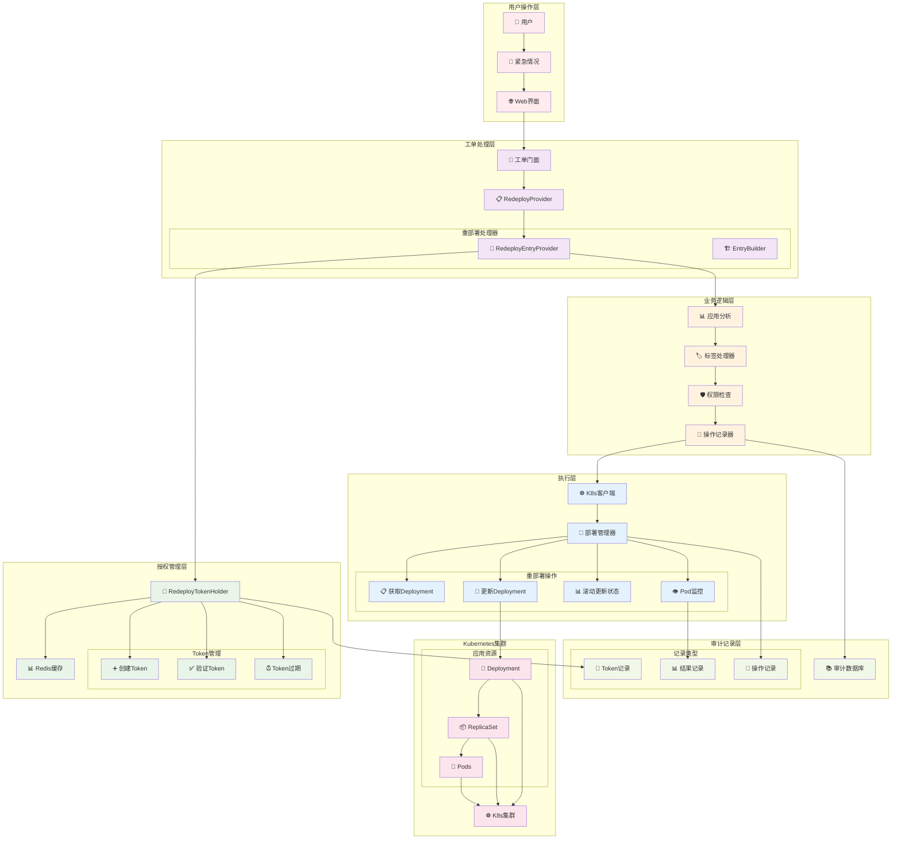
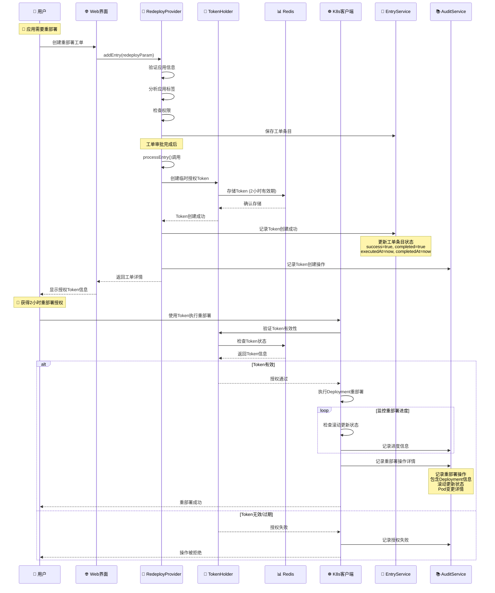
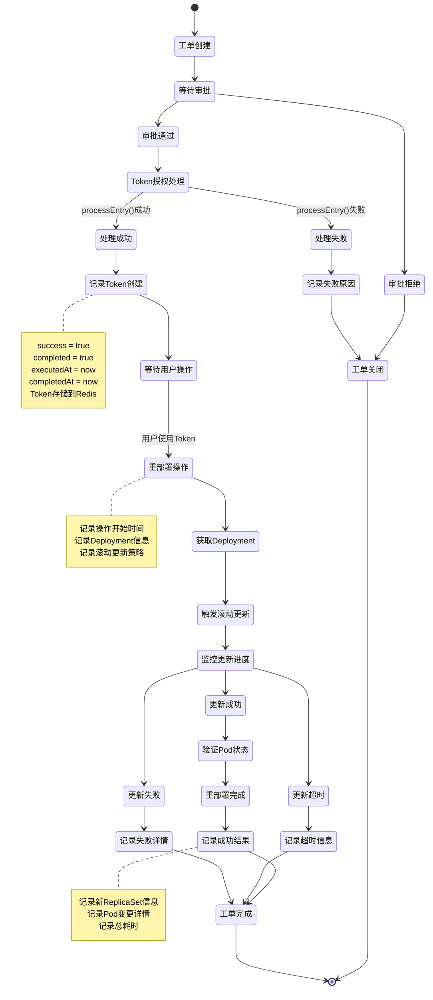
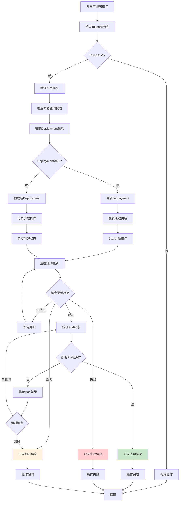
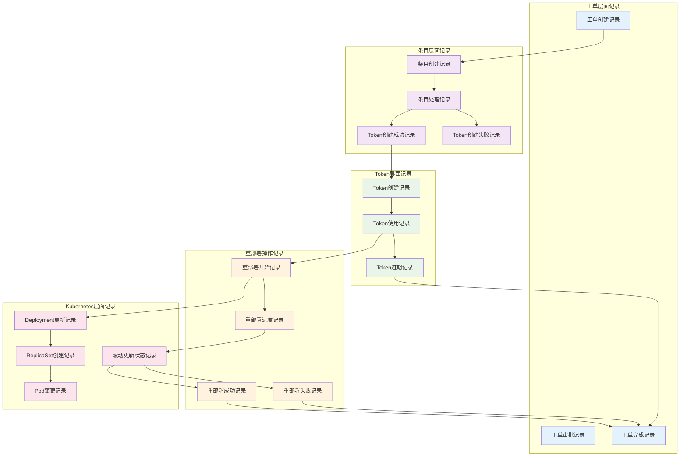

# 🔄 应用重部署工单使用指南

## 📋 概述

应用重部署工单是Cratos工单系统中的紧急处理功能，用于在紧急情况下快速重新部署应用实例。该工单属于紧急类工单，具有时效性授权机制，确保在应用故障、配置更新或版本回滚等紧急情况下能够快速响应，同时保证操作的安全性和完整的审计追踪。

---

## 🏗️ 系统架构图



---

## 🔄 工单处理流程

### 1️⃣ 完整重部署工单生命周期


### 2️⃣ 重部署操作状态管理



### 3️⃣ Kubernetes重部署执行流程



---

## 📝 操作记录机制深度分析

### 1. 重部署操作记录字段

```java
// ApplicationRedeployOperationRecord 记录结构
public class ApplicationRedeployOperationRecord {
    private Integer ticketId;              // 工单ID
    private Integer ticketEntryId;         // 工单条目ID
    private String username;               // 操作用户
    private String applicationName;        // 应用名称
    private String namespace;              // 命名空间
    private String deploymentName;         // Deployment名称
    private String previousImage;          // 重部署前镜像
    private String currentImage;           // 重部署后镜像
    private Integer previousReplicas;      // 重部署前副本数
    private Integer currentReplicas;       // 重部署后副本数
    private String rolloutStrategy;        // 滚动更新策略
    private Date operationStartTime;       // 操作开始时间
    private Date operationEndTime;         // 操作结束时间
    private Long durationSeconds;          // 操作耗时(秒)
    private Boolean success;               // 是否成功
    private String errorMessage;           // 错误信息
    private String rolloutStatus;          // 滚动更新状态
    private List<String> newPods;          // 新创建的Pod列表
    private List<String> terminatedPods;   // 终止的Pod列表
}
```

### 2. 重部署操作记录工具类

```java
public class RedeployOperationRecorder {
    
    // 记录重部署开始
    public void recordRedeployStart(String username, String applicationName, 
                                   String namespace, String deploymentName) {
        ApplicationRedeployOperationRecord record = ApplicationRedeployOperationRecord.builder()
            .username(username)
            .applicationName(applicationName)
            .namespace(namespace)
            .deploymentName(deploymentName)
            .operationStartTime(new Date())
            .rolloutStatus("STARTED")
            .build();
        
        redeployOperationService.save(record);
        log.info("记录重部署开始: user={}, app={}, deployment={}", 
                username, applicationName, deploymentName);
    }
    
    // 记录重部署进度
    public void recordRedeployProgress(String operationId, String status, 
                                     List<String> newPods, List<String> terminatedPods) {
        ApplicationRedeployOperationRecord record = redeployOperationService.getById(operationId);
        record.setRolloutStatus(status);
        record.setNewPods(newPods);
        record.setTerminatedPods(terminatedPods);
        record.setLastUpdateTime(new Date());
        
        redeployOperationService.updateByPrimaryKey(record);
        log.info("记录重部署进度: status={}, newPods={}, terminatedPods={}", 
                status, newPods.size(), terminatedPods.size());
    }
    
    // 记录重部署完成
    public void recordRedeployComplete(String operationId, boolean success, 
                                     String errorMessage, long durationSeconds) {
        ApplicationRedeployOperationRecord record = redeployOperationService.getById(operationId);
        record.setOperationEndTime(new Date());
        record.setDurationSeconds(durationSeconds);
        record.setSuccess(success);
        record.setErrorMessage(errorMessage);
        record.setRolloutStatus(success ? "COMPLETED" : "FAILED");
        
        redeployOperationService.updateByPrimaryKey(record);
        log.info("记录重部署完成: success={}, duration={}s, error={}", 
                success, durationSeconds, errorMessage);
    }
}
```

### 3. 完整的审计记录链



---
## 🏷️ 核心组件分析

### 1. 重部署工单提供者 (ApplicationRedeployTicketEntryProvider)

```java
@Component
@BusinessType(type = BusinessTypeEnum.APPLICATION)
@WorkOrderKey(key = WorkOrderKeys.APPLICATION_REDEPLOY)
public class ApplicationRedeployTicketEntryProvider 
    extends BaseTicketEntryProvider<ApplicationVO.Application, 
                                   WorkOrderTicketParam.AddApplicationRedeployTicketEntry> {
    
    private final ApplicationRedeployTokenHolder applicationRedeployTokenHolder;
    
    @Override
    protected void processEntry(WorkOrderTicket workOrderTicket, WorkOrderTicketEntry entry,
                                ApplicationVO.Application application) throws WorkOrderTicketException {
        // 审批完成后2h内可以重部署应用
        applicationRedeployTokenHolder.setToken(workOrderTicket.getUsername(), 
                                               application.getApplicationName(),
                                               workOrderTicket);
    }
}
```

**核心特性**:
- 🎯 **工单类型**: `APPLICATION_REDEPLOY`
- 🏢 **业务类型**: `APPLICATION`
- ⏰ **时效授权**: 审批通过后2小时内有效
- 🔑 **Token机制**: 基于Redis的临时授权
- 📝 **操作记录**: 完整的重部署操作审计

### 2. 重部署Token持有者 (ApplicationRedeployTokenHolder)

```java
@Component
@RequiredArgsConstructor
public class ApplicationRedeployTokenHolder {
    
    private final RedisUtil redisUtil;
    private static final String KEY = "APPLICATION:REDEPLOY:TOKEN:USERNAME:{}:APPLICATION_NAME:{}";
    private static final long DEFAULT_EXPIRE = 2; // 2 hours
    
    public void setToken(String username, String applicationName, WorkOrderTicket ticket) {
        ApplicationRedeployToken.Token token = ApplicationRedeployToken.Token.builder()
            .username(username)
            .applicationName(applicationName)
            .ticketId(ticket.getId())
            .ticketNo(ticket.getTicketNo())
            .expires(ExpiredUtils.generateExpirationTime(DEFAULT_EXPIRE, TimeUnit.HOURS))
            .build();
        
        redisUtil.set(buildKey(username, applicationName), token, 60 * 60 * 2);
    }
    
    public ApplicationRedeployToken.Token getToken(String username, String applicationName) {
        String key = buildKey(username, applicationName);
        if (redisUtil.hasKey(key)) {
            return (ApplicationRedeployToken.Token) redisUtil.get(key);
        }
        return ApplicationRedeployToken.Token.NO_TOKEN;
    }
}
```

**Token特性**:
- ⏰ **有效期**: 2小时自动过期
- 🔑 **唯一性**: 基于用户名和应用名生成唯一Key
- 📊 **存储**: Redis缓存存储，支持分布式
- 🛡️ **安全性**: 包含工单信息，可追溯操作来源
- 🔄 **重部署专用**: 专门用于应用重部署操作授权

### 3. 重部署Token数据模型

```java
@Data
@Builder
public static class Token implements Serializable {
    private String username;           // 用户名
    private String applicationName;    // 应用名称
    private Integer ticketId;          // 工单ID
    private String ticketNo;           // 工单号
    private Date expires;              // 过期时间
    private Boolean valid;             // 是否有效
    private String desc;               // 描述信息
    
    public static final Token NO_TOKEN = Token.builder().valid(false).build();
}
```

---

## 📊 数据模型

### 工单表格展示

```markdown
| Application Name | Tags |
| --- | --- |
| web-service | env:production,team:backend,version:v2.1.0,critical:true |
| api-gateway | env:staging,team:platform,version:v1.5.2,loadbalancer:nginx |
| data-processor | env:production,team:data,version:v3.0.1,schedule:cron |
```

### 重部署操作记录结构

```json
{
  "ticketId": 12345,
  "ticketEntryId": 67890,
  "username": "admin",
  "applicationName": "web-service",
  "namespace": "production",
  "deploymentName": "web-service-deployment",
  "previousImage": "web-service:v2.0.0",
  "currentImage": "web-service:v2.1.0",
  "previousReplicas": 3,
  "currentReplicas": 3,
  "rolloutStrategy": "RollingUpdate",
  "operationStartTime": "2025-08-22T10:15:00Z",
  "operationEndTime": "2025-08-22T10:18:30Z",
  "durationSeconds": 210,
  "success": true,
  "errorMessage": null,
  "rolloutStatus": "COMPLETED",
  "newPods": [
    "web-service-7d4f8b9c-abc12",
    "web-service-7d4f8b9c-def34",
    "web-service-7d4f8b9c-ghi56"
  ],
  "terminatedPods": [
    "web-service-6c3e7a8b-xyz98",
    "web-service-6c3e7a8b-uvw76",
    "web-service-6c3e7a8b-rst54"
  ]
}
```

---

## 🚀 使用指南

### 1. 创建重部署工单

#### 步骤1: 准备工单参数
```json
{
  "workOrderKey": "APPLICATION_REDEPLOY",
  "ticketId": 12345,
  "detail": {
    "id": 100,
    "name": "web-service",
    "applicationName": "web-service",
    "businessTags": [
      {
        "tag": {
          "tagKey": "env",
          "tagValue": "production"
        }
      },
      {
        "tag": {
          "tagKey": "version", 
          "tagValue": "v2.1.0"
        }
      },
      {
        "tag": {
          "tagKey": "critical",
          "tagValue": "true"
        }
      }
    ]
  }
}
```

#### 步骤2: 提交重部署工单
- 🚨 **紧急情况**: 应用需要紧急重部署
- 📋 **工单申请**: 通过Web界面提交重部署申请
- ✅ **快速审批**: 紧急工单优先审批流程
- 🔑 **获得授权**: 审批通过后获得2小时临时授权

#### 步骤3: 执行重部署操作
```bash
# 使用API执行重部署
curl -X POST \
  -H "Authorization: Bearer ${TOKEN}" \
  -H "Content-Type: application/json" \
  "https://api.cratos.com/v1/applications/web-service/redeploy" \
  -d '{
    "namespace": "production",
    "strategy": "RollingUpdate",
    "reason": "Emergency redeploy for bug fix"
  }'
```

### 2. 重部署操作示例

#### 获取和验证Token
```java
// Java代码示例
ApplicationRedeployToken.Token token = applicationRedeployTokenHolder
    .getToken("admin", "web-service");

if (token.getValid() && !ExpiredUtils.isExpired(token.getExpires())) {
    // Token有效，可以执行重部署操作
    executeRedeploy(token);
} else {
    // Token无效或已过期
    throw new UnauthorizedException("重部署授权已过期");
}
```

#### 执行重部署操作
```java
public RedeployResult executeRedeploy(ApplicationRedeployToken.Token token) {
    // 1. 记录操作开始
    String operationId = redeployOperationRecorder.recordRedeployStart(
        token.getUsername(), 
        token.getApplicationName(),
        namespace,
        deploymentName
    );
    
    try {
        // 2. 获取当前Deployment
        Deployment deployment = kubernetesClient.apps().deployments()
            .inNamespace(namespace)
            .withName(deploymentName)
            .get();
        
        // 3. 触发滚动更新
        deployment.getSpec().getTemplate().getMetadata()
            .getAnnotations().put("kubectl.kubernetes.io/restartedAt", 
                                 Instant.now().toString());
        
        kubernetesClient.apps().deployments()
            .inNamespace(namespace)
            .withName(deploymentName)
            .replace(deployment);
        
        // 4. 监控滚动更新进度
        boolean success = monitorRolloutProgress(namespace, deploymentName, operationId);
        
        // 5. 记录操作完成
        long duration = calculateDuration(operationId);
        redeployOperationRecorder.recordRedeployComplete(
            operationId, success, null, duration);
        
        return RedeployResult.success(operationId, duration);
        
    } catch (Exception e) {
        // 记录失败
        redeployOperationRecorder.recordRedeployComplete(
            operationId, false, e.getMessage(), 0);
        throw new RedeployException("重部署失败: " + e.getMessage());
    }
}
```

### 3. 重部署场景处理

#### 场景1: 应用Bug修复
```
问题: web-service发现严重Bug需要紧急修复
解决方案:
1. 创建重部署工单，说明Bug修复原因
2. 紧急审批通过
3. 获得2小时重部署授权
4. 执行滚动更新到修复版本
5. 监控新版本Pod状态
6. 验证Bug修复效果
```

#### 场景2: 配置更新重启
```
问题: 应用配置更新需要重启生效
解决方案:
1. 申请重部署权限
2. 审批通过获得Token
3. 触发Deployment滚动更新
4. 等待所有Pod重新创建
5. 验证新配置生效
```

#### 场景3: 版本回滚
```
问题: 新版本出现问题需要回滚
解决方案:
1. 创建紧急重部署工单
2. 标注回滚原因和目标版本
3. 快速审批流程
4. 执行版本回滚重部署
5. 监控回滚后应用状态
```

---

## ⚠️ 安全注意事项

### 1. 权限控制

| 检查项 | 说明 | 实现方式 |
|--------|------|----------|
| **用户权限** | 只有授权用户可申请 | RBAC权限验证 |
| **应用权限** | 只能重部署有权限的应用 | 应用权限检查 |
| **时间限制** | Token有2小时有效期 | Redis TTL机制 |
| **操作审计** | 所有操作完整记录 | 审计日志系统 |
| **重部署限制** | 防止频繁重部署 | 操作频率限制 |

### 2. 安全限制

```java
// 权限验证示例
@PreAuthorize("hasRole('APPLICATION_DEPLOYER') or hasRole('ADMIN')")
public void redeployApplication(String applicationName, String namespace) {
    // 验证Token
    if (!validateToken(getCurrentUser(), applicationName)) {
        throw new UnauthorizedException("无重部署授权或授权已过期");
    }
    
    // 验证应用权限
    if (!hasApplicationPermission(getCurrentUser(), applicationName)) {
        throw new ForbiddenException("无应用操作权限");
    }
    
    // 检查重部署频率
    if (isRedeployTooFrequent(applicationName)) {
        throw new TooManyRequestsException("重部署操作过于频繁");
    }
    
    // 执行重部署操作
    deploymentManager.redeploy(applicationName, namespace);
}
```

### 3. 操作限制

- ⏰ **时间窗口**: 仅在2小时授权期内有效
- 🎯 **应用范围**: 只能重部署指定应用
- 👤 **用户绑定**: Token与申请用户绑定
- 📊 **操作记录**: 所有重部署操作完整记录
- 🚨 **紧急标识**: 明确标识为紧急操作
- 🔄 **频率限制**: 防止短时间内频繁重部署

---
## 🔧 故障排查

### 常见问题及解决方案

| 问题 | 可能原因 | 解决方案 |
|------|----------|----------|
| **Token获取失败** | Redis连接异常 | 检查Redis服务状态 |
| **Token已过期** | 超过2小时有效期 | 重新申请工单获得授权 |
| **权限不足** | 用户无重部署权限 | 申请相应角色权限 |
| **应用不存在** | 应用名称错误 | 验证应用名称正确性 |
| **Deployment不存在** | 应用未部署到K8s | 检查应用部署状态 |
| **重部署失败** | K8s集群异常 | 检查集群连接状态 |
| **滚动更新卡住** | 资源不足或镜像拉取失败 | 检查集群资源和镜像 |
| **Pod启动失败** | 配置错误或健康检查失败 | 检查应用配置和日志 |

### 监控指标

```yaml
# Prometheus监控指标
- name: app_redeploy_ticket_created_total
  help: 应用重部署工单创建总数
  type: counter
  labels: [application, username, env]
  
- name: app_redeploy_token_created_total
  help: 重部署Token创建总数
  type: counter
  labels: [application, username, result]
  
- name: app_redeploy_token_expired_total  
  help: 重部署Token过期总数
  type: counter
  labels: [application, username]
  
- name: app_redeploy_operations_total
  help: 重部署操作总数
  type: counter
  labels: [application, namespace, username, result]
  
- name: app_redeploy_token_active_count
  help: 当前活跃重部署Token数量
  type: gauge
  
- name: app_redeploy_duration_seconds
  help: 重部署操作耗时
  type: histogram
  labels: [application, namespace, result]
  
- name: app_redeploy_success_rate
  help: 重部署操作成功率
  type: gauge
  labels: [application, time_window]
  
- name: app_redeploy_rollout_duration_seconds
  help: 滚动更新耗时
  type: histogram
  labels: [application, namespace, strategy]
```

### 告警规则

```yaml
# 告警配置
groups:
  - name: application-redeploy
    rules:
      - alert: TooManyRedeployTokens
        expr: app_redeploy_token_active_count > 15
        for: 5m
        labels:
          severity: warning
        annotations:
          summary: "重部署Token数量过多"
          description: "当前活跃的重部署Token数量为 {{ $value }}，可能存在异常情况"
          
      - alert: RedeployFailureRate
        expr: rate(app_redeploy_operations_total{result="failed"}[10m]) > 0.2
        for: 3m
        labels:
          severity: critical
        annotations:
          summary: "重部署失败率过高"
          description: "重部署操作失败率为 {{ $value }}，需要立即检查"
          
      - alert: RedeployDurationTooLong
        expr: histogram_quantile(0.95, rate(app_redeploy_duration_seconds_bucket[10m])) > 600
        for: 5m
        labels:
          severity: warning
        annotations:
          summary: "重部署耗时过长"
          description: "95%的重部署操作耗时超过10分钟"
          
      - alert: TokenProcessingFailure
        expr: rate(app_redeploy_token_created_total{result="failed"}[10m]) > 0.05
        for: 3m
        labels:
          severity: warning
        annotations:
          summary: "重部署Token创建失败率异常"
          description: "Token创建失败率为 {{ $value }}，可能存在系统问题"
          
      - alert: FrequentRedeployOperations
        expr: rate(app_redeploy_operations_total[1h]) > 10
        for: 10m
        labels:
          severity: info
        annotations:
          summary: "重部署操作过于频繁"
          description: "过去1小时重部署操作频率为 {{ $value }}/小时，可能需要关注"
```

### 日志分析

```bash
# 查看重部署工单处理日志
grep "ApplicationRedeploy" /var/log/cratos/workorder.log

# 查看Token创建日志
grep "setToken.*REDEPLOY" /var/log/cratos/workorder.log

# 查看重部署操作日志
grep "executeRedeploy" /var/log/cratos/application.log

# 查看滚动更新状态日志
grep "rollout.*status" /var/log/cratos/kubernetes.log

# 查看错误日志
grep "ERROR.*Redeploy" /var/log/cratos/error.log
```

---

## 📈 最佳实践

### 1. 使用场景

#### ✅ 适用场景
- 🐛 **Bug修复**: 紧急修复生产环境Bug
- ⚙️ **配置更新**: 需要重启生效的配置变更
- 🔄 **版本回滚**: 紧急回滚到稳定版本
- 🚨 **安全补丁**: 紧急安全漏洞修复
- 💾 **内存泄漏**: 解决内存泄漏问题
- 🔧 **性能优化**: 紧急性能问题修复

#### ❌ 不适用场景
- 📅 **日常发布**: 计划内的版本发布
- 🧪 **功能测试**: 测试环境的功能验证
- 📊 **性能测试**: 非紧急的性能测试
- 🔄 **常规维护**: 定期维护操作
- 📈 **扩容缩容**: 应用副本数调整

### 2. 操作建议

#### 🎯 申请工单时
- 📝 **详细描述**: 清楚描述重部署原因和预期效果
- 🏷️ **准确标签**: 确保应用标签信息准确完整
- ⏰ **时间评估**: 评估2小时是否足够完成操作
- 👥 **通知相关人**: 提前通知相关团队成员
- 📋 **准备回滚**: 准备回滚方案以防重部署失败

#### 🔑 使用Token时
- ✅ **及时验证**: 使用前验证Token有效性
- 🎯 **精确操作**: 只重部署必要的应用
- 📊 **监控状态**: 实时监控重部署和Pod状态
- 📝 **记录过程**: 详细记录操作过程和结果
- ⏰ **时间管理**: 合理安排操作时间，避免Token过期

#### 🔍 操作后检查
- 🚀 **Pod状态**: 确认新Pod正常启动和运行
- 🌐 **服务可用**: 验证服务恢复正常访问
- 📊 **监控指标**: 检查应用性能和业务指标
- 🔍 **日志检查**: 查看应用日志确认无异常
- 📋 **总结经验**: 记录问题原因和解决过程

### 3. 重部署策略

#### 🔄 滚动更新策略
```yaml
# 推荐的滚动更新配置
strategy:
  type: RollingUpdate
  rollingUpdate:
    maxUnavailable: 25%    # 最多25%的Pod不可用
    maxSurge: 25%          # 最多额外创建25%的Pod
```

#### ⏰ 超时设置
```yaml
# 合理的超时配置
progressDeadlineSeconds: 600    # 10分钟超时
revisionHistoryLimit: 10        # 保留10个历史版本
```

#### 🔍 健康检查
```yaml
# 确保健康检查配置正确
livenessProbe:
  httpGet:
    path: /health
    port: 8080
  initialDelaySeconds: 30
  periodSeconds: 10
  
readinessProbe:
  httpGet:
    path: /ready
    port: 8080
  initialDelaySeconds: 5
  periodSeconds: 5
```

---

## 🎯 总结

应用重部署工单是Cratos系统中的重要紧急处理功能，它提供了：

### ✅ 核心优势
- 🚨 **紧急响应**: 快速处理应用故障和紧急更新
- 🔑 **安全授权**: 基于Token的时效性授权机制
- 📊 **完整审计**: 从工单到重部署的全链路操作记录
- ⏰ **时间控制**: 2小时有效期防止权限滥用
- 🛡️ **权限隔离**: 用户和应用级别的权限控制
- 🔄 **滚动更新**: 支持零停机的滚动更新策略

### 🚀 技术特色
- **双重记录机制**: Token创建记录 + 重部署操作记录
- **完整状态追踪**: 从开始到完成的全过程状态监控
- **智能故障处理**: 自动检测和记录重部署过程中的问题
- **多维度监控**: 涵盖性能、成功率、耗时等多个维度

### 📊 适用价值
- **故障恢复**: 快速恢复应用服务可用性
- **风险控制**: 限时授权降低安全风险
- **操作规范**: 标准化的紧急重部署流程
- **责任追溯**: 完整的操作记录和审计
- **经验积累**: 通过记录分析优化重部署流程

这个功能为企业提供了安全、可控、高效的紧急应用重部署能力，是现代云原生应用运维的重要工具。通过完整的操作记录机制，不仅确保了操作的可追溯性，还为后续的流程优化和问题分析提供了宝贵的数据支撑。

---

**文档版本**: v1.0  
**创建时间**: 2025-08-22  
**分析范围**: Cratos应用重部署工单系统  
**技术栈**: Spring Boot + Redis + Kubernetes + 工单系统 + 操作审计
