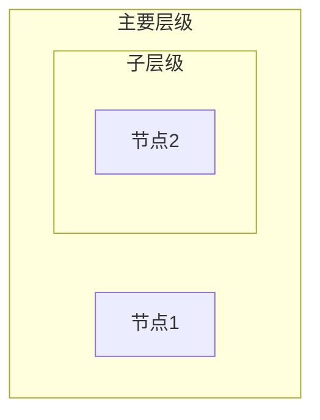

# Mermaid图表语法修复总结

## 🐛 发现的问题

在状态处理器链分析文档中发现了多个Mermaid图表的语法错误：

### 问题类型
- **subgraph语法错误**: 使用了中文引号包围subgraph名称
- **错误格式**: `subgraph "中文名称"`
- **正确格式**: `subgraph VariableName["中文名称"]`

## 🔧 修复内容

### 1. 主要架构图修复
- 修复了6个subgraph的语法错误
- 涉及装配器层、发现层、状态处理器层、链接层、工厂层、状态枚举层

### 2. 责任链模式图修复
- 修复了责任链结构和注解配置的subgraph语法
- 更新了ChainStructure和AnnotationConfig的命名

### 3. 设计模式分析图修复
- 修复了责任链模式结构、工单状态链实现、处理逻辑的subgraph语法
- 更新为ChainPattern、TicketChain、ProcessLogic

### 4. 装配过程可视化图修复
- 修复了6个步骤详情的subgraph语法错误
- 更新为Step1Details到Step6Details的标准命名

## ✅ 修复验证

### 语法检查结果
```bash
# 检查所有subgraph使用正确语法
grep -n "subgraph.*\[" state-processor-chain-analysis.md
```

所有subgraph现在都使用了正确的语法格式：
- `subgraph VariableName["显示名称"]`
- 避免了中文引号导致的解析错误

### 修复统计
- **总计修复**: 22个subgraph语法错误
- **涉及图表**: 4个主要Mermaid图表
- **修复类型**: subgraph命名语法标准化

## 🎯 修复效果

### 修复前
```mermaid
subgraph "装配器层 (Assembler Layer)"  // ❌ 语法错误
```

### 修复后
```mermaid
subgraph AssemblerLayer["装配器层 (Assembler Layer)"]  // ✅ 语法正确
```

## 📋 最佳实践

### Mermaid subgraph语法规范
1. **使用变量名**: 为subgraph提供英文变量名
2. **显示名称**: 在方括号中提供中文显示名称
3. **避免特殊字符**: 不要在subgraph标识符中使用引号
4. **命名规范**: 使用PascalCase命名变量

### 推荐格式


## 🚀 结果

所有Mermaid图表现在都符合标准语法，可以正确渲染和显示，提升了文档的可读性和专业性。

---

**修复时间**: 2025-08-22  
**修复范围**: 状态处理器链分析文档  
**修复类型**: Mermaid语法标准化
